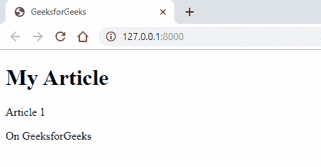
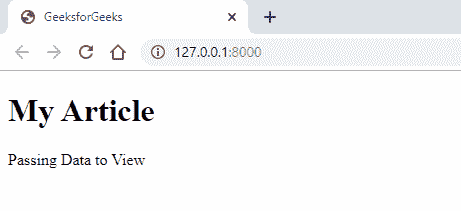

# 在 Laravel 中传递数据查看的不同方式

> 原文:[https://www . geeksforgeeks . org/异途数据转视图 in-laravel/](https://www.geeksforgeeks.org/different-ways-for-passing-data-to-view-in-laravel/)

Laravel 提供了不同的方法将数据传递给视图。我们可以直接从路线或通过控制器传递数据。

以下是我们将数据传递给视图的一些方法:

*   **使用视图()**
*   **与()**一起使用
*   **使用紧凑型()**
*   **使用控制器类**

**1。使用 view():** 我们可以通过使用函数中的第二个参数将数据直接传递到“ **view()** ”助手函数中，该函数以数组作为键和值对。

**注意:**在“*路线*目录下的“*web.php*文件中注释或删除任何以前的路线。

**例 1:**

1.  Write the below code in the ‘**web.php**’ file.

    ```php
    Route::get('/', function () {
        return view('gfg', ['articleName' => 'Article 1']);
    });

    ```

    在视图()中，第一个参数是视图的名称，第二个参数是我们必须指定数据的键和值对的地方。

2.  Create and write the below code in the ‘**gfg.blade.php**’ file in ‘**resources/views**’ directory.

    ```php
    <!DOCTYPE html>
    <html>
    <head>
        <title>GeeksforGeeks</title>
    </head>
    <body>
        <h1>My Article</h1>
        <h2>{{ $articleName }}</h2>
    </body>
    </html>
    ```

    这里我们用了双花括号“ **{{ }}** ”，就是为了转义 HTML 元素。在这种情况下，我们已经指定了键的名称，作为一个 PHP 变量，我们在“**视图**助手函数中传递了它。

**输出:**


**例 2:** 我们也可以传递一个有多个值的数组。

1.  Write the below code in the ‘**web.php**’ file.

    ```php
    Route::get('/', function () {
        return view('gfg', [ 'articles' => 
          ['Article 1','Article 2','Article 3'] ]);
    });
    ```

    在**视图()**中，第一个参数是视图的名称，第二个参数是我们指定了数据的一个键和多个值的地方。

    我们还可以将数组元素存储在变量中，然后将其传递给视图函数。在下面的代码中，我们已经将所有值存储在一个变量中，并将其作为一个**值**传递到**视图()**函数的第二个参数中。

    ```php
    Route::get('/', function () {
       $articles = ['Article 1','Article 2','Article 3'];
       return view('gfg', ['articles' => $articles]);
    });

    ```

2.  Create and write the below code in the ‘**gfg.blade.php**’ file in ‘**resources/views**’ directory.

    ```php
    <!DOCTYPE html>
    <html>
    <head>
        <title>GeeksforGeeks</title>
    </head>
    <body>
        <h1>My Article</h1>
        <ul>
            @foreach ($articles as $article)
                <li>{{ $article }}</li>
            @endforeach
        </ul>
    </body>
    </html>
    ```

    **注意:**两种方法的输出将是相同的。

**输出:**


**2。使用 with():** 带()的“**是一种传递单个数据形式的方法，与“**视图**辅助函数一起使用。
**注意:**在“*路线*目录下的“*web.php*文件中注释或删除任何以前的路线。**

**示例:**

1.  Write the below code in the ‘**web.php**’ file.

    ```php
    Route::get('/', function () {
       $articleName = ‘Article 1’;
       return view('gfg')->with('articleName', $articleName)->
                    with('articlePublished', 'On GeeksforGeeks');
    });
    ```

    在上面的代码中可以看到，我们必须指定一个箭头“ **- >** ”，然后使用“ **with()** ”方法搭配“ **view()** ”助手函数。根据需求和用例，我们可以用()指定一个或多个'**'。**

2.  Create and write the below code in the ‘**gfg.blade.php**’ file in ‘**resources/views**’ directory.

    ```php
    <!DOCTYPE html>
    <html>
    <head>
        <title>GeeksforGeeks</title>
    </head>
    <body>
        <h1>My Article</h1>
        <p>{{ $articleName }}</p>
        <p>{{ $articlePublished }}</p>
    </body>
    </html>
    ```

    这里我们用了双花括号“ **{{ }}** ”，就是为了转义 HTML 元素。在这种情况下，我们指定了键的名称，作为一个 PHP 变量，我们在“视图”帮助器函数中传递了它。

**输出:**


**3。使用 compact():** 这个“ **compact()** ”是一个 PHP 函数，可以用来创建一个有变量且有值的数组。这里，变量的名称是键，变量内容是值。

**注意:**在“*路线*目录下的“*web.php*文件中注释或删除任何以前的路线。

**示例:**

1.  Write the below code in the ‘**web.php**’ file.

    ```php
    Route::get('/', function () {
        $articleName = ['Article 1','Article 2'];
        $articlePublished = 'On GeeksforGeeks';
        return view('gfg', compact('articleName', 
                             'articlePublished'));
    });
    ```

    在视图()中，第一个参数是视图的名称，第二个参数是我们必须指定“ **compact()** ”函数的地方。

2.  Create and write the below code in the ‘**gfg.blade.php**’ file in ‘**resources/views**’ directory.

    ```php
    <!DOCTYPE html>
    <html>
    <head>
        <title>GeeksforGeeks</title>
    </head>
    <body>
        <h1>My Article</h1>    
        @foreach ($articleName as $article)
            <li>{{ $article }}</li>
        @endforeach
        <p>{{ $articlePublished }}</p>
    </body>
    </html>
    ```

    这里我们用了双花括号“ **{{ }}** ”，就是为了转义 HTML 元素。在这种情况下，我们已经指定了键的名称，作为一个 PHP 变量，我们在“**视图**助手函数中传递了它。

    **Output:**

    

    **4。使用控制器类:**使用控制器类传递数据很容易，也是正确的方法。
    **注意:**在“*路线*目录下的“*web.php*”文件中注释或删除任何以前的路线。

    **示例:**

    1.  我们首先必须通过在命令行上运行下面的命令来创建一个控制器类。

        ```php
        php artisan make:controller GfGController
        ```

    2.  之后，在 **app/Http/Controllers** 目录下打开“**GfGController.php**文件，创建一个名为“**文章**的公共函数。在这个函数中，我们可以指定上面看到的任何数据传递方法。

        ```php
        <?php

        namespace App\Http\Controllers;

        use Illuminate\Http\Request;

        class GfGController extends Controller
        {
            public function article() {
                return view('gfg', ['article' =>
                          'Passing Data to View']);
            }
        }
        ```

    3.  Now, write the below code in the ‘**web.php**’ file.

        ```php
        Route::get('/', 'GfGController@article');

        ```

        在这种情况下，第一个参数是路由，第二个参数是控制器名，带有处理路由的函数名，中间用“ **@** ”隔开。

    4.  Create and write the below code in the ‘**gfg.blade.php**’ file in ‘**resources/views**’ directory.

        ```php
        <!DOCTYPE html>
        <html>
        <head>
            <title>GeeksforGeeks</title>
        </head>
        <body>
            <h1>My Article</h1>
            <p>{{ $article }}</p>
        </body>
        </html>
        ```

        这里我们用了双花括号“ **{{ }}** ”，就是为了转义 HTML 元素。在这种情况下，我们已经指定了键的名称，作为一个 PHP 变量，我们在“**视图**助手函数中传递了它。

        **Output:**

        

        PHP 是一种专门为 web 开发设计的服务器端脚本语言。您可以通过以下 [PHP 教程](https://www.geeksforgeeks.org/php-tutorials/)和 [PHP 示例](https://www.geeksforgeeks.org/php-examples/)从头开始学习 PHP。