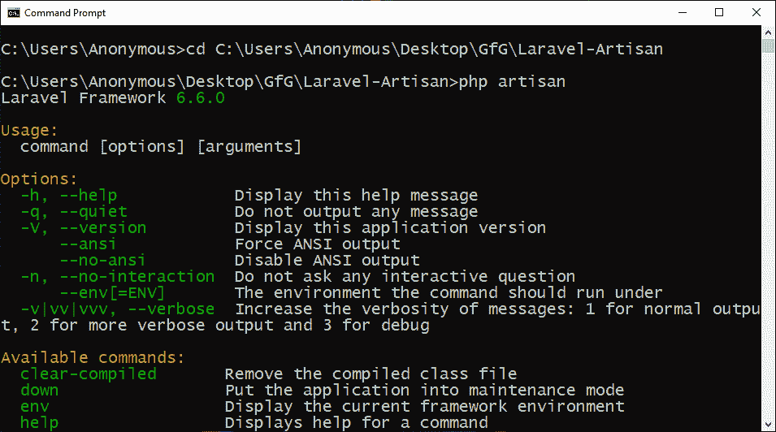
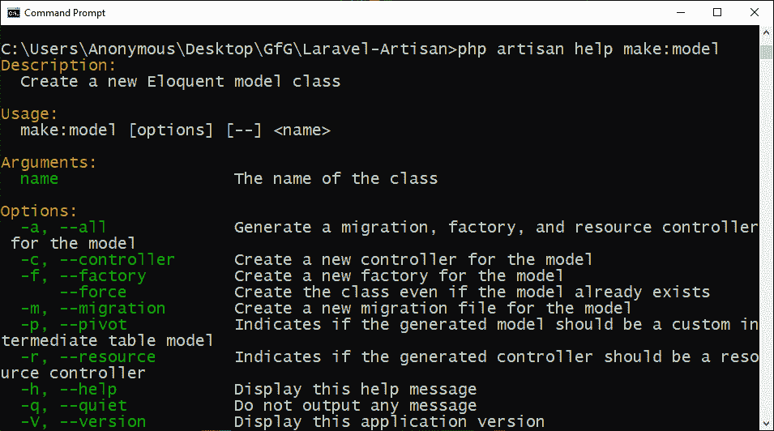

# Laravel |工匠控制台介绍

> 原文:[https://www . geesforgeks . org/laravel-artisan-console-introduction/](https://www.geeksforgeeks.org/laravel-artisan-console-introduction/)

Laravel 有自己的命令行界面，叫做 **Artisan** 。这就像一个 Linux 命令行，但是这些命令对于构建一个 Laravel 应用程序很有帮助。有了这个命令行工具，我们可以制作模型、控制器，还可以进行数据迁移等等。首先，我们必须将您的命令行控制台(即 windows 上的 cmd 或 Linux/Mac 上的终端)或任何其他 CLI 软件中的目录更改为您的 Laravel 应用程序的目录。

**所有工匠命令:**然后通过在控制台中写入“ **php 工匠列表**，我们将能够看到所有可以使用的工匠命令。我们还可以编写“ **php artisan** ”并按 enter 键，以显示 artisan 控制台中所有可用的命令。有了这个命令，我们将能够看到 **php artisan** 支持的一长串命令。

*   **Command:**

    ```php
    php artisan list
    ```

    或者

    ```php
    php artisan
    ```

*   **输出:**
    

**要获得帮助:**如果我们想了解更多关于任何命令的信息，那么我们可以写:

*   **Command:**

    ```php
    php artisan help
    ```

    或者

    ```php
    php artisan help make:model
    ```

*   **输出:**
    

**版本检查:**如果我们想知道我们的 Laravel 应用的版本，那么我们可以写“ **-V** ”选项。

*   **命令:**

    ```php
    php artisan -V
    ```

*   **输出:**
    

**制作命令:**如果这些还不够，那么我们可以使用**制作:命令**来制作自己的命令。使用**帮助**命令了解更多信息，如上文**获取帮助**部分所述。

*   **命令:**

    ```php
    php artisan make:controller
    ```

**控制台环境:**工匠提供了一个控制台环境，那就是**修补器**。 **Tinker** 为您提供了一个环境，在这个环境的帮助下，用户可以与 Laravel 应用程序进行交互，并提供了一种访问数据库中数据的简单方法。

*   **命令:**

    ```php
    php artisan tinker
    ```

*   **输出:**
    

**参考:**T2】https://laravel.com/docs/6.x/artisan