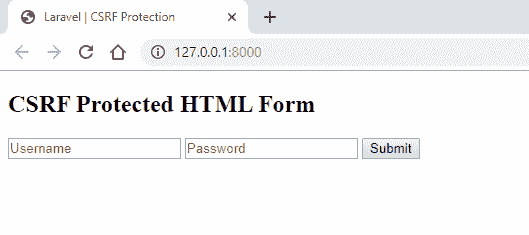

# 幼虫| CSRF 保护

> 原文:[https://www.geeksforgeeks.org/laravel-csrf-protection/](https://www.geeksforgeeks.org/laravel-csrf-protection/)

**[【跨站点请求伪造(CSRF)](https://www.geeksforgeeks.org/what-is-cross-site-request-forgery-csrf/)** 是一种攻击类型，攻击者在系统信任的授权用户的帮助下向系统发送请求。

Laravel 通过生成一个 **CSRF 令牌**为 **CSRF** 攻击提供保护。这个 **CSRF 令牌**是为每个用户自动生成的。这个令牌只是一个随机字符串，由 Laravel 应用程序管理，用于验证用户请求。

**如何使用:**通过指定 CSRF 令牌的隐藏表单字段，该 CSRF 令牌保护可以应用于 Laravel 应用程序中的任何 HTML 表单。这些请求由 CSRF **验证软件**中间件自动验证。

有三种不同的方法可以做到这一点。

1.  @ csrf
2.  **csrf_field()**
3.  **csrf_token()**

**@csrf:** 这是一个刀片模板指令，用于生成 HTML 表单中的隐藏输入字段。

*   **语法:**

    ```php
    <form method="POST">
      @csrf  // Generate hidden input field
      .....
      .....
    </form>
    ```

*   **例:**

    ```php
    <!DOCTYPE html>
    <html>
        <head>
            <title>Laravel | CSRF Protection</title>
        </head>
        <body>
            <section>
                <h1>CSRF Protected HTML Form</h1>
                <form method="POST">
                    @csrf

                    <input type="text" name="username" 
                                                placeholder="Username">
                    <input type="password" name="password" 
                                                placeholder="Password">
                    <input type="submit" name="submit" value="Submit">
                </form>
            </section>
        </body>
    </html>
    ```

**csrf_field():** 该功能可以生成 HTML 形式的隐藏输入字段。

**注意:**这个函数应该写在双花括号里面。

*   **语法:**

    ```php
    <form method="POST"<

      // Generate hidden input field
      {{ csrf_field() }}  
      .....
      .....
    </form>
    ```

*   **例:**

    ```php
    <!DOCTYPE html>
    <html>
        <head>
            <title>Laravel | CSRF Protection</title>
        </head>
        <body>
            <section>
                <h1>CSRF Protected HTML Form</h1>
                <form method="POST">
                    {{ csrf_field() }}

                    <input type="text" name="username" 
                                           placeholder="Username">
                    <input type="password" name="password"
                                           placeholder="Password">
                    <input type="submit" name="submit" 
                                                   value="Submit">
                </form>
            </section>
        </body>
    </html>
    ```

**csrf_token():** 这个函数只是给出一个随机字符串。该函数不生成隐藏的输入字段。

**注意:** HTML 输入字段应明确书写。这个函数应该写在双花括号里面。

*   **语法:**

    ```php
    <form method="POST">
      <input type="hidden" name="_token" value="{{ csrf_token() }}">
      .....
      .....
    </form>
    ```

*   **例:**

    ```php
    <!DOCTYPE html>
    <html>
        <head>
            <title>Laravel | CSRF Protection</title>
        </head>
        <body>
            <section>
                <h1>CSRF Protected HTML Form</h1>
                <form method="POST">
                    <input type="hidden" name="_token" value="{{ csrf_token() }}">

                    <input type="text" name="username" 
                                     placeholder="Username">
                    <input type="password" name="password"
                                     placeholder="Password">
                    <input type="submit" name="submit" 
                                             value="Submit">
                </form>
            </section>
        </body>
    </html>
    ```

**输出:**对于以上三种生成 CSRF 令牌的方式，输出将是相同的。在 Laravel 应用程序中，应该在每个 HTML 表单的开头使用三种方式中的任何一种来编写/生成 CSRF 令牌字段。



**检查元素输出:**


**参考:**T2】https://laravel.com/docs/6.x/csrf