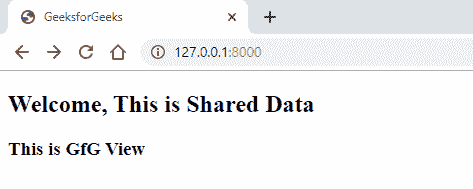
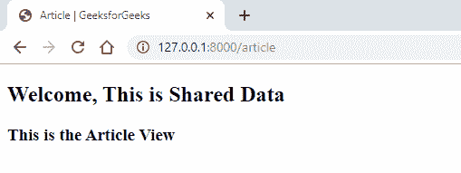

# Laravel |查看基础知识

> 原文:[https://www.geeksforgeeks.org/laravel-view-basics/](https://www.geeksforgeeks.org/laravel-view-basics/)

Laravel 是一个基于 **MVC** 的 PHP 框架。在 MVC 架构中， **V** 代表**视图**。**视图**是将在用户浏览器上显示给用户的数据，用户可以与之交互。它只是提供给用户进行交互的一个界面。

Laravel 使用了一个强大的模板引擎 **Blade** 。这里使用的文件扩展名是**filename.blade.php**。即使刀片使用了一些指令和布局格式来利用这个模板引擎，它仍然允许我们在视图文件中编写普通的 PHP。

使用 **[刀片模板引擎](https://www.geeksforgeeks.org/laravel-blade-templates-inheritance/)** 的主要优势是提供模板继承。这样，我们就可以创建一个主布局页面，它将成为其他页面的基础。因此，母版页成为我们扩展到的所有子页面的父页面。在本文中，我们将涵盖以下主题:

*   **检查视图存在**
*   **创建第一个可用视图**
*   **在视图中创建和显示数据**
*   **与所有视图共享数据**
*   **查看作曲者**
*   **查看创建者**

**1。检查视图是否存在:**要检查视图是否存在，有一个名为“ **exists()** 的方法。

*   **Syntax:**

    ```
    View::exists('gfg');
    ```

    代替“ **gfg** ”，您可以指定您想要查看其存在与否的视图的名称。如果视图存在，这将输出“**真**”，否则输出“**假**”。

*   **示例:**
    *   在“**资源/视图**”目录中创建一个名为“**gfg.balde.php**的视图。把下面的代码写进去。

        ```
        <!DOCTYPE html>
        <html>
        <head>
            <title>GeeksforGeeks</title>
        </head>
        <body>
            <h3>This is my View</h3>
        </body>
        </html>
        ```

    *   使用以下命令“**PHP artisan make:controller gfg controller**创建一个名为 **GfGController** 的控制器，并在其中写入以下代码。
        **注:**视图立面**使用照明\支撑\立面\视图；**应在控制器文件中定义。

```
<?php

namespace App\Http\Controllers;

use Illuminate\Http\Request;
use Illuminate\Support\Facades\View;

class GfGController extends Controller
{
    public function index() {
        if (View::exists('gfg')) {
            return view('gfg');
        }
        else {
            return 'No such view exist.';
        }
    }
}
?>
```

*   Write the code below in ‘**web.php**’ file in ‘route’ directory.

    ```
    Route::get('/', 'GfGController@index');
    ```

    **注意:**注释或删除任何先前定义的路线。

*   **Output:**
    *   如果视图显示:
        
    *   如果视图不存在:
        

    **2。创建第一个可用视图**如果在一个 Laravel 应用程序中有许多视图，那么使用“ **first()** 方法，我们可以创建第一个可用的视图。

    *   **语法:**

        ```
        view()->first(['main', 'gfg', 'article']);
        ```

    *   ```
        View::first(['main', 'gfg', 'article']);
        ```

        **注意:**对于该语法，需要指定视图立面**使用照亮\支持\立面\视图；**在控制器文件中。

    *   **示例:**
        *   在**资源中创建一个视图。把下面的代码写进去。

            ```
            <!DOCTYPE html>
            <html>
            <head>
                <title>GeeksforGeeks</title>
            </head>
            <body>
                <h3>This is the First Available View</h3>
            </body>
            </html>
            ```** 
        *   使用以下命令**PHP artisan make:controller gfgccontroller**创建一个名为**gfgccontroller**的控制器，并在其中写入以下代码。
            **注意:**视图立面**使用照明\支撑\立面\视图；**应在控制器文件中定义。

            ```
            <?php

            namespace App\Http\Controllers;

            use Illuminate\Http\Request;
            use Illuminate\Support\Facades\View;

            class GfGController extends Controller
            {
                public function index() {
                    return View::first(['main', 'gfg', 'article']);
                }
            }
            ?>
            ```

        *   将下面的代码写在**web.php**文件的**路线**目录中。
            **注意:**注释或删除任何先前定义的路线。

            ```
            Route::get('/', 'GfGController@index');
            ```

    *   **输出:**
        

**3。在视图中创建和显示数据:**要显示变量中存储的任何类型的数据，那么 **Blade** 提供了一种方法，即使用“ **{{ }}** ”即双花括号。这里的语句是通过 **PHP 的 htmlspecialchars 函数**发送的，该函数将特殊字符转换为 HTML 实体。这样做是为了防止 [**XSS(跨站点脚本)**](https://www.geeksforgeeks.org/what-is-cross-site-scripting-xss/) 攻击，这是由**刀锋**自动完成的。

*   **Syntax:**

    ```
    My name is {{ $name }} and my age is {{ $age }}
    ```

    变量 **$name** 和 **$age** 将被存储在这些变量中的值替换。如果我们不想数据被泄露，那么我们可以使用 **{！！！！}** 。这将防止数据被泄露，但现在它不受 **XSS 攻击**的保护。

*   **语法:**

    ```
    My name is {!! $name !!} and my age is {!! $age !!}
    ```

*   **示例:**
    *   将下面的代码写在**web.php**文件的**航线**目录中。

        ```
        Route::get('/', function () {
          return view('gfg')->with('name' => 'Aakash')->with('age' => '21');
        }

        ```

    *   现在，让我们在**资源/视图**目录中创建一个名为**gfg.blade.php**的视图文件，并在其中写入下面的代码。

        ```
        <!DOCTYPE html>
        <html>
        <head>
            <title>GeeksforGeeks</title>
        </head>
        <body>
            <h3>My name is {{ $name }} and my age is {{ $age }}</h3>
        </body>
        </html>
        ```

*   **输出:**
    

**4。与所有视图共享数据:**如果您希望在一个 Laravel 应用程序中的所有不同视图之间共享数据，那么您可以使用**共享**方法来实现。这是一个**视图立面**方法，所以你需要添加**使用照明\支持\立面\视图；**这条线。

*   **Syntax:**

    ```
    View::share(‘data’, ‘This is Shared Data’);
    ```

    这里，函数中的第一个参数是键，函数中的第二个参数是值。

*   **示例:**
    *   在**资源/视图**目录中创建三个不同的视图文件，名称分别为 **gfg** 、 **main** 和 **article** ，并为各自的视图文件编写下面的代码。
        **注意:***@ include*是一个 Laravel 指令，用于在视图中包含另一个视图。
    *   **gfg . blade . PHP**

        ```
        <!DOCTYPE html>
        <html>
        <head>
            <title>GeeksforGeeks</title>
        </head>
        <body>
            @include('shared')
            <h3>This is GfG View</h3>
        </body>
        </html>
        ```

    *   **main.blade.php**T3

        ```
        <!DOCTYPE html>
        <html>
        <head>
            <title>Main | GeeksforGeeks</title>
        </head>
        <body>
            @include('shared')
            <h3>This is the Main View</h3>
        </body>
        </html>
        ```

        T4】
    *   **篇. blade.php**

        ```
        <!DOCTYPE html>
        <html>
        <head>
            <title>Article | GeeksforGeeks</title>
        </head>
        <body>
            @include('shared')
            <h3>This is the Article View</h3>
        </body>
        </html>
        ```

*   现在，创建另一个名为**shared.blade.php**的视图，并编写下面的代码。

    ```
    <h2>Welcome, {{ $data }}</h2>
    ```

*   Now, open the file **AppServiceProvider.php** in the **app/Providers** directory. And in the boot function, write the below code.

    ```
    <?php

    namespace App\Providers;

    use Illuminate\Support\ServiceProvider;
    use Illuminate\Support\Facades\View;

    class AppServiceProvider extends ServiceProvider
    {
        /* Register any application services. */
        public function register()
        {

        }

        /* Bootstrap any application services. */
        public function boot()
        {
            View::share('data', 'This is Shared Data');
        }
    }
    ?>
    ```

    在这里，我们传递了作为**数据**的密钥，值为**这是共享数据**。这样做是因为我们已经在**shared.blade.php**文件中指定了变量 **$data** 。在前一步中。 **$data** 变量将在中替换为**这是共享数据**。

*   现在，在位于**路线**目录中的**web.php**文件中为前面步骤中创建的所有视图指定路线。

    ```
    Route::get('/', function () {
        return view('gfg');
    });

    Route::get('main', function () {
        return view('main');
    });

    Route::get('article', function () {
        return view('article');
    });
    ```

*   **输出:**
    *   同一个视图没有导航到另一个视图。
        
    *   如果我们导航到另一个视图，那么第一行将是相同的，但是第二行将会改变。
        

**5。视图编辑器:****视图编辑器**用于当我们想要输出一个视图时调用另一个视图。这可以作为 Laravel 中的另一种数据共享方式。

*   **Syntax:**

    ```
    View::composer('shared', function($view) {
      //
    });
    ```

    在这里，代替**共享**我们可以写任何其他我们想要共享的视图。我们可以使用数组在一个编辑器中指定多个视图。我们可以传递一系列视图。

*   **Syntax:**

    ```
    View::composer(['shared', 'sharedNew'], function($view) {
    $view->with('data', 'This is Shared Data');
    });
    ```

    我们也可以写一个“ ***** ”的星形符号，让所有的观点在作曲者中传递。

*   **语法:**

    ```
    View::composer(*, function($view) {
      $view->with('data', 'This is Shared Data');
    });
    ```

*   **示例:**
    *   在名为 gfg、main 和 article 的资源/视图目录中创建三个不同的视图文件，并为相应的视图文件编写下面的代码。
        **注意:***@ include*是一个 Laravel 指令，用于在视图中包含另一个视图。
    *   **gfg . blade . PHP**

        ```
        <!DOCTYPE html>
        <html>
        <head>
            <title>GeeksforGeeks</title>
        </head>
        <body>
            @include('shared')
            <h3>This is GfG View</h3>
        </body>
        </html>
        ```

    *   **main.blade.php**T3

        ```
        <!DOCTYPE html>
        <html>
        <head>
            <title>Main | GeeksforGeeks</title>
        </head>
        <body>
            @include('shared')
            <h3>This is the Main View</h3>
        </body>
        </html>
        ```

        T4】
    *   **篇. blade.php**

        ```
        <!DOCTYPE html>
        <html>
        <head>
            <title>Article | GeeksforGeeks</title>
        </head>
        <body>
            @include('shared')
            <h3>This is the Article View</h3>
        </body>
        </html>
        ```

*   现在，创建另一个名为“**shared.blade.php**的视图，并编写下面的代码。

    ```
    <h2>Welcome, {{ $data }}</h2>
    ```

*   Now, open the file ‘**AppServiceProvider.php**’ in the ‘**app/Providers**’ directory. And in the boot function, write the below code.

    ```
    <?php

    namespace App\Providers;

    use Illuminate\Support\ServiceProvider;
    use Illuminate\Support\Facades\View;

    class AppServiceProvider extends ServiceProvider
    {

        public function register()
        {
        }

        public function boot()
        {
           View::share('data', 'This is Shared Data');
        }
    }
    ```

    在这里，我们已经传递了关键字为“**数据**，值为“**这是共享数据**。这样做是因为我们在“**shared.blade.php**文件中指定了变量“ **$data** ”。在前一步中。“ **$data** ”变量将在中被替换为“**这是共享数据**”。

*   现在，在“**web.php**”文件中为前面步骤中创建的所有视图指定路线，该文件位于“**路线**目录中。

    ```
    Route::get('/', function () {
        return view('gfg');
    });

    Route::get('main', function () {
        return view('main');
    });

    Route::get('article', function () {
        return view('article');
    });
    ```

*   **Output:**
    

    **6。视图创建器:****视图创建器**与我们之前看到的**视图编辑器**相同，语法也基本相同。唯一的区别是，它不等待视图呈现，而是在找到视图后立即执行。

    *   **语法:**

        ```
        View::creator('shared', function($view) {
          $view->with('data', 'This is Shared Data');
        });
        ```

    **参考:**T2】https://laravel.com/docs/6.x/views