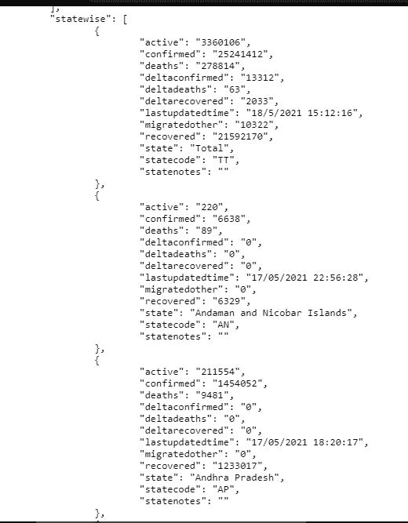
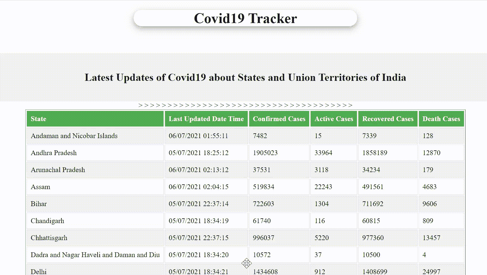

# 使用 PHP 的 Covid 19 追踪器网络应用

> 原文:[https://www . geeksforgeeks . org/新冠肺炎-追踪器-web-app-using-php/](https://www.geeksforgeeks.org/covid-19-tracker-web-app-using-php/)

在本文中，我们将看到如何使用 PHP 创建一个跟踪 Covid19 的网络应用程序。我们的 Coivd19 跟踪器应用程序将为印度各邦和联邦领土提供以下方面的最新信息。

*   Covid19 的活动病例数。
*   Covid19 确诊病例数。
*   Covid19 的恢复病例数。
*   Covid19 的死亡人数。

获取上述所有数据的来源是*****，实际上是一个以 JSON 文件形式返回数据的 API。主要思想是在 PHP 中使用关联数组，这样我们就可以从 JSON 文件中获得所需的信息。*****

*****经过*https://api.covid19india.org/data.json,*后，我们将获得状态数据，其形式为关联数组，如下所示:*****

*****

JSON 文件的输出***** 

*****所以我们将从 JSON 文件中获得的数据存储在一个变量中，比如说$data，这个变量可以使用 **file_get_contents()** 方法来完成，我们还需要使用 **json_decode()** 方法来解码 JSON 文件。*****

*******file_get_contents()** 方法用于读取存储在变量中的文件内容。当我们得到 JSON 格式的数据时，我们首先将它转换成一个数组。为此，我们使用 json_decode()函数。json_decode()函数用于将 json 对象解码或转换为 PHP 对象。现在，我们可以使用数组运算符轻松解析数组对象，并向用户显示细节。*****

*****下面是实现这一点的 PHP 代码片段。*****

```phphtml
***$data=file_get_contents('https://api.covid19india.org/data.json');

$coronalive =json_decode($data,true);***
```

*****现在，在我们解码 JSON 文件后，我们将以表格的形式显示所需的信息，在表格中，我们将状态名称、活动病例数、确诊病例、恢复病例和死亡人数作为表格标题，对于每个状态，我们将使用 PHP 中的关联数组来获取数据，其中每个状态都由索引唯一确定。*****

*****为了实现这一点，我们可以创建一个 PHP 文件，比如 index.php，如下所示:*****

## *****服务器端编程语言（Professional Hypertext Preprocessor 的缩写）*****

```phphtml
***<!DOCTYPE html>
<html>

<head>
    <meta name="viewport" content=
        "width=device-width, initial-scale=1.0">
    <title>Covid19 Report</title>

    <style type="text/css">
        .header {
            background-image: url('cool-background.png');
            width: 40%;
            font-family: 'Niconne';
            box-shadow: 0 4px 8px 0 rgba(0, 0, 0, 0.2), 
                    0 6px 20px 0 rgba(0, 0, 0, 0.19);
            border-radius: 20px;
            background-size: auto;
        }

        .middle {
            margin-top: 60px;
            opacity: 1.0;
            border-radius: 20px;
            background-color: #f2f2f2;
            background-image: url('cool-background3.png');
            background-size: auto;
            padding: 20px;
        }

        th {
            padding-top: 12px;
            padding-bottom: 12px;
            text-align: left;
            background-color: #4CAF50;
            color: white;
        }

        td,
        th {
            border: 1px solid #ddd;
            padding: 8px;
        }

        tr:nth-child(even) {
            background-color: #f2f2f2;
        }

        tr:hover {
            background-color: #ddd;
        }
    </style>
</head>

<body>
    <center>
        <div class="header">
            <h1>Covid19 Tracker</h1>
        </div>

        <div class="middle">
            <h2>
                Latest Updates of Covid19 
                about States and Union 
                Territories of India
            </h2>
        </div>

        <div style="overflow-x:auto;">
            <table border="1px ">
                <?php
                $data=file_get_contents(
    'https://api.covid19india.org/data.json');

    $coronalive =json_decode($data,true);

    // echo $coronalive['statewise'][1]['state'];
    $satecount = count($coronalive['statewise']);
                ?>
                <tr>
                    <th>State</th>
                    <th>Last Updated Date Time</th>
                    <th>Confirmed Cases</th>
                    <th>Active Cases</th>
                    <th>Recovered Cases</th>
                    <th>Death Cases</th>
                </tr>
                <?php   
                $i = 1;
                while($i < 38) { 
                ?>
                <tr>
                    <td>
<?php echo $coronalive['statewise'][$i]['state'] ?>
                    </td>

                    <td>
<?php echo $coronalive['statewise'][$i]['lastupdatedtime'] ?>
                    </td>>

                    <td>
<?php echo $coronalive['statewise'][$i]['confirmed'] ?>
                    </td>

                    <td>
<?php echo $coronalive['statewise'][$i]['active'] ?>
                    </td>

                    <td>
<?php echo  $coronalive['statewise'][$i]['recovered'] ?>
                    </td>

                    <td>
<?php echo $coronalive['statewise'][$i]['deaths'] ?>
                    </td>
                </tr>
                <?php  $i++;
                }
                ?>
            </table>
        </div>
    </center>
</body>

</html>***
```

*******输出:*******

**********

*******项目现场演示:**[https://covid-ap.herokuapp.com/index.php](https://covid-ap.herokuapp.com/index.php)*****