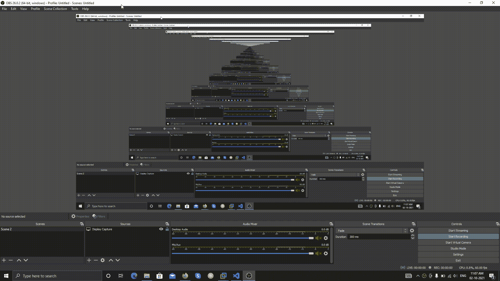

# PHP 中 require()和 require_once()的区别

> 原文:[https://www . geesforgeks . org/require 和 require _ in-once-PHP 之间的差异/](https://www.geeksforgeeks.org/difference-between-require-and-require_once-in-php/)

[**PHP require()函数:**](https://www.geeksforgeeks.org/php-inclusion/)**PHP 中的 require()函数主要用于将一个 PHP 文件的代码/数据包含到另一个文件中。在这个过程中，如果有任何类型的错误，那么这个 **require()** 函数将显示一个警告和一个致命错误，它将立即停止脚本的执行。**

**为了使用这个 **require()** 函数，我们首先需要创建两个 PHP 文件。使用 [**include()**](https://www.geeksforgeeks.org/php-inclusion/) 功能将一个 PHP 文件包含到另一个 PHP 文件中。这两个 PHP 文件合并成一个 HTML 文件。这个 **require()** 函数不会看到代码之前是否包含在指定的文件中，而是会像使用 **require()** 函数一样多次包含代码。**

****示例:****

## **超文本标记语言**

```
<html>

<body>
    <h1>Welcome to geeks for geeks!</h1>
    <p>Myself, Gaurav Gandal</p>

    <p>Thank you</p>

    <?php require 'requiregfg.php'; ?>
</body>

</html>
```

## **requiregfg.php**

```
<?php

    echo "<p>visit Again-" . date("Y") 
        . " geeks for geeks.com</p>";

?>
```

****输出:****

****

**[**PHP require_once()函数**](https://www.geeksforgeeks.org/php-include_once-require_once/)**:**PHP 中的 **require_once()** 函数用于将一个 PHP 文件包含到另一个 PHP 文件中。它为我们提供了一个特性，如果一个 PHP 文件中的代码已经包含在指定的文件中，那么如果我们使用 **require_once()** 函数，它将不会再次包含该代码。这意味着这个函数只会将一个文件添加到另一个文件中一次。**

**如果这个函数没有找到一个指定的文件，那么它将产生一个致命的错误，并将立即停止执行。**

****示例:****

## **服务器端编程语言（Professional Hypertext Preprocessor 的缩写）**

```
<?php
    require_once('demo.php');
    require_once('demo.php');
?>
```

**上面的 PHP 代码中使用了以下代码。**

## **demo.php**

```
<?php
    echo "Hello from Geeks for Geeks";
?>
```

****输出:****

****

****require()和 require_once()的区别:****

<figure class="table">

| **要求()** | **require _ once()** |
| **T0】 require () function is used to include one PHP file into another, regardless of whether the file was previously included.** | **Require _ once ()** It will first check whether the file has been included, and if it has been included, it will not be included again. |
| This function is mostly used where you want to include a certain code again and again. | This function is mainly used where you only want to include a certain code once. |
| Use **require ()** to load files similar to templates. | Use **require _ once ()** to load dependencies (classes, functions, constants). |
| Every call to the **require ()** function will be executed. | **T0】 require _ once() 【T1] function will not be executed every time it is called (it will not be executed if the file to be included is included before)** |

</figure>