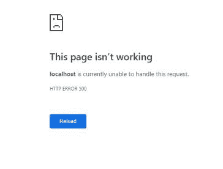

# 如何让 PHP 错误显示出来？

> 原文:[https://www . geesforgeks . org/how-do-I-get-PHP-errors-to-display/](https://www.geeksforgeeks.org/how-do-i-get-php-errors-to-display/)

PHP 中有四种显示错误的方法，如下所示:

*   **错误报告:**它不会消除 E-STRICT、E-NOTICE 和 E_DEPRECATED 级别的错误，并显示所有其他级别的错误。
*   **display_errors:** 默认值为“关”。将其设置为“开”。
*   **log_errors:** 默认值为“开”，表示是否进行错误记录。
*   **error_log 字符串:**设置脚本错误应该记录的文件名。

**示例:**要在 PHP 中显示错误，最快最简单的方法是在代码中添加以下几行。

```
ini_set('display_errors', 1);
ini_set('display_startup_errors', 1);
error_reporting(E_ALL);

```

*   **ini _ set:**ini _ set 函数将尝试覆盖在 PHP ini 文件中找到的配置。
*   **display_errors:** 这是一个指令，用于确定错误是显示给用户还是保持隐藏。
*   **display_startup_errors:** 是一个指令，用于在 PHP 的启动序列中查找错误。可以被 ini_set 函数覆盖的指令列表可以在官方文档中找到。

这两个指令**不显示解析错误。**

**程序 1:**

```
<?php
ini_set('display_errors', 1);
ini_set('display_startup_errors', 1);
error_reporting(E_ALL);

include("gfg.php");
?>
```

**输出:**

```
A warning will be shown- No such directory or file found in (location of file)
with the specified line of error.

```

要显示包括解析错误在内的错误，必须在 php.ini 中进行以下更改，并重新启动 php-fpm，apche2

```
display_errors = on

```

**程序 2:**

```
<?php 

// Display number 0 to 5
for($i = 0; $i <= 5 $i++) // Semicolon after $i<=5 is missing 
{
echo $i;
}
?>
```

**输出:**

*   **在 php.ini 文件中禁用 display_error 时的输出:**
    
*   【display _ error 启用并重启时的输出:
    

上述指令将显示在浏览器上加载网站时遇到的任何 PHP 错误。当站点处于活动状态时，应禁用**显示错误**，以防止不在开发环境中时出现任何安全问题。