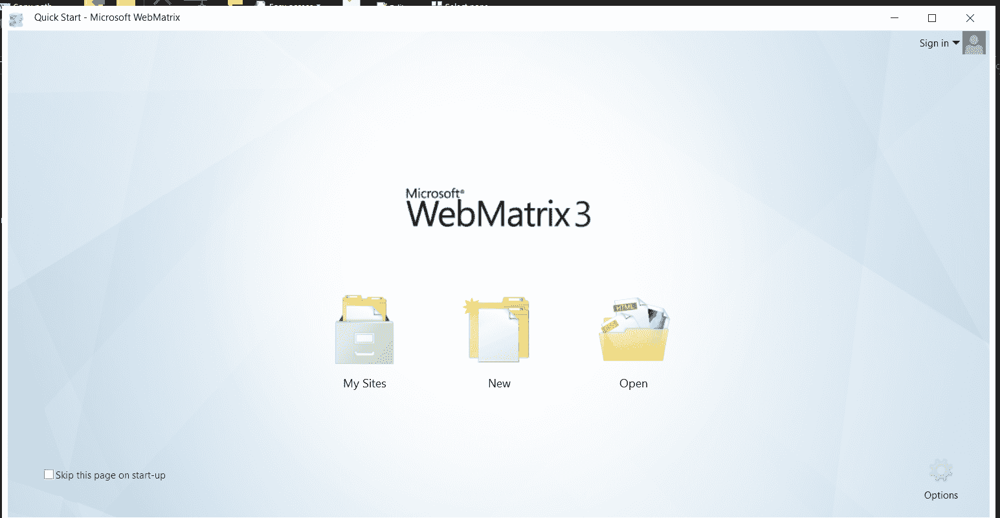
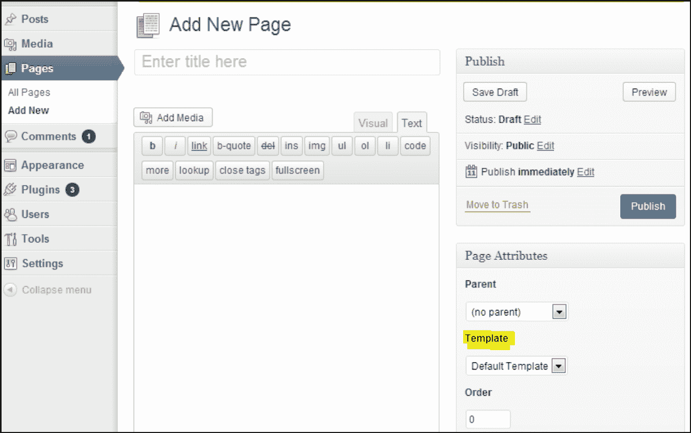

# 如何给 WordPress 添加一个 PHP 页面？

> 原文:[https://www . geesforgeks . org/how-add-a-PHP-page-to-WordPress/](https://www.geeksforgeeks.org/how-to-add-a-php-page-to-wordpress/)

WordPress 是最好的博客平台之一。这是一个场景，我们有一个自定义的 PHP 页面，我们想与 WordPress 博客集成。我们将要集成的 PHP 文件可能不使用任何 WordPress APIs。将 PHP 文件与 WordPress 集成对于网页设计的后端开发非常重要。

**第一步:**登录微软网络矩阵
出现如下画面。打开或创建您的 WordPress 模板。


**第二步:**创建 WordPress 模板页面
我们可以从一个示例文件开始，复制 page.php，根据您的选择重命名它，并将其放入主题文件夹中../WP-内容/主题/神话/

```
<?php
/*
Template Name: GFG
*/

/* Rest PHP code here */
?>
```

这个新文件应该从以下内容开始，然后是自定义的 PHP 内容。这是 WordPress 模板。
记得把这个上传到主题文件夹。现在 WordPress 模板已经准备好了。

**第三步:**创建 WordPress 页面
点击 WordPress 仪表盘中的*【页面】*链接。我们创建的模板可以用来创建这个新页面。我们可以给出页面名称，并从*“页面属性”*部分的下拉列表中选择*“模板”*。在那里，我们上传的 PHP 页面将带有下拉列表中列出的*“极客博客”*。现在发表。在这里，我们已经使用自定义代码创建了一个 WordPress PHP 页面。每当这个页面被链接时，我们的定制 PHP 代码就会被执行。可以通过它创建各种类型的模板。



**示例:**在函数中，需要如下实现:

```
function simple_function_1() {
    return "Hello World!";
}

add_shortcode( 'own_shortcode1', 'simple_function_1' );
```

在帖子/页面中:

```
[own_shortcode1]
```

输出:

```
Hello World!
```

一个实时的场景是我们将使用这个 WordPress 模板选项构建一个站点地图页面。