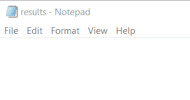
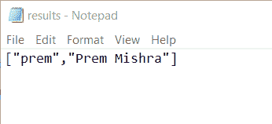

# 如何使用 PHP 在按钮点击时给数组添加更多的值？

> 原文:[https://www . geesforgeks . org/how-to-add-more-values-to-array-on-button-click-using-PHP/](https://www.geeksforgeeks.org/how-to-add-more-values-to-array-on-button-click-using-php/)

在本文中，我们将学习使用 PHP 通过点击按钮向现有数组添加元素。

PHP 是一种服务器端语言，它只响应请求(GET、POST、PUT、PATCH 和 DELETE)。按钮点击动作作为客户端的一部分直接调用一个 PHP 函数。

我们需要一种中介语言来执行这个动作。在这种情况下，我们将使用 [JavaScript。](https://www.geeksforgeeks.org/javascript-tutorial/)当用户点击按钮时，按钮会调用 JavaScript 函数。然后，该函数将向服务器上的 PHP 脚本发送一个 POST 请求，将数据追加到数组中。

每次点击按钮，一个新的请求将被发送到 PHP 脚本，从而重新初始化我们的数组。为了克服这个问题，我们将数组存储在服务器上的一个 JSON 文件中，然后对于每个请求，我们将向它追加数据。我们将处理三个文件“index.html”，包含文本输入和按钮，“data.php”，处理请求，从 JSON 文件中读取数据并向其中追加数据，以及“array.json”存储数组。

**示例:**

## index.html

```phphtml
<!DOCTYPE html>
<html>

<head>
    <script src=
"https://ajax.googleapis.com/ajax/libs/jquery/3.5.1/jquery.min.js">
    </script>
</head>

<body>

    <!--We are taking array elements from user-->
    <input type="text" value="name" id="name" />

    <!--It will call our JS function-->
    <button type="button" id="add">Add</button>

    <script>
        $(document).ready(function () {
            var he = $("#name").value;
            $("#add").click(function () {
                $.post(
                    "data.php", {
                        data: document.getElementById("name").value,
                    },
                    function (data, status) {
                        alert("Data: " + data + "\nStatus: " + status);
                    }
                );
            });
        });
    </script>
</body>

</html>
```

下面是上面的 HTML 文件中使用的“data.php”的 PHP 代码。我们正在使用 [jQuery](https://www.geeksforgeeks.org/jquery-tutorials/) 的 [post()](https://www.geeksforgeeks.org/jquery-post-method/) 方法，进行请求。

## data.php

```phphtml
<?php

if(isset($_POST['data'])) {
    $data= $_POST['data'];
    $inp = file_get_contents('array.json');
    $tempArray = json_decode($inp);

    if($tempArray) {
        array_push($tempArray, $data);
        $jsonData = json_encode($tempArray);
    }
    else {
        $jsonData=json_encode(array($data));
    }

    file_put_contents('array.json', $jsonData);
    $inp = file_get_contents('array.json');
    $tempArray = json_decode($inp);
    print_r($tempArray);
}

?>
```

我们正在处理请求以及发送到“*data.php*”的数据。每当发送请求时，它都会打开 JSON 文件并从中读取前一个数组。如果没有先前的数组，即“*数组. json* ”文件为空，则它创建一个数组。然后，它会向其中追加数据。

**输出:**

**执行步骤:**我们将首先确认我们的“results.json”文件为空。



空文件

We will be running “http://localhost/index.html” in the browser.

用户输入屏幕

Type something in the input that you want to add to the array and click on the Add button. You will notice a dialog box appearing that confirms that the data is added, and it even shows the array.

首次进入

Repeat this a few times.


查看*【战果】*文件。