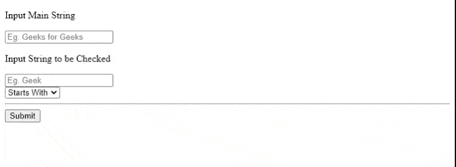

# 在 PHP 中如何检查字符串以特定字符串开头/结尾？

> 原文:[https://www . geeksforgeeks . org/如何检查字符串-以特定的 php 字符串开头和结尾/](https://www.geeksforgeeks.org/how-to-check-a-string-starts-ends-with-a-specific-string-in-php/)

在本文中，我们将学习如何在 PHP 中检查给定的字符串是以给定的特定字符串开始还是结束。

我们需要使用 [XAMPP](https://www.apachefriends.org/download.html) 、[网豆](https://netbeans-ide.informer.com/8.2/)来运行这段代码。

```html
Input: "Geeks For Geeks"
Starting with: "G"
Output: "Geeks For Geeks Starts with String G"
```

在 PHP 版本中，有**str _ start _ with()，str _ end _ with()**函数，它们采用两个参数，一个作为原始字符串，第二个作为要检查的字符串。

我们将学习如何检查以特定字符串开头/结尾的字符串。

**进场:**

*   我们将创建一个基本的 HTML 表单来输入两个字符串，主字符串和要检查的字符串。
*   我们将使用**str _ start _ with()，str _ end _ with()**函数验证输入。

**PHP 代码:**创建一个文件*“index . PHP”*并编写以下 PHP 代码。

## 服务器端编程语言（Professional Hypertext Preprocessor 的缩写）

```html
<!DOCTYPE html>
<?php
$msg = "";
error_reporting(0);

if (isset($_POST['submit'])) {

    if ($_POST['stringSearchType'] == 0)
    {
        if ((str_starts_with($_POST['mainString'], 
                strtoupper($_POST['checkString']))) 
            || (str_starts_with($_POST['mainString'], 
                strtolower($_POST['checkString'])))
            || (str_starts_with($_POST['mainString'], 
                $_POST['checkString']))) 
        {
            $msg = "The Given string [$_POST[mainString]] 
                    Starts with [$_POST[checkString]]";
        } else {
            $msg = "The Given string [$_POST[mainString]] 
                  do not Starts with [$_POST[checkString]]";
        }
    } else if ($_POST['stringSearchType']) {
        if ((str_ends_with($_POST['mainString'], 
                strtoupper($_POST['checkString']))) 
            || (str_ends_with($_POST['mainString'], 
                strtolower($_POST['checkString']))) 
            ||  (str_ends_with($_POST['mainString'], 
                $_POST['checkString'])))
        {
            $msg = "The Given string [$_POST[mainString]] 
                    ends with [$_POST[checkString]]";
        } else
        {
            $msg = "The Given string [$_POST[mainString]] 
                    do not ends with [$_POST[checkString]]";
        }
    }
}

?>
<html>

<body>
    <form action="index.php" method="POST">
        <p>Input Main String</p>

        <input type="text" autocomplete="off" name="mainString" 
            placeholder="Eg. Geeks for Geeks" required="true">
        <p>Input String to be Checked</p>

        <input type="text" autocomplete="off" name="checkString" 
            placeholder="Eg. Geek" required="true"><br>
        <select name="stringSearchType">
            <option value=0>Starts With</option>
            <option value=1>Ends With</option>
        </select><br>
        <hr>
        <input type="submit" name="submit">
    </form>
    <h2 style="color:green">
        <?php
            if ($msg) {
                echo $msg;
            }          
        ?>
    </h2>
</body>

</html>
```

**输入:**

```html
Input: Geeks For Geeks
String To be Checked: Geek
Type: Starts With

Input: Geeks For Geeks
String To be Checked: s
Type: Ends With

Input: Geeks For Geeks
String To be Checked: For
Type: Starts With
```

**输出:**

