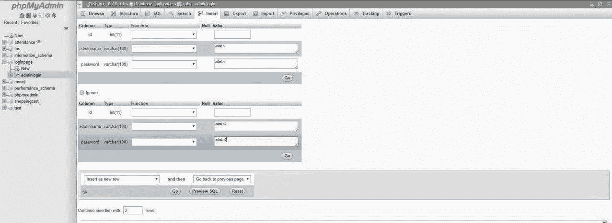
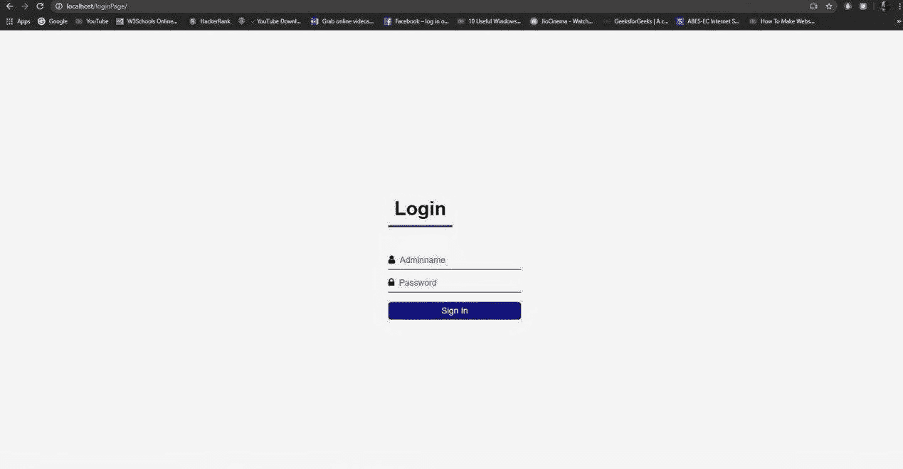
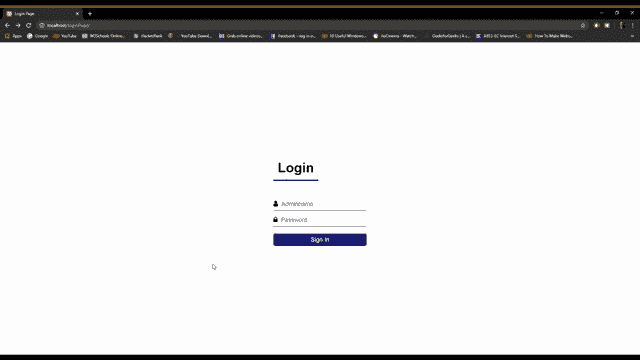

# 如何用 PHP 创建管理员登录页面？

> 原文:[https://www . geesforgeks . org/how-create-admin-log in-page-using-PHP/](https://www.geeksforgeeks.org/how-to-create-admin-login-page-using-php/)

**按照步骤使用 PHP 创建**一个 **admin 登录页面:**
在这里，我们已经创建了一个 admin 的登录页面，与数据库连接，或者其登录页面的信息已经存储在我们的数据库中。
**1。创建数据库:**使用 XAMPP 创建一个数据库，这个数据库在这里被命名为“loginpage”。你可以给你的数据库起任何名字。


**2。创建表:**在“loginpage”数据库中创建一个名为“adminlogin”的表。


**3。创建表结构:**表“adminlogin”应该包含三个字段。

*   id-主键-自动递增
*   admin name-varchar(100)
*   密码–varchar(100)

adminname 和密码的数据类型是 **varchar** 。尺寸可以根据需要改变。但是，100 就足够了，“id”的数据类型是 **int** ，并且是**主键**。
主关键字**也称为主关键字，是关系数据库中对每个记录都是唯一的关键字。它是一个唯一的标识符，例如驾照号码、电话号码(包括区号)或车辆识别号(VIN)。** 


表格的结构会是这样的


**4。插入管理员登录信息:**这里插入 2 个管理员的信息。你想加多少就加多少。



**或**您可以编写一个 SQL 查询来插入这些值。


插入值后，表格将如下所示。


**5。创建一个文件夹**，其中**包含****以下文件:**该文件夹应该在**中“D:\xampp\htdocs\"** (或安装 xampp 的位置)。在 Linux 上 **"/opt/lampp/htdocs"** 。

*   **文件名:index.php**

## 超文本标记语言

```phphtml
<!DOCTYPE html>
<html lang="en">

<head>
    <meta charset="UTF-8">
    <link rel="stylesheet" href=
"https://stackpath.bootstrapcdn.com/font-awesome/4.7.0/css/font-awesome.min.css">
    <meta name="viewport" content="width=device-width, initial-scale=1.0">
    <meta http-equiv="X-UA-Compatible" content="ie=edge">
    <link rel="stylesheet" href="login.css">
    <title>Login Page</title>
</head>

<body>
    <form action="validate.php" method="post">
        <div class="login-box">
            <h1>Login</h1>

            <div class="textbox">
                <i class="fa fa-user" aria-hidden="true"></i>
                <input type="text" placeholder="Adminname"
                         name="adminname" value="">
            </div>

            <div class="textbox">
                <i class="fa fa-lock" aria-hidden="true"></i>
                <input type="password" placeholder="Password"
                         name="password" value="">
            </div>

            <input class="button" type="submit"
                     name="login" value="Sign In">
        </div>
    </form>
</body>

</html>
```

*   **文件名:connection.php**

## 服务器端编程语言（Professional Hypertext Preprocessor 的缩写）

```phphtml
<?php

$conn = "";

try {
    $servername = "localhost:3306";
    $dbname = "loginPage";
    $username = "root";
    $password = "";

    $conn = new PDO(
        "mysql:host=$servername; dbname=loginPage",
        $username, $password
    );

   $conn->setAttribute(PDO::ATTR_ERRMODE,
                    PDO::ERRMODE_EXCEPTION);
}
catch(PDOException $e) {
    echo "Connection failed: " . $e->getMessage();
}

?>
```

*   **文件名:login.css**

## 钢性铸铁

```phphtml
body {
    margin: 0;
    padding: 0;
    font-family: sans-serif;
    background: url() no-repeat;
    background-size: cover;
}

.login-box {
    width: 280px;
    position: absolute;
    top: 50%;
    left: 50%;
    transform: translate(-50%, -50%);
    color: #191970;
}

.login-box h1 {
    float: left;
    font-size: 40px;
    border-bottom: 4px solid #191970;
    margin-bottom: 50px;
    padding: 13px;
}

.textbox {
    width: 100%;
    overflow: hidden;
    font-size: 20px;
    padding: 8px 0;
    margin: 8px 0;
    border-bottom: 1px solid #191970;
}

.fa {
    width: px;
    float: left;
    text-align: center;
}

.textbox input {
    border: none;
    outline: none;
    background: none;
    font-size: 18px;
    float: left;
    margin: 0 10px;
}

.button {
    width: 100%;
    padding: 8px;
    color: #ffffff;
    background: none #191970;
    border: none;
    border-radius: 6px;
    font-size: 18px;
    cursor: pointer;
    margin: 12px 0;
}
```

*   **文件名:validate.php**

## 服务器端编程语言（Professional Hypertext Preprocessor 的缩写）

```phphtml
<?php

include_once('connection.php');

function test_input($data) {

    $data = trim($data);
    $data = stripslashes($data);
    $data = htmlspecialchars($data);
    return $data;
}

if ($_SERVER["REQUEST_METHOD"]== "POST") {

    $adminname = test_input($_POST["adminname"]);
    $password = test_input($_POST["password"]);
    $stmt = $conn->prepare("SELECT * FROM adminlogin");
    $stmt->execute();
    $users = $stmt->fetchAll();

    foreach($users as $user) {

        if(($user['adminname'] == $adminname) && 
            ($user['password'] == $password)) {
                header("Location: adminpage.php");
        }
        else {
            echo "<script language='javascript'>";
            echo "alert('WRONG INFORMATION')";
            echo "</script>";
            die();
        }
    }
}

?>
```

*   **文件名:adminpage.php**将您想要显示的任何内容添加到管理页面。

## 超文本标记语言

```phphtml
<h2>Hello Admin</h2>
```

**6。完成以上所有****步骤后，现在按照以下步骤操作:**

*   经营 XAMPP
*   启动 Apache 和 MySQL 服务器
*   在浏览器中输入 *<u>。</u>*

将出现此登录页面。



如果您输入正确的凭据，即管理员名称和密码，那么您将登录到“admin.php”页面。



否则，您会收到一个错误弹出警报。


HTML 是网页的基础，通过构建网站和网络应用程序用于网页开发。您可以通过以下 [HTML 教程](https://www.geeksforgeeks.org/html-tutorials/)和 [HTML 示例](https://www.geeksforgeeks.org/html-examples/)从头开始学习 HTML。

CSS 是网页的基础，通过设计网站和网络应用程序用于网页开发。你可以通过以下 [CSS 教程](https://www.geeksforgeeks.org/css-tutorials/)和 [CSS 示例](https://www.geeksforgeeks.org/css-examples/)从头开始学习 CSS。

PHP 是一种专门为 web 开发设计的服务器端脚本语言。您可以通过以下 [PHP 教程](https://www.geeksforgeeks.org/php-tutorials/)和 [PHP 示例](https://www.geeksforgeeks.org/php-examples/)从头开始学习 PHP。