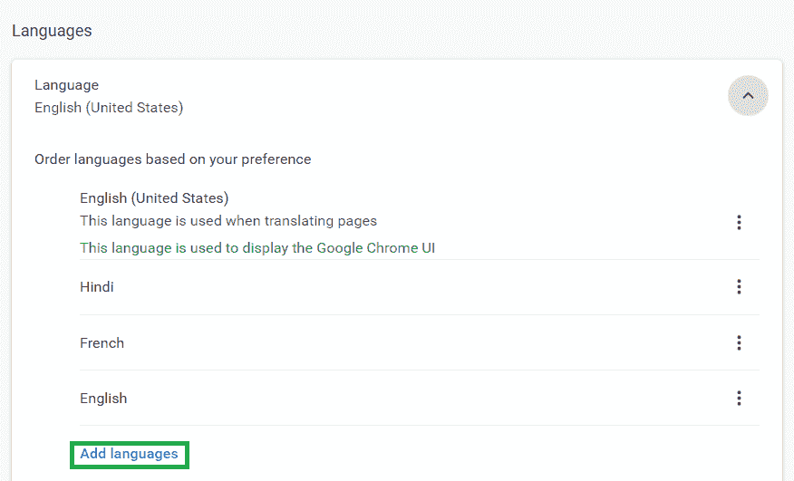

# 如何检测 PHP 中的浏览器语言？

> 原文:[https://www . geesforgeks . org/how-to-detection-browser-in-language-PHP/](https://www.geeksforgeeks.org/how-to-detect-browser-language-in-php/)

我们可以使用 PHP 的超级全局变量`$_SERVER`来检测请求浏览器的语言。它是一个超级全局变量，保存着关于**头、路径和脚本位置**的信息。基本上是 PHP 中的关联数组，有`SERVER_NAME, SERVER_ADDR, REQUEST_METHOD`等键。

我们可以使用`HTTP_ACCEPT_LANGUAGE`键获取浏览器的语言。

**语法:**

```
$_SERVER['HTTP_ACCEPT_LANGUAGE']
```

**我们可以看到如下输出:**

```
en-US, en;q=0.9, hi;q=0.8, fr;q=0.7
```

**示例 1:**
为了获取浏览器的当前语言，我们可以使用 PHP 内置的 [substr](https://www.geeksforgeeks.org/php-substr-function/) 函数来获取字符串的前两个字母，如-

```
<?php

   echo substr($_SERVER['HTTP_ACCEPT_LANGUAGE'], 0, 2);

?>
```

运行上述程序后，您将看到作为当前浏览器语言的输出–

```
en
```

您可以通过更改浏览器的语言来测试它。如果你在 chrome 上，你可以去`chrome://settings/languages`选择不同的语言。



现在再次运行上面的程序，您会看到输出是新选择的语言。

**示例 2:** 如果你的网站有不同语言的**不同页面**，你可以使用这个方法，以便**根据用户浏览器的语言将**重定向到该页面。

```
<?php

   $lang = substr($_SERVER['HTTP_ACCEPT_LANGUAGE'], 0, 2);

   // Redirect browser 
   header("Location: https://www.geeksforgeeks.org/" . $lang . "/index.php");    
   exit;

?>
```

上述程序将重定向到如下链接

```
http://www.example.com/en/index.php
```