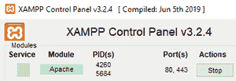
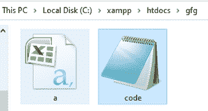
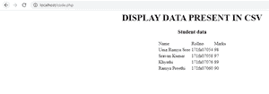

# 如何用 PHP 显示 CSV 文件中的数据？

> 原文:[https://www . geesforgeks . org/how-display-data-from-CSV-file-using-PHP/](https://www.geeksforgeeks.org/how-to-display-data-from-csv-file-using-php/)

我们已经给出了 CSV 文件格式的数据，任务是使用 PHP 将 CSV 文件数据显示到网络浏览器中。要将 CSV 文件中的数据显示到 web 浏览器中，我们将使用 fgetcsv()函数。

**逗号分隔值(CSV)** 是包含数据内容的文本文件。它是一个逗号分隔的值文件，带有。csv 扩展，允许以表格格式保存数据。

**fgetcsv()函数:**fgetcsv()函数用于解析打开文件中的一行，检查 csv 字段。

**执行步骤:**

*   打开 XAMPP 服务器并启动 apache 服务



*   打开记事本，输入 PHP 代码，保存为 code.php



*   将 CSV 文件存储在同一文件夹中。像 xampp/htdocs/gfg/a.csv
*   进入浏览器，输入

<u></u>

<u>**文件名:code.php**</u>

## <u>服务器端编程语言（Professional Hypertext Preprocessor 的缩写）</u>

```phphtml
<!DOCTYPE html>
<html>

<body>
    <center>
        <h1>DISPLAY DATA PRESENT IN CSV</h1>
        <h3>Student data</h3>

        <?php
        echo "<html><body><center><table>\n\n";

        // Open a file
        $file = fopen("a.csv", "r");

        // Fetching data from csv file row by row
        while (($data = fgetcsv($file)) !== false) {

            // HTML tag for placing in row format
            echo "<tr>";
            foreach ($data as $i) {
                echo "<td>" . htmlspecialchars($i) 
                    . "</td>";
            }
            echo "</tr> \n";
        }

        // Closing the file
        fclose($file);

        echo "\n</table></center></body></html>";
        ?>
    </center>
</body>

</html>
```

<u>**输出:**</u>

<u></u>