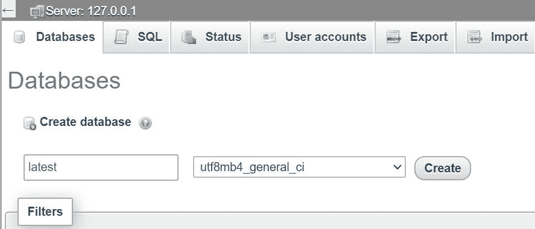
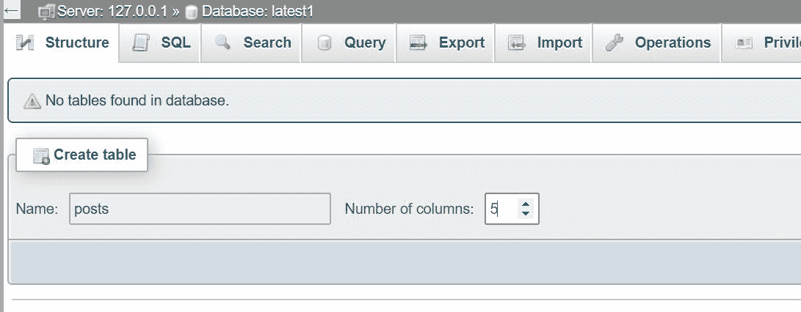
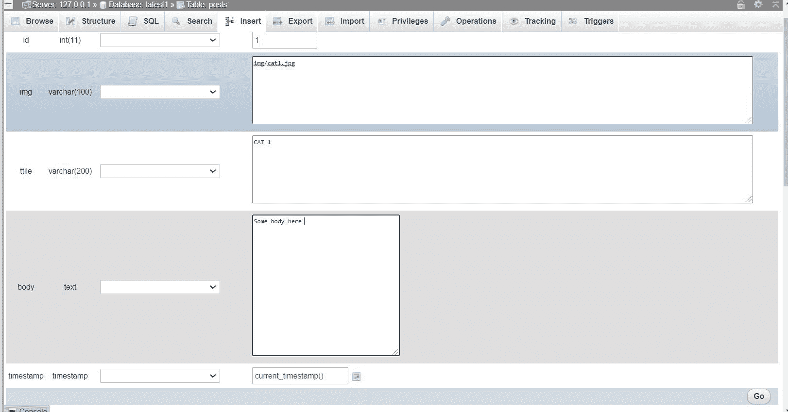
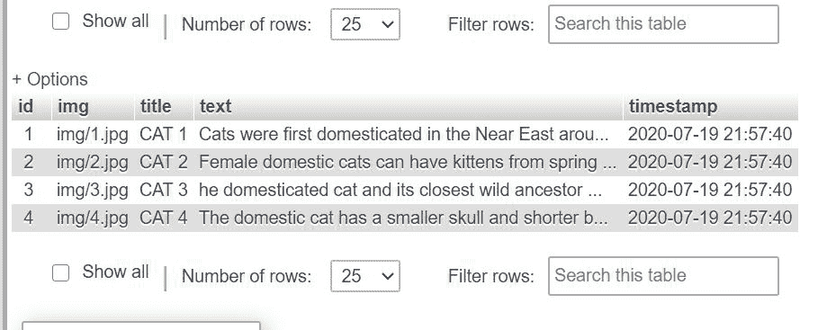
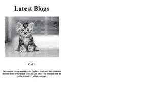

# 如何使用 PHP 和 MySQL 在 DOM 中显示最近的帖子？

> 原文:[https://www . geesforgeks . org/how-display-最近的帖子-in-DOM-using-PHP-MySQL/](https://www.geeksforgeeks.org/how-to-display-recent-posts-in-dom-using-php-and-mysql/)

很多时候，我们非常熟悉网站中的“最新博客”或“最新帖子”。现在，这里有一个简单的解决方案，通过使用 PHP 和 MySQLi 在 DOM 上显示最近的博客。

**要求:**

1.  数据库和表格
2.  XAMPP 服务器
3.  编辑器(本文中的 VS 代码)。

**注意:**代码中需要的引导可以从[引导下载](https://getbootstrap.com/docs/4.5/getting-started/download/)下载。如下所示，在您的 HTML 或 PHP 代码中添加所需的文件。

**代码片段:**下面的代码片段展示了如何在各自的 HTML 或 PHP 代码中添加所需的库。

```phphtml
<head> 
 <link rel="stylesheet" 
  href="https://stackpath.bootstrapcdn.com/
  bootstrap/4.3.1/css/bootstrap.min.css"> 
</head> 
<body> 

<script src="
   https://code.jquery.com/jquery-3.2.1.slim.min.js"
   integrity="sha384-KJ3o2DKtIkvYIK3UENzmM7KCkRr/rE9/
   Qpg6aAZGJwFDMVNA/GpGFF93hXpG5KkN" crossorigin="anonymous">
</script> 
<script src="
   https://stackpath.bootstrapcdn.com/bootstrap/
   4.5.2/js/bootstrap.min.js">
</script> 
</body>
```

**要求:**

1.  数据库和表格。
2.  XAMPP 服务器(下载–[下载服务器](https://www.apachefriends.org/download.html))
3.  编辑器(本文中使用了 VS 代码)。

**后续步骤:**

1.  创建一个数据库，其中的表“帖子”有“id”和需要在页面中显示的内容。
2.  **Steps to create a table in phpmyadmin tool:**
    *   前往 [phpmyadmin](http://localhost/phpmyadmin) 
    *   使用用户名作为“root”，密码作为“”登录。
    *   在 **phpmyadmin** 首页，点击左侧边栏的*新建*创建新数据库。

    

    *   为数据库命名。

    

    *   对于**创建表格**，给出表格的名称及其列数。

    

    *   给出列名和各自的大小或长度。

    

    *   转到**插入**选项卡，插入要存储的值。(这只是一个例子)

    

    添加要显示的值。

    

    员额表

3.  Create a PHP page named **posts.php** and place the folder inside the **htdocs** folder inside **XAMPP**.

    **HTML 代码:**将 [**font-awesome**](https://fontawesome.com/v4.7.0/get-started/) 目录下载到你的工作文件夹中，并参考文件“font-awesome.min.css”的适当位置，如下所示。

    ## 超文本标记语言

    ```phphtml
    <!DOCTYPE html>
    <html lang="en" dir="ltr">

    <head>
        <meta charset="utf-8">
        <meta name="viewport" content=
            "width=device-width, initial-scale=1">

        <link rel="stylesheet" href="
    https://stackpath.bootstrapcdn.com/bootstrap/4.3.1/css/bootstrap.min.css"
            crossorigin="anonymous">

        <!--Font Awesome-->
        <link rel="stylesheet" href="
        path/to/font-awesome/css/font-awesome.min.css">
        <!--Stylesheet-->
        <link href="style.css" rel="stylesheet" />

        <link rel="stylesheet" href="
        https://unpkg.com/flickity@2/dist/flickity.min.css">
    </head>

    <body>

        <!-- Blog Latest -->
        <div class="blog-latest">
            <div class="container">
                <h1 class="blog-secondary-heading text-dark">
                    Latest Blogs
                </h1>

                <div class="main-carousel p-2 " 
                    id="latestCarousel">

                    <div class="carousel-cell p-2">
                        <div class="card  mx-2" 
                            style="width: 18rem;">
                            
                            <div class="card-body">

                                <h5 class="card-title">
                                    <a href="blog-template.php" 
                                    class="blog-link">
                                        CAT 1
                                </h5>
                                </a>
                                <h6 class="card-subtitle 
                                    mt-2 text-muted">
                                    The domestic cat is a member 
                                    of the Felidae,a family that 
                                    had a common ancestor about 
                                    10–15 million years ago. The 
                                    genus Felis diverged from the 
                                    Felidae around 6–7 million 
                                    years ago.
                                </h6>
                            </div>
                        </div>
                    </div>
                </div>
            </div>
        </div>

        <!-- Bootstrap -->
        <script src="https://code.jquery.com/jquery-3.5.1.slim.min.js" 
            integrity=
    "sha384-DfXdz2htPH0lsSSs5nCTpuj/zy4C+OGpamoFVy38MVBnE+IbbVYUew+OrCXaRkfj"
            crossorigin="anonymous">
        </script>

        <script src=
    "https://cdn.jsdelivr.net/npm/popper.js@1.16.0/dist/umd/popper.min.js"
            integrity=
    "sha384-Q6E9RHvbIyZFJoft+2mJbHaEWldlvI9IOYy5n3zV9zzTtmI3UksdQRVvoxMfooAo"
            crossorigin="anonymous">
        </script>

        <script src=
    "https://stackpath.bootstrapcdn.com/bootstrap/4.5.2/js/bootstrap.min.js"
            crossorigin="anonymous">
        </script>

        <script src="
    https://unpkg.com/flickity@2/dist/flickity.pkgd.min.js">
        </script>
    </body>

    </html>
    ```

    **CSS 代码片段:**上面的代码中使用了下面的“style.css”文件来设置 HTML 控件的样式。

    ```phphtml
    *{
      box-sizing: border-box;    
    }

    .card {
        height: 40%;
    }

    a.blog-link {    
        color:black;
        text-decoration:none;
    }

    a.blog-link:hover {    
        color: #adadad;
    }

    .column {
        float:left;
        width:15%;
        padding:2px;
        height:100px;
    }

    .row:after {
        content: "";
        display: table;
        clear: both;
    }
    ```

    **输出:**

    

    此处为单个帖子

4.  现在，我们必须连接到数据库并检索“id”，因此所有与之对应的细节都被添加到 DOM 中。为此，我们将使用 MySQL 查询。
    在这里，我们首先使用*时间戳*对数据库进行排序，使用“order by”子句，然后在数组中推送最新博客的 id，后面是文件“ *retrieve_id.php* ”中的其他 id。

    ## 服务器端编程语言（Professional Hypertext Preprocessor 的缩写）

    ```phphtml
    <?php

    $servername = "localhost";
    $username = "root";
    $password = "";
    $db= "latest";

    $conn = mysqli_connect($servername, $username, $password, $db);

    if (!$conn) {
      die('Could not connect: ' . mysqli_error());  
    }

    /* To sort the id and limit the post by 4 */
    $sql = "SELECT * FROM posts ORDER BY timestamp desc limit 4 "; 
    $result = $conn->query($sql);
    $sqlall= "SELECT * FROM posts ORDER BY timestamp desc";
    $resultall = $conn->query($sqlall);

    $i = 0;

    if ($result->num_rows > 0) {  

        // Output data of each row
        $idarray= array();
        while($row = $result->fetch_assoc()) {
            echo "<br>";  

            // Create an array to store the
            // id of the blogs        
            array_push($idarray,$row['id']); 
        } 
    }
    else {
        echo "0 results";
    }
    ?>
    ```

5.  更改“*posts.php*”文件，并在其中包含上面的“ *retrieve_id.php* ”。将卡片放入一个循环中，循环将根据你想要显示的帖子数量一直运行到一个数字。使用 MySQL 查询，使用在“ *retrieve_id.php* 中创建的“id”数组从数据库表中检索值。

    将 PHP 代码或具有从数据库中检索的值的变量放在 HTML 代码中任何需要的地方。

    **最终代码:**是以上所有步骤和代码的组合。

    ## 服务器端编程语言（Professional Hypertext Preprocessor 的缩写）

    ```phphtml
    <?php 
    include 'retrieve_id.php'
    ?>

    <!DOCTYPE html>
    <html lang="en" dir="ltr">

    <head>
      <meta charset="utf-8">
      <meta name="viewport" content=
        "width=device-width, initial-scale=1">
      <title>Posts</title>

      <link rel="stylesheet" href="style.css">

      <link rel="stylesheet" href=
    "https://stackpath.bootstrapcdn.com/bootstrap/4.3.1/css/bootstrap.min.css"
        crossorigin="anonymous">

      <!--Font Awesome-->
      <link rel="stylesheet" href=
    "path/to/font-awesome/css/font-awesome.min.css">

      <link rel="stylesheet" href=
    "https://unpkg.com/flickity@2/dist/flickity.min.css">
    </head>

    <body>
      <!-- Blog Latest -->

      <div class="blog-latest">
        <div class="container">
          <h1 class="blog-secondary-heading text-dark">
            Latest Blogs</h1>

          <div class="main-carousel p-2 " 
            id="latestCarousel">
            <div class="row">

              <?php 

                for($x = 0; $x < 4; $x++) {

                  // This is the loop to display all
                  // the stored blog posts
                  if(isset($x)) {
                    $query = mysqli_query(
    $conn,"SELECT * FROM `posts` WHERE id = '$idarray[$x]'");

                    $res = mysqli_fetch_array($query);

                    $image = $res['img'];
                    $blog_title = $res['title'];
                    $blog_text = $res['text'];
                    $blog_id = $res['id'];
              ?>
              <div class="column">
                <div class="carousel-cell p-2">
                  <div class="card  mx-2" style="width: 18rem;">
                    " alt="Card image cap">
                    <div class="card-body">
                      <h5 class="card-title">
                        <a href="blog-template.php" class="
                                    blog-link">
                          <?php 
                             echo $blog_title;
                        ?>
                      </h5>
                      </a>
                      <h6 class="card-subtitle mt-2 text-muted">
                        <?php 
                        echo $blog_text;
                      ?>
                      </h6>
                    </div>
                  </div>
                </div>
              </div>
              <?php
                  }
                 }
               ?>
            </div>
          </div>
        </div>
      </div>

      <!-- Bootstrap -->
      <script src="
    https://code.jquery.com/jquery-3.5.1.slim.min.js" 
        integrity=
    "sha384-DfXdz2htPH0lsSSs5nCTpuj/zy4C+OGpamoFVy38MVBnE+IbbVYUew+OrCXaRkfj"
        crossorigin="anonymous">
      </script>

      <script src=
    "https://cdn.jsdelivr.net/npm/popper.js@1.16.0/dist/umd/popper.min.js"
        integrity=
    "sha384-Q6E9RHvbIyZFJoft+2mJbHaEWldlvI9IOYy5n3zV9zzTtmI3UksdQRVvoxMfooAo"
        crossorigin="anonymous">
      </script>

      <script src=
    "https://stackpath.bootstrapcdn.com/bootstrap/4.5.2/js/bootstrap.min.js"
        crossorigin="anonymous">
      </script>

      <script src=
    "https://unpkg.com/flickity@2/dist/flickity.pkgd.min.js">
      </script>
    </body>

    </html>
    ```

    **最终输出:**

    

    最近添加的帖子