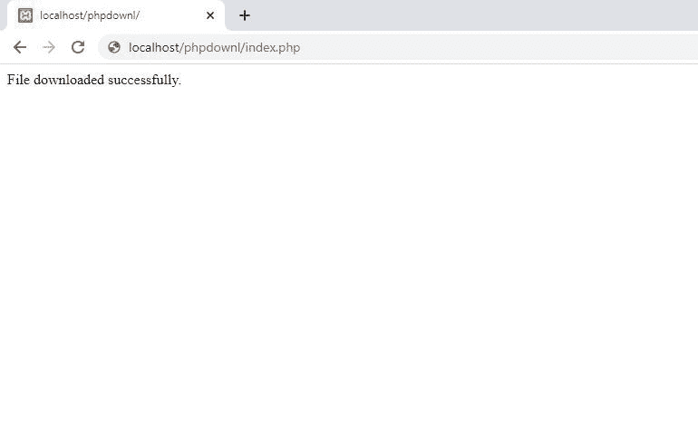

# 如何下载 PHP 中通过 URL 触发的 CSV 文件？

> 原文:[https://www . geesforgeks . org/how-download-a-CSV-file-in-PHP-即通过 url 触发/](https://www.geeksforgeeks.org/how-to-download-a-csv-file-in-php-that-is-triggered-through-a-url/)

**为什么我们需要下载 CSV 文件？**
**逗号分隔值或 CSV 文件**是计算机科学的重要组成部分。训练数据科学模型所需的几乎每个数据集都是 CSV 文件格式。数据集在互联网上随处可见，无论是在某人的个人电脑上还是在服务器上，都必须随时将它们放在自己的机器上。在服务器端，如果一个人可以开发一个服务器端系统，通过任何指向数据集的网址在服务器上轻松下载一个 CSV 文件，他或她的网络模型就可以很容易地用各种数据集进行训练。

**我们如何下载通过 URL 触发的 CSV 文件？**
使用 **PHP** 通过 URL 下载 CSV 文件非常容易，我们将在这里讨论如何实现在服务器端和客户端下载 CSV 文件。

**服务器端下载:**

为此，我们需要一个 PHP 函数 **file_get_contents()** 。这是一个内置的 PHP 函数，可以读取字符串类型的文件内容。该函数使用内存映射技术，在服务器端有一个缓存。因此，对于我们的目的来说，这是一个更好的选择。

**语法:**

```
file_get_contents($path, $include_path, 
        $context, $start, $max_length)
```

**参数:**该函数有一个强制参数， *$path* 和其他参数是可选的。

*   **$path:** 保存相关文件的路径或 URL。
*   **$include_path:** 如果该值设置为 1，它将在 include_path(在 php.ini 中)中搜索文件。
*   **$context:** 用于指定上下文。
*   **$max_length:** 用于限制要读取的字节。

**返回值:**返回从文件中读取的数据，如果过程失败，则返回 False。

**示例 1:** 这个简单的示例演示了如何使用 **file_get_contents()** 函数在服务器端下载 CSV 文件。

```
<?php

// Initialize a file URL to the variable 
$url = 'Sample-Spreadsheet-10-rows.csv';  

// Use basename() function to return
// the base name of file  
$file_name = basename($url); 

// Checking if the file is a
// CSV file or not
$info = pathinfo($file_name);

if ($info["extension"] == "csv") {

    /* Use file_get_contents() function
    to get the file from url and use 
    file_put_contents() function to save
    the file by using base name */   
    if(file_put_contents( $file_name, 
            file_get_contents($url))) { 
        echo "File downloaded successfully";
    }
    else { 
        echo "File downloading failed."; 
    }
}
else echo "Sorry, that's not a CSV file";

?>
```

**输出:**
浏览器在成功执行时显示的响应。


服务器目录中下载的文件。


**对于客户端下载:**通过 PHP 在客户端强制一个 CSV 文件，用一个名为 **[readfile()方法](https://www.geeksforgeeks.org/php-readfile-function/)** 的 PHP 内置函数，简直是小菜一碟。该函数读取一个文件并将其传递到输出缓冲区。

**语法:**

```
readfile($filename, $include_path, $context)
```

**参数:**

*   **$filename:** 要读取的文件的名称。
*   **$include_path:** 如果该值设置为 1，它将在 include_path(在 php.ini 中)中搜索文件。
*   **$context:** 用于指定上下文。

**返回值:**成功时返回读取的字节数，否则返回假。

**例 2:** 下面简单的程序演示了使用 **readfile()** 功能在客户端机器上下载 csv 文件。

```
<?php

$url = "Sample-Spreadsheet-10-rows.csv";

echo "Your file is being checked. <br>";

// Use basename() function to return
// the base name of file
$file_name = basename($url); 

$info = pathinfo($file_name);

// Checking if the file is a
// CSV file or not
if ($info["extension"] == "csv") {

    /* Informing the browser that
    the file type of the concerned
    file is a MIME type (Multipurpose
    Internet Mail Extension type).
    Hence, no need to play the file
    but to directly download it on
    the client's machine. */
    header("Content-Description: File Transfer"); 
    header("Content-Type: application/octet-stream"); 
    header(
    "Content-Disposition: attachment; filename=\""
    . $file_name . "\""); 
    echo "File downloaded successfully";
    readfile ($url);
} 

else echo "Sorry, that's not a CSV file";

exit(); 

?>
```

**输出:**
