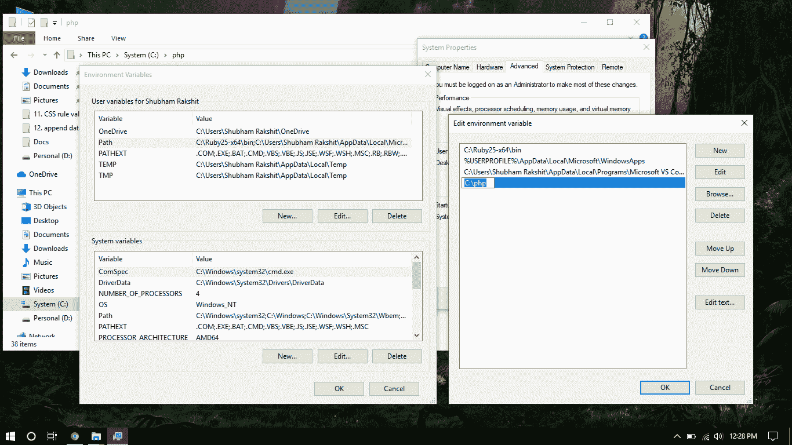
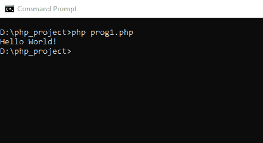

# 如何使用命令行执行 PHP 代码？

> 原文:[https://www . geesforgeks . org/如何使用命令行执行 php 代码/](https://www.geeksforgeeks.org/how-to-execute-php-code-using-command-line/)

**Windows 用户 PHP 安装:**按照步骤在 Windows 操作系统上安装 PHP。

*   **第一步:**首先我们要从它的[官网](https://windows.php.net/download#php-7.3)下载 PHP。我们必须下载。根据我们的系统架构(x86 或 x64)，从相应的部分下载 zip 文件。
*   **步骤 2:** 提取。压缩文件到您的首选位置。建议在一个名为 php(即。C:\php)。
*   **Step 3:** Now we have to add the folder (C:\php) to the Environment Variable Path so that it becomes accessible from the command line. To do so, we have to right click on My Computer or This PC icon, then Choose Properties from the context menu. Then click the Advanced system settings link, and then click Environment Variables. In the section System Variables, we have to find the PATH environment variable and then select and Edit it. If the PATH environment variable does not exist, we have to click New. In the Edit System Variable (or New System Variable) window, we have to specify the value of the PATH environment variable (C:\php or the location of our extracted php files). After that, we have to click OK and close all remaining windows by clicking OK.

    

**面向 Linux 用户的 PHP 安装:**

*   Linux users can install php using the following command.

    ```
    apt-get install php5-common libapache2-mod-php5 php5-cli
    ```

    它将安装 php 与 apache 服务器。更多信息请点击[此处](https://www.php.net/manual/en/install.unix.debian.php)。

    **Mac 用户 PHP 安装:**

    *   Mac users can install php using the following command.

        ```
        curl -s https://php-osx.liip.ch/install.sh | bash -s 7.3
        ```

        它会在你的系统中安装 php。更多信息请点击[此处](https://www.php.net/manual/en/install.macosx.packages.php)。

        安装完 PHP 后，我们就可以通过命令行运行 PHP 代码了。您只需按照步骤使用命令行运行 PHP 程序。

        *   打开终端或命令行窗口。
        *   转到存在 php 文件的指定文件夹或目录。
        *   Then we can run php code code using the following command:

            ```
            php file_name.php
            ```

            

        *   We can also start server for testing the php code using the command line by the following command:

            ```
            php -S localhost:port -t your_folder/
            ```

            

    **注意:**使用 PHP 内置服务器时，根文件夹内的 PHP 文件名称必须是 index.php，其他所有 PHP 文件都可以通过主索引页超链接。

    PHP 是一种专门为 web 开发设计的服务器端脚本语言。您可以通过以下 [PHP 教程](https://www.geeksforgeeks.org/php-tutorials/)和 [PHP 示例](https://www.geeksforgeeks.org/php-examples/)从头开始学习 PHP。