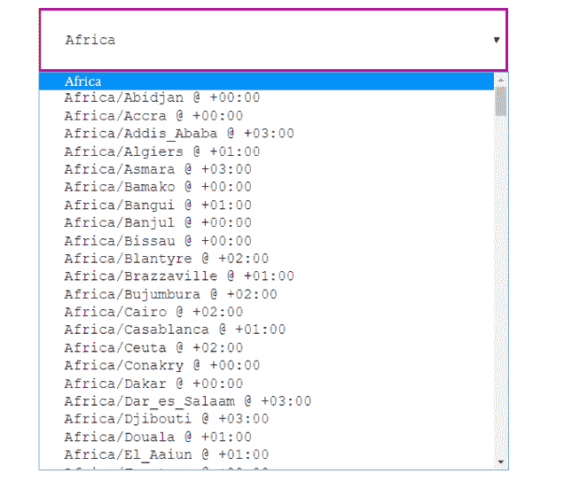

# 如何用 PHP 生成时区下拉列表？

> 原文:[https://www . geesforgeks . org/如何使用-php 生成时区下拉列表/](https://www.geeksforgeeks.org/how-to-generate-a-drop-down-list-of-timezone-using-php/)

函数的作用是:用 PHP 生成时区的下拉列表。此函数用于返回包含所有时区标识符的索引数组。datetimezone 对象作为参数发送给 timezone_identifiers_list()函数，成功时返回索引数组，失败时返回 False。此函数是 DateTizone::LiST identifier()函数的别名。
time zone _ identifier _ list()函数使用其时区常数和国家来独立显示时区列表。
时区常数的可能值为:

> 1 =非洲| 2 =美洲| 4 =南极洲| 8 =北极| 16 =亚洲| 32 =大西洋| 64 =澳大利亚| 128 =欧洲| 256 =印度| 512 =太平洋| 1024 =世界协调时| 2047 =所有| 4095 =所有 _WITH_BC | 4096 =每个 _ 国家

**语法:**

```
*array* timezone_identifiers_list( *int* $datetimezone, *string* $country )
```

**示例 1:** 此示例说明了如何使用时区标识符选择下拉列表中列出的时区。

```
<?php

function select_Timezone($selected = '') {

    // Create a list of timezone
    $OptionsArray = timezone_identifiers_list();
        $select= '<select name="SelectContacts">
                    <option disabled selected>
                        Please Select Timezone
                    </option>';

        while (list ($key, $row) = each ($OptionsArray) ){
            $select .='<option value="'.$key.'"';
            $select .= ($key == $selected ? : '');
            $select .= '>'.$row.'</option>';
        } 

        $select.='</select>';
    return $select;
}

echo select_Timezone() . '<br>';

?>
```

**输出:**


**示例 2:** 此示例说明了如何使用时区标识符选择下拉列表中列出的时区。

```
<?php

// Create a timezone identifiers
$timezone_identifiers = 
    DateTimeZone::listIdentifiers(DateTimeZone::ALL);

echo "<select>";

echo "<option disabled selected>
         Please Select Timezone
      </option>";

$n = 425;
for($i = 0; $i < $n; $i++) {

    // Print the timezone identifiers
    echo "<option value='" . $timezone_identifiers[$i] . 
        "'>" . $timezone_identifiers[$i] . "</option>";
}

echo "</select>";

?>
```

**输出:**


**示例 3:** 本示例使用 DateTizone::list identifier(DateTizone::ALL)和 range()函数说明了带有时区列表的下拉列表。

```
<?php

$timezone_identifiers = 
    DateTimeZone::listIdentifiers(DateTimeZone::ALL);

$Africa = range(0, 51);
$America = range(52, 198);
$Asia = range(211, 292);
$tz_stamp = time();

echo "<center><select style='padding:20px;
     font-family: Courier New, Courier, monospace;
     width: 450px;border:2px solid #a09;
     outline: none;'>";

echo "<option style='color:#FFF;font-family:Cambria;
          background-color:#a09;'><h3>Africa</h3>
      </option>";

foreach($Africa as $x) { 
    $tzone[$x] = date_default_timezone_set(
                        $timezone_identifiers[$x]);

    echo "<option>" . $timezone_identifiers[$x] .
            ' @ ' . date('P', $tz_stamp);"</option>";
}

echo "<option style='color:#FFF;font-family:Cambria;
        background-color:#a09;font-size:15px;'>
        <h3>America</h3></option>";

foreach($America as $x) { 
    $tzone[$x] = date_default_timezone_set(
                        $timezone_identifiers[$x]);

    echo "<option>" . $timezone_identifiers[$x] . 
            ' @ ' . date('P', $tz_stamp);"</option>";
}

echo "<option style='color:#FFF;font-family:Cambria;
        background-color:#a09;font-size:15px;'>
        <h3>Asia</h3></option>";

foreach($Asia as $x) { 
    $tzone[$x] = date_default_timezone_set(
                        $timezone_identifiers[$x]);

    echo "<option>" . $timezone_identifiers[$x] .
            ' @ ' . date('P', $tz_stamp);"</option>";
}

echo "</select></center>";
?>
```

**输出:**


**参考:**[https://www . PHP . net/manual/en/function . time zone-identifiers-list . PHP](https://www.php.net/manual/en/function.timezone-identifiers-list.php)