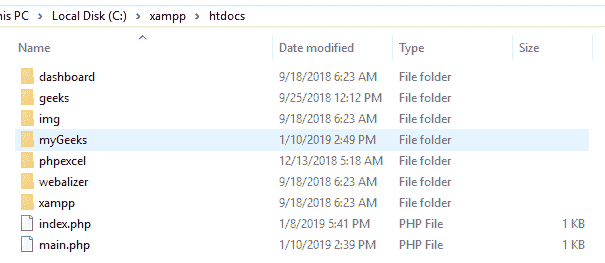
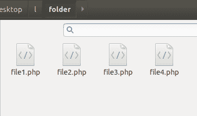
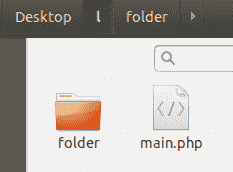
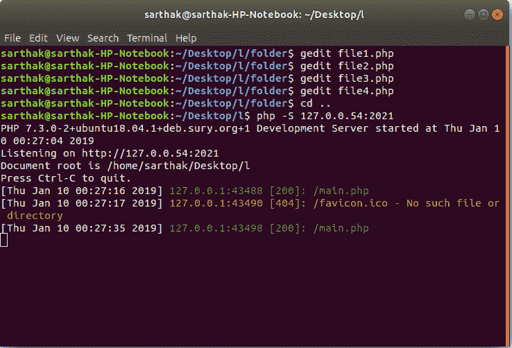

# 如何包含()一个目录下的所有 PHP 文件？

> 原文:[https://www . geeksforgeeks . org/如何从目录中包含所有 php 文件/](https://www.geeksforgeeks.org/how-to-include-all-php-files-from-a-directory/)

给定一个目录中的 PHP 文件列表，任务是包含一个目录中的所有文件。为了同时包含目录中的所有 PHP 文件，需要一个 foreach 循环。

**示例:**这个示例在一个目录中包含四个 PHP 文件(file1.php，file1.php，file1.php，file1.php)。创建一个名为 main.php 的文件，其中包含 PHP 代码来包含文件。

**在文件夹“我的极客”中创建 file1.php:**

```
<?php 
echo "1st File Included Successfully<br>";
?>
```

**在文件夹“我的极客”中创建 file2.php:**

```
<?php 
echo "2nd File Included Successfully<br>";
?>
```

**在文件夹“我的极客”中创建 file3.php:**

```
<?php 
echo "3rd File Included Successfully<br>";
?>
```

**在文件夹“我的极客”中创建 file4.php:**

```
<?php 
echo "4th File Included Successfully<br>";
?>
```

**创建 main.php 外文件夹:**

```
<?php
foreach (glob("folder/*.php") as $filename) {
    include $filename;
}
?>
```

**在 Windows 平台上运行:**

*   **包含所有文件的文件夹:**
    
*   **文件夹 htdocs 包含 main.php 文件:**
    
*   **在浏览器上运行:**
    

**在 Ubuntu 平台上运行:**

*   **包含所有文件的文件夹‘桌面/文件夹’:**
    
*   **文件夹‘桌面’包含 main.php 文件:**
    
*   **在终端上运行:**
    
*   **输出:**
    