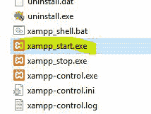
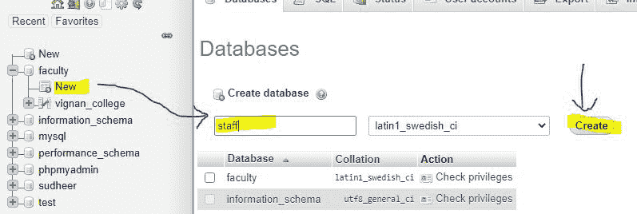
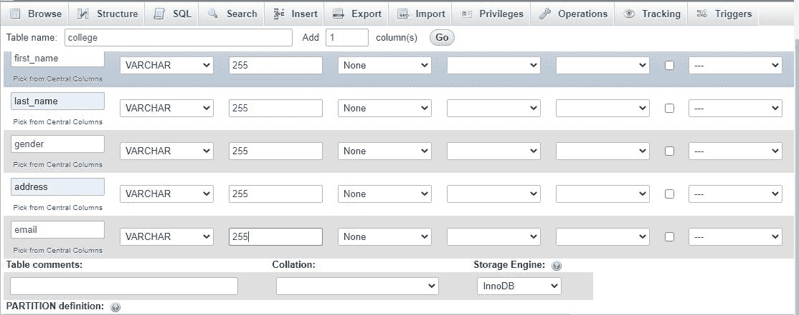
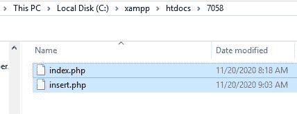
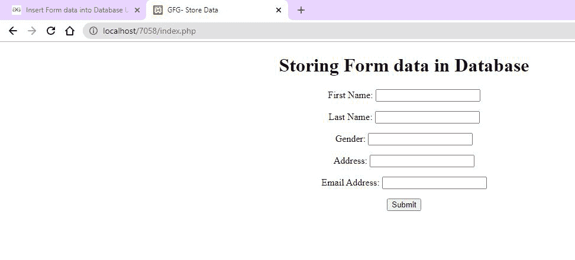
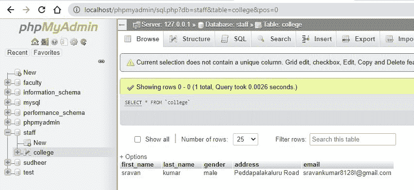

# 如何用 PHP 将表单数据插入数据库？

> 原文:[https://www . geesforgeks . org/如何使用-php 将表单数据插入数据库/](https://www.geeksforgeeks.org/how-to-insert-form-data-into-database-using-php/)

在本文中，我们将把数据存储在数据库中，数据是通过 HTML 表单提交的。

**要求:**

*   [XAMPP 服务器](https://www.geeksforgeeks.org/how-to-install-xampp-on-windows/)(网络服务器)
*   [HTML](https://www.geeksforgeeks.org/html-tutorials/)
*   PHP
*   [MySQL](https://www.geeksforgeeks.org/sql-tutorial/) 的实现

**HTML 表单:**首先我们创建一个需要从键盘获取用户输入的 HTML 表单。 [HTML 表单](https://www.geeksforgeeks.org/html-form-tag/)是使用交互式控件在网络服务器上存储用户信息的文档。一个 HTML 表单包含不同种类的信息，如用户名、密码、联系号码、电子邮件 id 等。

HTML 表单中使用的元素有复选框、输入框、单选按钮、提交按钮等。在这些元素的帮助下，用户的信息被提交到网络服务器上。 ***表单*** 标签用于创建一个 HTML 表单。

**语法:**

```phphtml
<form> Form Elements... </form>
```

或者

要将值传递到下一页，我们使用具有以下语法的页面名称。我们可以使用 GET 或 POST 方法将数据发送到服务器。

```phphtml
<form action=other_page.php  method= POST/GET>
    Form Elements...
</form>
```

[**数据库连接**](https://www.geeksforgeeks.org/php-database-connection/) **:** 相关数据的集合称为数据库。XAMPP 代表跨平台、Apache、MySQL、PHP 和 Perl。它是用于网站开发的简单轻量级本地服务器之一。在 PHP 中，我们可以使用 localhost XAMPP web 服务器连接到数据库。

**语法:**

## 服务器端编程语言（Professional Hypertext Preprocessor 的缩写）

```phphtml
<?php

$servername = "localhost";
$username = "username";
$password = "password";
$dbname = "database_name";

// Create connection
$conn = new mysqli($servername, 
    $username, $password, $dbname);

// Check connection
if ($conn->connect_error) {
    die("Connection failed: " 
        . $conn->connect_error);
}

$sqlquery = "INSERT INTO table VALUES 
    ('John', 'Doe', 'john@example.com')"

if ($conn->query($sql) === TRUE) {
    echo "record inserted successfully";
} else {
    echo "Error: " . $sql . "<br>" . $conn->error;
}
```

**如何获取表单数据:**我们要收集通过 HTML 表单提交的表单数据。PHP **$_REQUEST** 方法是一个 PHP 超级全局变量，用于提交 HTML 表单后收集数据。

**语法:**

## 服务器端编程语言（Professional Hypertext Preprocessor 的缩写）

```phphtml
<?php

if ($_SERVER["REQUEST_METHOD"] == "POST") {

    // collect value of input field
    $data = $_REQUEST['val1'];

    if (empty($data)) {
        echo "data is empty";
    } else {
        echo $data;
    }
}
?>

// Closing the connection.
$conn->close();

?>
```

**完成设计项目的步骤:**

*   启动 XAMPP 服务器。
*   在网络浏览器中打开 localhost/phpmyadmin。
*   创建名称数据库**员工**和名称表**学院**。
*   在记事本的特定文件夹中编写 HTML 和 PHP 代码。
*   通过 HTML 表单提交数据。
*   验证结果。

**详细步骤:**

*   打开 XAMPP 启动 XAMPP 服务器，点击 XAMPP 启动。



*   在网页浏览器中打开***localhost/phpmyadmin***，创建数据库，数据库名称为**五线谱**，点击【创建】。



*   然后创建表名**学院**。


*   输入列，然后单击保存



*   现在打开记事本，开始编写 PHP 代码，保存为 index.php，打开其他记事本，保存为 insert.php 将两个文件保存在 **htdocs** 下的一个文件夹中。



**文件名:index.php**

## 服务器端编程语言（Professional Hypertext Preprocessor 的缩写）

```phphtml
<!DOCTYPE html>
<html lang="en">

<head>
    <title>GFG- Store Data</title>
</head>

<body>
    <center>
        <h1>Storing Form data in Database</h1>

        <form action="insert.php" method="post">

<p>
                <label for="firstName">First Name:</label>
                <input type="text" name="first_name" id="firstName">
            </p>

<p>
                <label for="lastName">Last Name:</label>
                <input type="text" name="last_name" id="lastName">
            </p>

<p>
                <label for="Gender">Gender:</label>
                <input type="text" name="gender" id="Gender">
            </p>

<p>
                <label for="Address">Address:</label>
                <input type="text" name="address" id="Address">
            </p>

<p>
                <label for="emailAddress">Email Address:</label>
                <input type="text" name="email" id="emailAddress">
            </p>

            <input type="submit" value="Submit">
        </form>
    </center>
</body>

</html>
```

**文件名:insert.php**

## 服务器端编程语言（Professional Hypertext Preprocessor 的缩写）

```phphtml
<!DOCTYPE html>
<html>

<head>
    <title>Insert Page page</title>
</head>

<body>
    <center>
        <?php

        // servername => localhost
        // username => root
        // password => empty
        // database name => staff
        $conn = mysqli_connect("localhost", "root", "", "staff");

        // Check connection
        if($conn === false){
            die("ERROR: Could not connect. " 
                . mysqli_connect_error());
        }

        // Taking all 5 values from the form data(input)
        $first_name =  $_REQUEST['first_name'];
        $last_name = $_REQUEST['last_name'];
        $gender =  $_REQUEST['gender'];
        $address = $_REQUEST['address'];
        $email = $_REQUEST['email'];

        // Performing insert query execution
        // here our table name is college
        $sql = "INSERT INTO college  VALUES ('$first_name', 
            '$last_name','$gender','$address','$email')";

        if(mysqli_query($conn, $sql)){
            echo "<h3>data stored in a database successfully." 
                . " Please browse your localhost php my admin" 
                . " to view the updated data</h3>"; 

            echo nl2br("\n$first_name\n $last_name\n "
                . "$gender\n $address\n $email");
        } else{
            echo "ERROR: Hush! Sorry $sql. " 
                . mysqli_error($conn);
        }

        // Close connection
        mysqli_close($conn);
        ?>
    </center>
</body>

</html>
```

**输出:**在浏览器中键入***localhost/7058/index . PHP***，会显示表单。提交表单后，表单数据被提交到数据库中。

  

让我们检查一下我们的数据库



HTML 是网页的基础，通过构建网站和网络应用程序用于网页开发。您可以通过以下 [HTML 教程](https://www.geeksforgeeks.org/html-tutorials/)和 [HTML 示例](https://www.geeksforgeeks.org/html-examples/)从头开始学习 HTML。

PHP 是一种专门为 web 开发设计的服务器端脚本语言。您可以通过以下 [PHP 教程](https://www.geeksforgeeks.org/php-tutorials/)和 [PHP 示例](https://www.geeksforgeeks.org/php-examples/)从头开始学习 PHP。