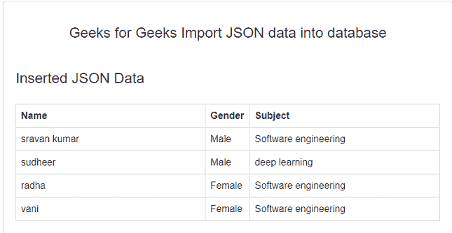
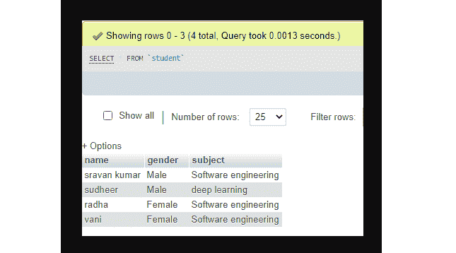

# 如何用 PHP 将 JSON 数据插入 MySQL 数据库？

> 原文:[https://www . geesforgeks . org/how-insert-JSON-data-in-MySQL-database-using-PHP/](https://www.geeksforgeeks.org/how-to-insert-json-data-into-mysql-database-using-php/)

在本文中，我们将看到如何使用 [PHP](https://www.geeksforgeeks.org/php-tutorials/) 通过 [XAMPP](https://www.geeksforgeeks.org/how-to-install-xampp-on-windows/) 服务器将 [JSON](https://www.geeksforgeeks.org/javascript-json/) 数据存储到 [MySQL](https://www.geeksforgeeks.org/mysql-database-current_user-functions/) 数据库中。

**要求:** XAMPP 服务器

**简介:** PHP 是一种开源脚本语言，用于连接数据库和服务器。MySQL 是一种数据库查询语言，用来管理数据库中的数据，与 PHP 进行通信。JSON 代表以窄格式存储数据的 JavaScript 对象表示法。

**结构:**

```php
[{
    "data1": "value1",
    "data2": "value2",
    . . .
    "datan": "value n"
}]
```

**示例:**以下为 *student.json* 文件的内容。

```php
[  
  {  
    "name": "sravan kumar",  
    "gender": "Male",  
    "subject": "Software engineering"  
  },  
  {  
    "name": "sudheer",  
    "gender": "Male",  
    "subject": "deep learning"    
  },  
  {  
    "name": "radha",  
    "gender": "Female",  
    "subject": "Software engineering"  
  },  
  {  
    "name": "vani",  
    "gender": "Female",  
    "subject": "Software engineering"  
  }
]
```

*   **MySQL**[**INSERT**](https://www.geeksforgeeks.org/sql-insert-statement/)**语句:**是用来将数据插入数据库。

**语法:**

```php
INSERT INTO table_name(col1, col2, …, col n) 
    VALUES(value1, value2, …, value n);

```

**使用的方法:**

[**json_decode()方法:**](https://www.geeksforgeeks.org/php-json_decode-function/) 此函数用于将一个 json 对象解码或转换为一个 PHP 对象。

**语法:**

```php
json_decode(string, assoc)
```

*   字符串是 JSON 数据，assoc 是布尔值。
*   如果 assoc 为*真*，数据将被转换为关联数组。
*   *为假*为默认值。

**进场:**

*   启动 XAMPP 服务器
*   在数据库*测试**下创建名为*学生*的表格。***
*   编写 PHP 代码将 JSON 数据插入*学生*表。

**步骤:**

*   启动 XAMPP 服务器。


*   在*测试*数据库下创建一个名为*学生* 的表。


*   创建 JSON 数据并保存为 *xampp-htdocs* 文件夹下的 *college_subjects.json* 。

```php
[  
  {  
    "name": "sravan kumar",  
    "gender": "Male",  
    "subject": "Software engineering"  
  },  
  {  
    "name": "sudheer",  
    "gender": "Male",  
    "subject": "deep learning"    
  },  
  {  
    "name": "radha",  
    "gender": "Female",  
    "subject": "Software engineering"  
  },  
  {  
    "name": "vani",  
    "gender": "Female",  
    "subject": "Software engineering"  
  }
]
```

**PHP 代码:**以下是存储 JSON 数据并显示在网页上的 PHP 代码。

## 服务器端编程语言（Professional Hypertext Preprocessor 的缩写）

```php
<!DOCTYPE html>
<html>

<head>
    <script src=
"https://ajax.googleapis.com/ajax/libs/jquery/2.2.0/jquery.min.js">
    </script>

    <link rel="stylesheet" href=
"https://maxcdn.bootstrapcdn.com/bootstrap/3.3.6/css/bootstrap.min.css" />

    <script src=
"https://maxcdn.bootstrapcdn.com/bootstrap/3.3.6/js/bootstrap.min.js">
    </script>

    <style>
        .box {
            width: 750px;
            padding: 20px;
            background-color: #fff;
            border: 1px solid #ccc;
            border-radius: 5px;
            margin-top: 100px;
        }
    </style>
</head>

<body>
    <div class="container box">
        <h3 align="center">
            Geeks for Geeks Import JSON 
            data into database
        </h3><br />

        <?php

            // Server name => localhost
            // Username => root
            // Password => empty
            // Database name => test
            // Passing these 4 parameters
            $connect = mysqli_connect("localhost", "root", "", "test"); 

            $query = '';
            $table_data = '';

            // json file name
            $filename = "college_subjects.json";

            // Read the JSON file in PHP
            $data = file_get_contents($filename); 

            // Convert the JSON String into PHP Array
            $array = json_decode($data, true); 

            // Extracting row by row
            foreach($array as $row) {

                // Database query to insert data 
                // into database Make Multiple 
                // Insert Query 
                $query .= 
                "INSERT INTO student VALUES 
                ('".$row["name"]."', '".$row["gender"]."', 
                '".$row["subject"]."'); "; 

                $table_data .= '
                <tr>
                    <td>'.$row["name"].'</td>
                    <td>'.$row["gender"].'</td>
                    <td>'.$row["subject"].'</td>
                </tr>
                '; // Data for display on Web page
            }

            if(mysqli_multi_query($connect, $query)) {
                echo '<h3>Inserted JSON Data</h3><br />';
                echo '
                <table class="table table-bordered">
                <tr>
                    <th width="45%">Name</th>
                    <th width="10%">Gender</th>
                    <th width="45%">Subject</th>
                </tr>
                ';
                echo $table_data;  
                echo '</table>';
            }
          ?>
        <br />
    </div>
</body>

</html>
```

**输出:**

*   打开浏览器，输入 *localhost/base.php*



数据库表

*   查看表中插入的数据。



**执行视频:**

<video class="wp-video-shortcode" id="video-585851-1" width="640" height="360" preload="metadata" controls=""><source type="video/mp4" src="https://media.geeksforgeeks.org/wp-content/uploads/20210407164332/bandicam-2021-04-07-17-44-37-700.mp4?_=1">[https://media.geeksforgeeks.org/wp-content/uploads/20210407164332/bandicam-2021-04-07-17-44-37-700.mp4](https://media.geeksforgeeks.org/wp-content/uploads/20210407164332/bandicam-2021-04-07-17-44-37-700.mp4)</video>