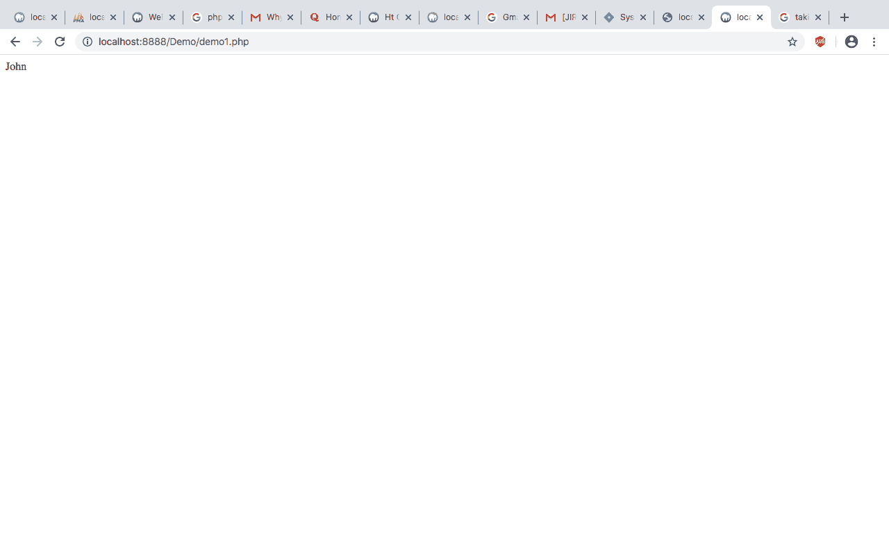

# 如何在 PHP 中使用 file_get_contents 发布数据？

> 原文:[https://www . geesforgeks . org/how-post-data-use-file _ get _ contents-in-PHP/](https://www.geeksforgeeks.org/how-to-post-data-using-file_get_contents-in-php/)

PHP 中的 [file_get_contents()函数](https://www.geeksforgeeks.org/php-file_get_contents-function/)用于读取一个文件的内容，使用 get 进行 HTTP 请求，使用 POST 方法获取 HTTP 响应。可以使用 file_get_contents()函数的$context 参数发出 HTTP POST 请求，该函数将指定的数据发布到使用$path 参数指定的 URL。以下语法用于将请求发送到所需路径:

**语法:**

```
*string* file_get_contents( $path, $include_path, 
                      $context, $offset, $max_length )
```

**参数:**

*   **$path:** 指定发布数据的网址的必需参数。
*   **$include_path:** 它是一个可选参数，指定我们是否希望在读取时在包含的路径中搜索文件。
*   **$context:** 它以 JSON 流的形式指定要发布到 URL 的数据。
*   **$start:** 是一个可选参数，用于指定文件中读取的起始点。
*   **$max_length:** 是一个可选参数，用于指定要读取的字节数。

因此，可以创建内容流，然后将其注入到相应的路径中。数据可以包含键值对形式的信息。上下文流由 stream_context_create($options)函数使用$options 参数中提供的参数创建。参数包含由 GET 或 POST 组成的“方法”和包含必须出现在网址上的数据的“内容”参数。

该代码片段指示使用 file_get_contents()方法将数据发布到 URL 的示例程序。我们创建了一个名为 Demo 的文件夹，其中包含两个文件“index.php”和“demo1.php”，并使用 MAMP 服务器运行它。


以下代码包含在‘index . PHP’中。

```
<?php

// Contains the url to post data
// this is my local server url
// demo is the folder name and
// demo1.php is other file
$url_path = 'http://localhost:8888/Demo/demo1.php';

// Data is an array of key value pairs
// to be reflected on the site
$data = array('Name' => 'John', 'Age' => '24');

// Method specified whether to GET or
// POST data with the content specified
// by $data variable. 'http' is used
// even in case of 'https'

$options = array(
    'http' => array(
    'method' => 'POST',
    'content' => http_build_query($data))
);

// Create a context stream with
// the specified options
$stream = stream_context_create($options);

// The data is stored in the 
// result variable
$result = file_get_contents(
        $url_path, false, $stream);

echo $result;
?>
```

要查看内容中的项目，以下代码是用“demo1.php”编写的:

```
<?php
echo $_POST['Name'];
?> 
```

该代码在指定的 URL 上打印以下输出:
