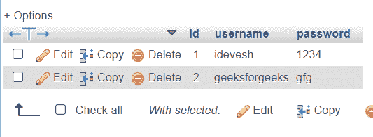

# PHP 中如何防止 SQL 注入？

> 原文:[https://www . geesforgeks . org/如何防止 sql 注入 php/](https://www.geeksforgeeks.org/how-to-prevent-sql-injection-in-php/)

在本文中，我们将讨论如何在 PHP 中防止 SQL 注入。这个话题的前提是你的电脑里有 XAMPP。

#### 为什么会出现 SQL 注入？

SQL 注入是一种代码注入技术，用于攻击数据驱动的应用程序，其中恶意的 SQL 语句被插入到入口字段中执行(例如，将数据库内容转储给攻击者)。

在这种技术中，黑客或攻击者使用一些特殊字符将 SQL 查询转换为新的 SQL 查询，攻击者可以通过输入更多种类的关键字来操纵查询。

让我们制作一个 SQL 注入场景，然后我们将学习如何修复它。

**步骤 1:** 那么，让我们从创建数据库开始–

```
CREATE DATABASE GFG;
```

**步骤 2:** 使用该数据库–

```
USE GFG;
```

**步骤 3:** 在 GFG 数据库中创建登录凭据表–

```
CREATE TABLE users( 
    id int(10) PRIMARY KEY AUTO_INCREMENT,
    username VARCHAR(255),
    password VARCHAR(255)
);
```

**步骤 4:** 将一些数据插入数据库–

```
INSERT INTO users VALUES(1, 'idevesh', '1234');
INSERT INTO users VALUES(2, 'geeksforgeeks', 'gfg');
```



插入后的数据

**步骤 5:** 现在为登录页面创建一个 PHP 脚本–

**(a)创建数据库连接文件(dbconnection.php)–**

## 服务器端编程语言（Professional Hypertext Preprocessor 的缩写）

```
<?php

$db = mysqli_connect("localhost","root","","GFG");

if (mysqli_connect_errno()) {
    echo "Failed to connect to MySQL: " 
        . mysqli_connect_error();
}
?>
```

**(b)** 创建一个 HTML 表单，以便用户输入–

## 服务器端编程语言（Professional Hypertext Preprocessor 的缩写）

```
<!DOCTYPE html>
<html>

<head>
    <title>GFG SQL Injection Article</title>
    <link rel="stylesheet" type="text/css" 
        href="style.css">
</head>

<body>
    <div id="form">
        <h1>LOGIN FOR SQL INJECTION</h1>
        <form name="form" 
            action="verifyLogin.php" method="POST">

            <p>
                <label> USER NAME: </label>
                <input type="text" id="user" 
                    name="userid" />
            </p>

            <p>
                <label> PASSWORD: </label>
                <input type="text" id="pass" 
                    name="password" />
            </p>

            <p>
                <input type="submit" 
                    id="button" value="Login" />
            </p>
        </form>
    </div>
</body>

</html>
```

**(c)** 创建一个文件 verifyLogin.php，用于验证用户输入–

## 服务器端编程语言（Professional Hypertext Preprocessor 的缩写）

```
<?php

include 'dbconnection.php';
$userid = $_POST['userid'];
$password = $_POST['password'];
$sql = 
"SELECT * FROM users WHERE username = '$userid' AND password = '$password'";
$result = mysqli_query($db, $sql) or die(mysqli_error($db));
$num = mysqli_fetch_array($result);

if($num > 0) {
    echo "Login Success";
}
else {
    echo "Wrong User id or password";
}
?>
```

**第 6 步:**现在我们将传递一个中毒的密码进入用户配置文件–

```
Poisoned password = ' or 'a'='a
```

<video class="wp-video-shortcode" id="video-607526-1" width="640" height="360" preload="metadata" controls=""><source type="video/mp4" src="https://media.geeksforgeeks.org/wp-content/uploads/20210513172141/sqlInjection.mp4?_=1">[https://media.geeksforgeeks.org/wp-content/uploads/20210513172141/sqlInjection.mp4](https://media.geeksforgeeks.org/wp-content/uploads/20210513172141/sqlInjection.mp4)</video>

因此，正如您所看到的，上面提到的中毒字符串可以让任何用户登录 geeksforgeeks 用户名，所以这被称为 SQL 注入。

现在为了避免这种类型的 SQL 注入，我们需要使用**MySQL _ real _ escape _ string()**函数来净化密码输入和用户名输入。

mysqli _ real _ escape _ string()函数将特殊字符作为用户的输入，而不将其视为查询用法。

因此，verifyLogin.php 的新代码将是–

## 服务器端编程语言（Professional Hypertext Preprocessor 的缩写）

```
<?php

include 'dbconnection.php';
$userid = $_POST['userid'];
$password = $_POST['password'];

$sanitized_userid = 
    mysqli_real_escape_string($db, $userid);

$sanitized_password = 
    mysqli_real_escape_string($db, $password);

$sql = "SELECT * FROM users WHERE username = '" 
    . $sanitized_userid . "' AND password = '" 
    . $sanitized_password . "'";

$result = mysqli_query($db, $sql) 
    or die(mysqli_error($db));

$num = mysqli_fetch_array($result);

if($num > 0) {
    echo "Login Success";
}
else {
    echo "Wrong User id or password";
}

?>
```

<video class="wp-video-shortcode" id="video-607526-2" width="640" height="360" preload="metadata" controls=""><source type="video/mp4" src="https://media.geeksforgeeks.org/wp-content/uploads/20210513174401/sqlinjection-fixed.mp4?_=2">[https://media.geeksforgeeks.org/wp-content/uploads/20210513174401/sqlinjection-fixed.mp4](https://media.geeksforgeeks.org/wp-content/uploads/20210513174401/sqlinjection-fixed.mp4)</video>