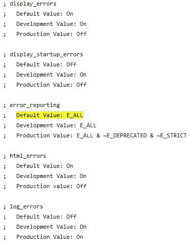
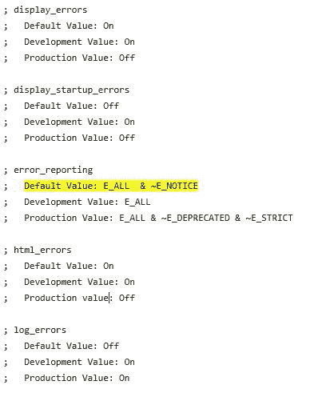

# 如何关闭 PHP notifications？

> 原文:[https://www.geeksforgeeks.org/how-to-turn-off-php-notices/](https://www.geeksforgeeks.org/how-to-turn-off-php-notices/)

在 PHP 中，**notice**是 PHP 项目中一组行或特定行上指示的未定义变量。它通常不会影响或破坏编写的代码的功能。当 PHP 注意到检测到错误时，它将显示如下:

```
PHP Notice: Use of undefined constant name - assumed 'name' in line number
```

PHP 编辑不同于它的版本。因此，关闭 PHP 通知的方法如下:

**方法 1:** 关闭通知是最简单方便的方法。可以通过设置 **php.ini** 文件来禁用通知。在当前文件中，搜索代码行**错误报告**。会出现一行**默认值:E_ALL** ，如下图:


将这一行代码替换为**默认值:E_ALL & ~E_NOTICE** 。

将显示除通知外的所有错误。确保该部分已启用，然后重新启动或刷新 PHP 服务器。在 PHP 的某些版本中，默认值设置为**默认值:E_ALL & ~E_NOTICE** 。

**方法 2:** 要关闭通知，可以在 PHP 文件的代码开头添加一行代码。例如**gfg.php**T4】下面的代码看起来像这样

```
<?php

// Open a file
$file = fopen("gfg.txt", "w") 
        or die("Unable to open file!");

// Store the string into variable
$txt = "GeeksforGeeks \n";

// Write the text content to the file
fwrite($file, $txt);

// Store the string into variable
$txt = "Welcome to Geeks! \n";

// Write the text content to the file
fwrite($file, $txt);

// Close the file
fclose($file);

?>
```

在代码的开头添加这一行:

```
error_reporting(E_ERROR | E_WARNING | E_PARSE);
```

```
<?php

error_reporting(E_ERROR | E_WARNING | E_PARSE); 

// Open a file
$file = fopen("gfg.txt", "w") 
        or die("Unable to open file!");

// Store the string into variable
$txt = "GeeksforGeeks \n";

// Write the text content to the file
fwrite($file, $txt);

// Store the string into variable
$txt = "Welcome to Geeks! \n";

// Write the text content to the file
fwrite($file, $txt);

// Close the file
fclose($file);

?>
```

它将显示错误、警告和编译时解析错误。

**方法 3:** 可以给任意操作符添加“@”使 PHP notifications 在执行当前操作时静音:
**@ $ mid = $ _ POST[' mid ']；**