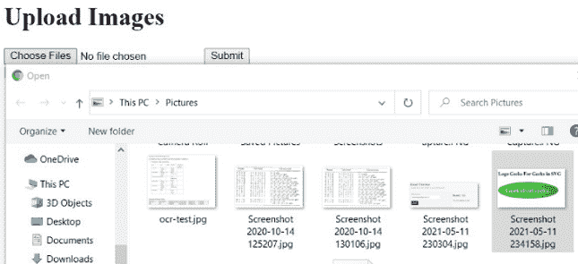

# 如何使用 PHP PDO 在 MySQL 中上传图片？

> 原文:[https://www . geesforgeks . org/如何上传图片-in-mysql-using-php-pdo/](https://www.geeksforgeeks.org/how-to-upload-images-in-mysql-using-php-pdo/)

在本文中，我们将使用 PDO-PHP 将图像上传到 [MySQL 数据库](https://www.geeksforgeeks.org/php-mysql-database-introduction/)并显示在网页上。

**方法:**可以通过创建一个 [MySQL 表](https://www.geeksforgeeks.org/php-mysql-creating-table/)来完成，该表将*图像*作为数据类型 *varchar 的一列。*

在项目中创建一个文件夹，用于存储实际图像。

**注意:**创建一个上传文件夹，用于存储项目文件夹中的图像文件。

**文章内容:**

1.  [表格结构](https://www.geeksforgeeks.org/mysql-common-mysql-queries/)
2.  [数据库配置使用 PDO](https://www.geeksforgeeks.org/how-to-fetch-data-from-database-in-php-pdo-using-loop/) 。
3.  超文本标记语言和 PHP 文件
4.  运行程序
5.  结论

**1。表结构:**以下是 MySQL 查询创建数据库并创建一个表，其中数据库名为*“gfg”*，表名为*“images”。*

```php
CREATE DATABASE gfg;
```

```php
CREATE TABLE images 
(`id` int(11) NOT NULL PRIMARY KEY AUTO_INCREMENT, 
 `name` varchar(80) NOT NULL, `image` varchar(80) NOT NULL) ;
```


**2。使用 PHP PDO 的数据库配置:**

**PHP 代码:**为数据库连接创建一个 PHP*“database _ connection . PHP”*文件。

## 服务器端编程语言（Professional Hypertext Preprocessor 的缩写）

```php
<?php

$server = "localhost";
$username = "root";
$password = "";
$dbname = "gfg";

try {
    $conn = new PDO(
        "mysql:host=$server;dbname=$dbname",
        "$username","$password"
    );

    $conn->setAttribute(
        PDO::ATTR_ERRMODE,
        PDO::ERRMODE_EXCEPTION
    );
}
catch(PDOException $e) {
    die('Unable to connect with the database');
}

?>
```

**3。HTML 和 PHP 文件:**

**index.php:** 在下面的示例中， [*文件元素中的多个*](https://www.geeksforgeeks.org/html-multiple-attribute/) 属性用于启用选择多个文件。

## 服务器端编程语言（Professional Hypertext Preprocessor 的缩写）

```php
<?php 
include "database_connection.php";

if(isset($_POST['submit'])) {

    // Count total files
    $countfiles = count($_FILES['files']['name']);

    // Prepared statement
    $query = "INSERT INTO images (name,image) VALUES(?,?)";

    $statement = $conn->prepare($query);

    // Loop all files
    for($i = 0; $i < $countfiles; $i++) {

        // File name
        $filename = $_FILES['files']['name'][$i];

        // Location
        $target_file = 'upload/'.$filename;

        // file extension
        $file_extension = pathinfo(
            $target_file, PATHINFO_EXTENSION);

        $file_extension = strtolower($file_extension);

        // Valid image extension
        $valid_extension = array("png","jpeg","jpg");

        if(in_array($file_extension, $valid_extension)) {

            // Upload file
            if(move_uploaded_file(
                $_FILES['files']['tmp_name'][$i],
                $target_file)
            ) {

                // Execute query
                $statement->execute(
                    array($filename,$target_file));
            }
        }
    }

    echo "File upload successfully";
}
?>

<!DOCTYPE html>
<html lang="en">

<head>
    <meta charset="UTF-8">
    <meta name="viewport" content=
        "width=device-width, initial-scale=1.0">
    <title>Geeks for geeks Image Upload</title>
</head>

<body>
    <h1>Upload Images</h1>

    <form method='post' action='' 
        enctype='multipart/form-data'>
        <input type='file' name='files[]' multiple />
        <input type='submit' value='Submit' name='submit' />
    </form>

    <a href="view.php">|View Uploads|</a>
</body>

</html>
```

**view.php:** 以下文件是上述代码中使用的*【view . PHP】*文件的代码内容。

## 服务器端编程语言（Professional Hypertext Preprocessor 的缩写）

```php
<?php
include "database_connection.php";
?>

<!DOCTYPE html>
<html lang="en">

<head>
    <meta charset="UTF-8">
    <meta name="viewport" content=
    "width=device-width, initial-scale=1.0">    
</head>

<body>
    <?php

    $stmt = $conn->prepare('select * from images');
    $stmt->execute();
    $imagelist = $stmt->fetchAll();

    foreach($imagelist as $image) {
    ?>

    " 
        title="<?=$image['name'] ?>" 
        width='200' height='200'>
    <?php
    }
    ?> 
</body>

</html>
```

**4。工作程序:**

1.运行本地服务器或任何服务器，并重定向到您的*index.php*页面。


2.选择要上传的文件。



3.点击提交按钮将图像上传到数据库。


4.点击查看上传链接，查看上传的文件。


**5。结论:**可以根据应用需求添加 CSS，更改 HTML。在上面，这个上传图片功能的工作是在 PHP 中实现的。