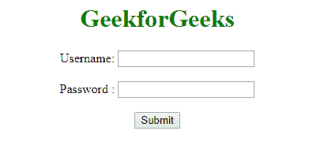

# 如何用 PHP 验证和净化用户输入？

> 原文:[https://www . geesforgeks . org/如何用 php 验证和净化用户输入/](https://www.geeksforgeeks.org/how-to-validate-and-sanitize-user-input-with-php/)

数据验证是 web 开发不可或缺的一部分，尤其是在处理表单时，用户首先输入他们的个人数据，然后将其发送到数据库。以无效格式发送的数据可能会导致数据库管理系统安全问题。黑客经常使用 SQL 注入将恶意的 SQL 命令插入数据库。一旦插入，SQL 注入甚至会破坏数据库。因此，为了保护数据库免受黑客攻击，有必要在将用户输入的数据发送到数据库之前对其进行净化和过滤。

**我们举个 SQL 注入的例子把事情说清楚。**


假设黑客在**【用户名】**输入框输入‘5 = 5’，然后提交数据。条件“5=5”总是正确的。因此，在按下**“提交”**按钮后将执行的 SQL 命令将是

```php
SELECT * FROM registration WHERE UserId = 105 OR 1=1;
```

上面的 SQL 命令是无错误的，因此 MySQL 服务器将执行它。但是，如果登记表包含敏感信息，如信用卡信息或密码，该怎么办。黑客可能通过在用户名输入框中输入“5=5”来获得所有注册用户的信息，然后滥用它。

**为防止此类情况发生，需要对用户数据进行验证和清理:**
功能用于此目的。该函数通常采用两个参数。首先是需要验证的变量，其次是我们要对该变量进行的检查类型。

**让我们看看一些类型的检查及其示例:**

1.  **String Sanitization – FILTER_SANITIZE_STRING:** This removes all the HTML tags from a string. This will sanitize the input string, and block any HTML tag from entering into the database.

    ```php
    <?php
    $geeks= "<h1>GeeksforGeeks Portal</h1>";
    $newgeeks = filter_var($geeks, FILTER_SANITIZE_STRING);
    echo $newgeeks;
    ?>
    ```

    **输出:**

    ```php
    GeeksforGeeks Portal
    ```

    **代码解释:**
    **“极客”**变量在上面的例子中存储了标题“极客 forGeeks Portal”。这个**“极客”**变量然后使用**FILTER _ SAITH _ STRING**进行过滤。过滤后的字符串存储在**“new geeks”**变量中。经过呼应，输出出来的是“极客 forGeeks 门户”。这是因为原始字符串中没有 HTML 标记，因此没有什么可过滤的。

2.  **IP Address Validation – FILTER_VALIDATE_IP:** This filter checks whether the IP address is valid or not.

    ```php
    <?php
    $ipaddr = "126.0.0.5";

    if (!filter_var($ipaddr, FILTER_VALIDATE_IP) === false) {
        echo("Valid IP-address");
    } else {
        echo("Invalid IP-address");
    }
    ?>
    ```

    **输出:**

    ```php
    Valid IP-address
    ```

    **代码说明:**
    发现存储在$ipaddr 变量中的 IP 地址有效。如果“126.2.5”存储在$ipaddr 变量中，那么输出将是“无效的 IP 地址”。这是因为它没有遵循为 IP 地址设计的协议。

3.  **Integer Sanitization – FILTER_VALIDATE_INT:** This filter checks whether a variable is an integer or not.

    ```php
    <?php
    $num = 500;

    if (!filter_var($num, FILTER_VALIDATE_INT) === false) {
        echo("Valid");
    } else {
        echo("Invalid");
    }
    ?>
    ```

    **输出:**

    ```php
    Valid
    ```

    **代码说明:**
    如果$num 是有效整数，代码将输出‘有效’，否则输出‘无效’。这里，500 是一个整数，这就是为什么输出结果是“有效”。

4.  **Email ID Validation – FILTER_SANITIZE_EMAIL and FILTER_VALIDATE_EMAIL:** This filter first removes all the illegal characters from the email and then checks whether the format is valid or not.

    ```php
    <?php
    $em = "career@geeksforgeeks.com";

    // Removing the illegal characters
    $em = filter_var($em, FILTER_SANITIZE_EMAIL);

    //Validating
    if (!filter_var($em, FILTER_VALIDATE_EMAIL) === false) {
        echo("$em is valid");
    } else {
        echo("$em is invalid");
    }
    ?>
    ```

    **输出:**

    ```php
    career@geeksforgeeks.com is valid
    ```

    **代码解释:**
    首先，对存储在$em 变量中的电子邮件进行清理，以删除任何非法字符，如“/ > < )* & ^'等。消毒后，电子邮件将被验证，以检查输入的电子邮件格式是否有效。

5.  **URL Validation – FILTER_SANITIZE_URL:** Like the email filter, this filter also first removes all the illegal characters from the URL and then checks whether the format is valid or not.

    ```php
    <?php
    $url = "https://www.geeksforgeeks.com";

    //url sanitizer
    $url = filter_var($url, FILTER_SANITIZE_URL);

    //url validator
    if (!filter_var($url, FILTER_VALIDATE_URL) === false) {
        echo("$url is valid");
    } else {
        echo("$url is invalid");
    }
    ?>
    ```

    **输出:**

    ```php
    https://www.geeksforgeeks.com is valid
    ```

    **代码解释:**
    存储在$url 变量中的电子邮件首先被净化以删除非法字符。之后，检查网址，以确定网址格式是否有效。