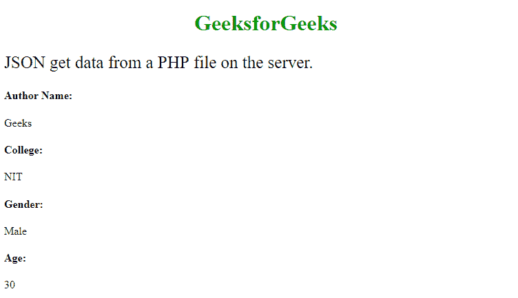

# JavaScript | JSON PHP

> 原文:[https://www.geeksforgeeks.org/javascript-json-php/](https://www.geeksforgeeks.org/javascript-json-php/)

JSON 代表**J**ava**S**script**O**object**N**旋转。它用于交换和存储来自网络服务器的数据。JSON 使用 JavaScript 的对象表示法。JavaScript 对象可以转换成 JSON，并将 JSON 格式的文本接收到 JavaScript 对象中。将 JavaScript 对象转换为 JSON 格式是通过给定的函数完成的:

```php
JSON.stringify(object)
```

将 JSON 格式转换成 JavaScript 对象是通过给定的函数完成的:

```php
JSON.parse(string_format)
```

从服务器交换数据，使用 PHP 作为服务器语言。JSON.parse()函数用于从 php 或任何其他服务器获取数据。为了从服务器接收数据，需要一些 AJAX 语句来检查服务器是否准备好响应来自服务器的数据。如果满足这些条件，那么就可以接收到来自 php 文件的数据。用于从服务器发送和接收数据的协议由下式给出:

```php
XMLHttpRequest()
```

**PHP Files 及其客户端 JavaScript:** 考虑一个 PHP 文件，其中给出了人的对象以及他的个人数据，如姓名、性别、年龄。php 对象的数据将被编码成 JSON 格式。给定的文件由 geeks.php
保存

## 服务器端编程语言（Professional Hypertext Preprocessor 的缩写）

```php
<?php
$myObj = new stdClass();
$myObj->name = "Geeks";
$myObj->college="NIT";
$myObj->gender = "Male";
$myObj->age = 30;

$myJSON = json_encode($myObj);

echo $myJSON;
?>
```

从 php 文件中，数据通过“echo”发送到 JSON，数据将在客户端的 JavaScript 中得到响应。在 php 文件中，json_encode()用于将 php 文件中的对象转换为 json 格式。通过客户端 JavaScript 访问 php 文件中的数据使用以下脚本:

## 超文本标记语言

```php
<!DOCTYPE html>
<html>
<body>
<h1 style = "color:#090; text-align:center;">GeeksforGeeks</h1>
<p style="font-size:25px">
JSON get data from a PHP file on the server.
</p>

<h4>Author Name:</h4>
<p id="name"></p>

<h4>College:</h4>
<p id="college"></p>

<h4>Gender:</h4>
<p id="gender"></p>

<h4>Age:</h4>
<p id="age"></p>

<script>

var xmlhttp = new XMLHttpRequest();

xmlhttp.onreadystatechange = function() {
    if (this.readyState == 4 && this.status == 200) {
        myObj = JSON.parse(this.responseText);
        document.getElementById("name").innerHTML = myObj.name;
        document.getElementById("college").innerHTML = myObj.college;
        document.getElementById("gender").innerHTML = myObj.gender;
        document.getElementById("age").innerHTML = myObj.age;
    }
};
xmlhttp.open("GET", "geeks.php", true);
xmlhttp.send();

</script>

</body>
</html>
```

**输出:**



在脚本**中，JSON . parse(this . responsetext)**函数用于将数据解析为变量，以便它可以从该对象调用值。 **this.response** 用于从正在打印的 php 中获取字符串形式的数据。在给定的代码中，php 对象数据由 JSON 的脚本提取。脚本中的 AJAX 函数正在检查数据是否有响应，如果没有响应，数据将被发送并打印在网页上。**xmlhttp . open(“GET”、“geeks.php”，true)** 函数用于从 php 文件**geeks.php**中获取值。 **xmlhttp.send()** 功能用于将数值发送至 **XMLHttpRequest()** 。
**PHP 数组及其客户端 JavaScript:** 考虑一个由名称数组组成的 PHP 文件。数据被编码到 JSON 中，并将使用“回声”打印。

## 服务器端编程语言（Professional Hypertext Preprocessor 的缩写）

```php
<?php
$arrDay = array(
    "Monday",
    "Tuesday",
    "Wednesday",
    "Thursday",
    "Friday",
    "Saturday",
    "Sunday"
);

$arrJSON = json_encode($arrDay);

echo $arrJSON;
?>
```

让我们使用客户端 JavaScript 从 php 文件的数组中访问数据。为此，让我们考虑下面的 HTML 文件。

## 超文本标记语言

```php
<!DOCTYPE html>
<html>
<body>
<h1 style = "color:#090; text-align:center;">GeeksforGeeks</h1>
<p style="font-size:25px">JSON get data from PHP file,
                   and converting into JavaScript array.</p>

<p style = "font-size:25px;">Second Date of week: </p>

<p id="day"></p>

<script>
var xmlhttp = new XMLHttpRequest();

xmlhttp.onreadystatechange = function() {
    if (this.readyState == 4 && this.status == 200) {
        var myObj = JSON.parse(this.responseText);
        document.getElementById("day").innerHTML = myObj[2];
    }
};
xmlhttp.open("GET", "daylist.php", true);
xmlhttp.send();

</script>

</body>
</html> 
```

**输出:**


数组中的值被解析为 JavaScript 中的变量，该值由上面一行中初始化的 js 数组调用。
**PHP 数据库:**从数据库中检索数据就像从普通的 PHP 文件中获取数据一样。但是要添加的几个附加查询。在这个过程中，首先必须将数据库中的数据提取到 php 文件中，然后 JavaScript 必须获取这些数据，将其投影到客户端服务器中。首先使用 php 创建 MySQL 数据库。下面的程序用于创建一个表，并在其中插入一些数据。

## 服务器端编程语言（Professional Hypertext Preprocessor 的缩写）

```php
<?php
    $conn = new mysqli("localhost", "root", "", "geeksforgeeks");

    $createTable = "create table geeks(names varchar(255))";
    $tableadd = $conn->query($createTable);

    $conn->query("insert into geeks values('Geeks')");
    $conn->query("insert into geeks values('gfg')");
    $conn->query("insert into geeks values('g4g')");

    $conn->close();
?>
```

现在，从其他 php 脚本中提取数据。

## 服务器端编程语言（Professional Hypertext Preprocessor 的缩写）

```php
<?php
    $conn = new mysqli("localhost", "root", "", "geeksforgeeks");
    $result = $conn->query("select names from geeks");

    $output = array();

    $output = $result->fetch_all(MYSQLI_ASSOC);
    $sresult = json_encode($output);

    echo $sresult;
        $conn->close();   
?>
```

现在让我们在客户端 JavaScript 中收集数据并打印结果。

## 超文本标记语言

```php
<!DOCTYPE html>
<html>
    <body>
        <h1 style = "color:#090; text-align:center;">GeeksforGeeks</h1>
        <p style="font-size:25px">
         JSON received the data from the PHP file
        </p>

        <p id="arrayContent"></p>

        <script>
        var obj, xmlhttp;
        xmlhttp = new XMLHttpRequest();
        xmlhttp.onreadystatechange = function() {
            if (this.readyState == 4 && this.status == 200) {
                document.getElementById("arrayContent").innerHTML =
                          this.responseText;
            }
        };
        xmlhttp.open("GET", "data.php", true);
        xmlhttp.send();
        </script>
    </body>
</html>                   
```

下面是发送给客户端并以 JSON 结构打印的结果，因为它没有将值过滤成每个不同的值。
**输出:**


**PHP 循环:**这是数组和上面两个主题(PHP 数组及其客户端 JavaScript & PHP 数据库)的结合，并将其与其中的循环集成在一起。在这个脚本中，JavaScript 将这些值解析成一个变量，这些值由数组调用，在打印每个 myObj 后，它的值将增加到下一个值。

## 超文本标记语言

```php
<!DOCTYPE html>
<html>
    <body>
        <h1 style = "color:#090; text-align:center;">GeeksforGeeks</h1>
        <p style="font-size:25px">
         JSON received the data from the PHP file
        </p>

        <p id="arrayContent"></p>

        <script>
        var obj, xmlhttp, myObj, x, txt = "";
        xmlhttp = new XMLHttpRequest();
        xmlhttp.onreadystatechange = function() {
            if (this.readyState == 4 && this.status == 200) {
                myObj = JSON.parse(this.responseText);
                for (x in myObj) {
                    txt += myObj[x].names + "<br>";
                }
                document.getElementById("arrayContent").innerHTML = txt;
            }
        };
        xmlhttp.open("GET", "data.php", true);
        xmlhttp.send();
        </script>
    </body>
</html>       
```

**输出:**


**PHP Method = POST:** 如果上面的话题已经完全理解了，那就再简单不过了。在下面的语法中会发生变化。在 POST 方法中，参数必须通过 send 方法传递，但是在 GET 方法中，参数可以在发送 php 文件的请求时传递。
T3【GET 法:T5】

```php
open("GET", file_name?x=argument, asyn, username, password)
```

**POST 方法:**

```php
open("POST", file_name, asyn, username, password)
```

参数由 **send(参数)**方法传递，并从 php 发送请求以从服务器访问数据。所以使用函数获取请求如下:

```php
setRequestHeader("Content-type", "application/x-www-form-urlencoded")
```

在 php 文件中，必须添加一个标题:

```php
header("Content-Type: application/json; charset=UTF-8")
```

。
下面给出的 php 文件可以使用**post.php**T3 保存

## 服务器端编程语言（Professional Hypertext Preprocessor 的缩写）

```php
<?php
    header("Content-Type: application/json; charset=UTF-8");
    $obj = json_decode($_POST["x"], false);
    $conn = new mysqli("localhost", "root", "", "geeksforgeeks");
    $result = $conn->query("select names from ".$obj->table);

    $output = array();

    $output = $result->fetch_all(MYSQLI_ASSOC);
    $sresult = json_encode($output);

    echo $sresult;
?>
```

在 php 和 html 文件中完成所有这些之后，它将如下所示:

## 超文本标记语言

```php
<!DOCTYPE html>
<html>
    <body>
        <h1 style = "color:#090; text-align:center;">GeeksforGeeks</h1>
        <p style="font-size:25px">geeks table values:</p>

        <p id="arrayContent"></p>

        <script>
        var obj, xmlhttp, myObj, x, txt = "";
        obj = JSON.stringify({"table":"geeks"});
        xmlhttp = new XMLHttpRequest();
        xmlhttp.onreadystatechange = function() {
            if (this.readyState == 4 && this.status == 200) {
                myObj = JSON.parse(this.responseText);
                for (x in myObj) {
                    txt += myObj[x].names + "<br>";
                }
                document.getElementById("arrayContent").innerHTML = txt;
            }
        };
        xmlhttp.open("POST", "post.php", true);
        xmlhttp.setRequestHeader("Content-type",
                              "application/x-www-form-urlencoded");
        xmlhttp.send("x=" + obj );

        </script>
    </body>
</html>                   
```

**输出:**

