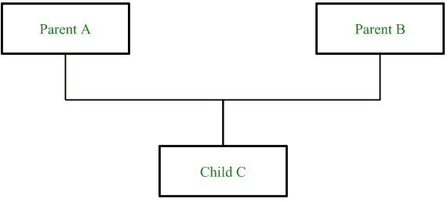

# PHP 中的多重继承

> 原文:[https://www.geeksforgeeks.org/multiple-inheritance-in-php/](https://www.geeksforgeeks.org/multiple-inheritance-in-php/)

多重继承是面向对象编程语言的属性，其中子类或子类可以继承多个父类或超类的属性。

PHP 不支持多重继承，但是通过在 PHP 中使用 Interfaces 或者在 PHP 中使用 Traits 代替 classes，我们可以实现它。

**性状(使用类和性状):**性状是一种能够多重遗传的类。类、案例类、对象和特征都可以扩展不超过一个类，但是可以同时扩展多个特征。
**语法:**

```php
class child_class_name extends parent_class_name {
    use trait_name;
    ...
    ...
    child_class functions
}

```

**示例:**

```php
<?php

// Class Geeks
class Geeks {
  public function sayhello() {
     echo "Hello";
  }
}

// Trait forGeeks
trait forGeeks {
  public function sayfor() {
     echo " Geeks";
  }
}

class Sample extends Geeks {
   use forGeeks;
   public function geeksforgeeks() {
      echo "\nGeeksforGeeks";
  } 
}

$test = new Sample();
$test->sayhello();
$test->sayfor();
$test->geeksforgeeks();
?>
```

**Output:**

```php
Hello Geeks
GeeksforGeeks

```

在上面的程序中,“特征”和父类一起使用。有一个名为“Geeks”的“类”，它包含函数 sayhello()和一个名为“forGeeks”的“特征”，它包含函数 geeksforgeeks()，还有一个名为“Sample”的子类，我们正在创建这个名为“test”的类的对象，并使用它调用一个类和一个特征的所有函数。

**性状(使用多个性状):**多个性状可以通过在 use 语句中列出来插入到一个类中，用逗号分隔。
**语法:**

```php
class child_class_name {
    use trait_name;
    ...
    ...
    child_class functions
}

```

**示例:**

```php
<?php

// trait Geeks
trait Geeks {
  public function sayhello() {
     echo "Hello";
   }
 }

// trait forGeeks
trait forGeeks {
  public function sayfor() {
     echo " Geeks";
   }
 }

class Sample {
  use Geeks;
  use forGeeks;
  public function geeksforgeeks() {
      echo "\nGeeksforGeeks";
   } 
}

$test = new Sample();
$test->sayhello();
$test->sayfor();
$test->geeksforgeeks();
?>
```

**Output:**

```php
Hello Geeks
GeeksforGeeks

```

在上面的程序中“特质”已经被使用。有两个分别包含函数 sayhello()和函数 geeksforgeeks()的名为“Geeks”的特性，还有一个子类“Sample”，我们正在创建这个类的名为“test”的对象，并使用它调用特性的所有函数。

**接口(使用类和接口):**
**语法:**

```php
class child_class_name extends parent_class_name implements interface_name1, ...
```

**示例:**

```php
<?php

class A {
   public function insideA() {
    echo "I am in class A";
     }
}

interface B {
   public function insideB();
}

class Multiple extends A implements B {

    function insideB() {
        echo "\nI am in interface";
    }

    public function insidemultiple() {
    echo "\nI am in inherited class";
    }
}

$geeks = new multiple();
$geeks->insideA();
$geeks->insideB();
$geeks->insidemultiple();
?>
```

**Output:**

```php
I am in class A
I am in interface
I am in inherited class

```

在上面的程序中，接口“B”和类“A”一起被用来实现多重继承。需要记住的重要一点是，不能在接口内部定义函数，应该在子类“Multiple”内部定义。我们正在使用名为“极客”的子类(多个)对象调用所有的函数。

**接口(使用多个接口):**

**语法:**

```php
class child_class_name implements interface_name1, interface_name2, ...
```

**示例:**

```php
<?php

interface C {
   public function insideC();
}

interface B {
   public function insideB();
}

class Multiple implements B, C {

    // Function of the interface B
    function insideB() {
        echo "\nI am in interface B";
    }

    // Function of the interface C
    function insideC() {
        echo "\nI am in interface C";
    }

    public function insidemultiple()
    {
        echo "\nI am in inherited class";
    }
}

$geeks = new multiple();
$geeks->insideC();
$geeks->insideB();
$geeks->insidemultiple();
?>
```

**Output:**

```php
I am in interface C
I am in interface B
I am in inherited class

```

在上面的程序中，使用了多个接口来实现多重继承。在上面的例子中，有两个名为“B”和“C”的接口，它们扮演基类的角色，还有一个名为“Multiple”的子类，我们使用其名为“geeks”的对象调用所有的函数。

PHP 是一种专门为 web 开发设计的服务器端脚本语言。您可以通过以下 [PHP 教程](https://www.geeksforgeeks.org/php-tutorials/)和 [PHP 示例](https://www.geeksforgeeks.org/php-examples/)从头开始学习 PHP。