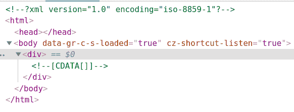
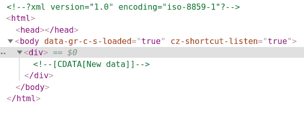

# PHP|DOMCharacterData delete()函数

> Original: [https://www.geeksforgeeks.org/php-domcharacterdata-deletedata-function/](https://www.geeksforgeeks.org/php-domcharacterdata-deletedata-function/)

**DOMCharacterData：：delete eData()函数**是 PHP 中的一个内置函数，用于从节点中删除一定范围的字符。

**语法：**

```php
*void* DOMCharacterData::deleteData( *int* $offset, *int* $count )
```

**参数：**此函数接受上述两个参数，如下所述：

*   **$OFFSET：**指定删除数据的起始位置。
*   **$count：**它指定要删除的字符数。

**返回值：**此函数不返回任何值。

下面给出的程序演示了 PHP 中的**DOMCharacterData：：delete eData()函数**：

**程序 1：**

```php
<?php

// Create a new DOM Document
$dom = new DOMDocument('1.0', 'iso-8859-1');

// Create a div element
$element = $dom->appendChild(new DOMElement('div'));

// Create a DOMCdataSection 
$text = $element->appendChild(
        new DOMCdataSection('DOMC Data'));

// Delete all data
$text->deleteData(0, 9);

echo $dom->saveXML();
?>
```

```php
<?xml version="1.0" encoding="iso-8859-1"?>
<div><![CDATA[]]></div>
```

**输出：**使用 Chrome Developer 工具查看 HTML 或按 Ctrl+U


**程序 2：**

```php
<?php

// Create a new DOM Document
$dom = new DOMDocument('1.0', 'iso-8859-1');

// Create a div element
$element = $dom->appendChild(new DOMElement('div'));

// Create a DOMCdataSection 
$text = $element->appendChild(
        new DOMCdataSection('DOMC Data'));

// Delete all data
$text->deleteData(0, 9);

// Adding new data again
$text->insertData(0, 'New data');

echo $dom->saveXML();
?>
```

```php
<?xml version="1.0" encoding="iso-8859-1"?>
<div><![CDATA[New data]]></div>
```

**输出：**


**引用：**[https://www.php.net/manual/en/domcharacterdata.deletedata.php](https://www.php.net/manual/en/domcharacterdata.deletedata.php)