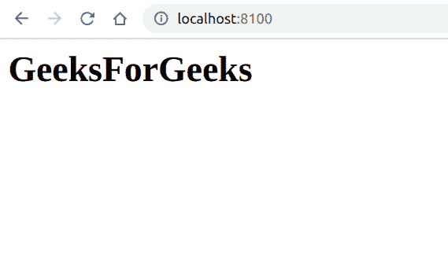

# PHP|DOMCharacterData subingData()函数

> Original: [https://www.geeksforgeeks.org/php-domcharacterdata-substringdata-function/](https://www.geeksforgeeks.org/php-domcharacterdata-substringdata-function/)

**DOMCharacterData：：subingData()函数**是 PHP 中的一个内置函数，用于从节点提取一定范围的数据。

**语法：**

```
*string* DOMCharacterData::substringData( *int* $offset, *int* $count )
```

**参数：**此函数接受上述两个参数，如下所述：

*   **$Offset：**指定要提取的子串的起始位置。
*   **$count：**它指定要提取的字符数。

**返回值：**此函数返回指定的子字符串。

**异常：如果**$OFFSET**为负或大于数据中的 16 位单元数，或者如果**$COUNT**为负，则会引发**DOM_INDEX_SIZE_ERR。

下面给出的程序演示了 PHP 中的**DOMCharacterData：：subingData()函数**：

**程序 1(使用 PHP ECHO 函数查看子串)：**

```
<?php

// Create a new DOM Document
$dom = new DOMDocument('1.0', 'iso-8859-1');

// Create a div element
$element = $dom->appendChild(new DOMElement('div'));

// Create a DOMCdataSection 
$text = $element->appendChild(
        new DOMCdataSection('GeeksForGeeks'));

// Get the substring
$text = $text->substringData(0, 13);

echo $text;
?>
```

发帖主题：Re：Колибри0.7.0

```
GeeksForGeeks
```

**程序 2(创建 HTML 标题以查看子字符串)：**

```
<?php

// Create a new DOM Document
$dom = new DOMDocument('1.0', 'iso-8859-1');

// Create a div element
$element = $dom->appendChild(new DOMElement('div'));

// Create a DOMCdataSection 
$text = $element->appendChild(
        new DOMCdataSection('GeeksForGeeks'));

// Get the substring
$text = $text->substringData(0, 13);

// Create a new element
$elementnew = $dom->createElement('h1', $text);

// We insert the new element
$dom->appendChild($elementnew);

echo $dom->saveXML();
?>
```

**输出：**


**引用：**[https://www.php.net/manual/en/domcharacterdata.substringdata.php](https://www.php.net/manual/en/domcharacterdata.substringdata.php)