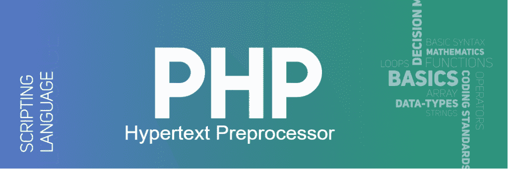

# PHP Full Form

> Original: [https://www.geeksforgeeks.org/php-full-form/](https://www.geeksforgeeks.org/php-full-form/)

**PHP 是超文本预处理器的缩写，早期缩写为 Personal Home Page**。 它是一种通用编程语言，用于设计网站或 Web 应用程序。 它是嵌入 HTML 的服务器端脚本语言，用于开发**静态网站**、**动态网站**或**Web 应用程序**。 它是由**Rasmus Lerdorf**在**1994**创建的。 PHP 的语法类似于 C、C++和 Java。 它管理动态网站的动态内容、数据库、会话、cookie 等。



像*www.facebook.com，www.yahoo.com*这样的网站也是建立在 PHP 之上的。 它可以很容易地嵌入 HTML 文件，HTML 代码也可以写成 PHP 文件。 PHP 和 HTML 的区别在于，PHP 代码在服务器上执行，而 HTML 代码直接在浏览器上呈现。 PHP 代码首先在服务器上执行，然后将结果返回给浏览器。 客户端或浏览器知道的唯一信息是在服务器上执行 PHP 脚本后返回的结果，而不是 PHP 文件中存在的实际 PHP 代码。 此外，PHP 文件还可以支持其他客户端脚本语言，如 CSS 和 JavaScript。
**语法：**和

## PHP

```
<?php
    echo "Welcome to GeeksforGeeks!";
?>
```

**PHP 的特性：**和

*   **开源：**它是一种开源编程语言，因此可以免费下载。
*   **简单性：**因为 PHP 不包括 C/C++这样的库，所以它的结构很简单。 它包含许多预定义的函数来保护您的数据。 PHP 的执行从(<？php)开始，以结束转义序列(？>)结束。
*   **效率：**PHP 4.0 除了会话管理功能外，还使用资源分配机制和面向对象的编程。 它消除了不必要的内存分配。
*   **安全性：**PHP 支持许多加密函数来保护数据。
*   **灵活性：**它是一种非常灵活的语言，因为它可以嵌入 HTML、CSS、JavaScript、XML 和许多其他语言。 此外，PHP 代码可以在任何设备上运行，如手机、平板电脑、笔记本电脑等。
*   **面向对象：**PHP 4.0 中增加了面向对象的编程特性。

**PHP 的优势：**和

*   它受到所有操作系统(如 Windows、Linux、Unix 等)的支持。
*   它与其他编程语言(HTML、CSS、JavaScript 等)集成，并基于数据库。
*   它很容易与数据库连接，以便从数据库中存储和检索数据。 多个数据库也可以与 PHP 集成。
*   与其他编程语言相比，它是速度最快的编程语言。
*   PHP 框架和工具用于保护 Web 应用程序免受外部攻击和安全威胁。

**PHP 的缺点：**和

*   因为 PHP 是开源的，所以它的代码对所有程序员都是可见的。 如果源代码中存在任何错误，则其他程序员可以探究其弱点。
*   它不适合大型应用，因为它的维护很困难。
*   PHP 框架的错误处理不是很好。