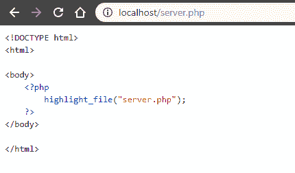
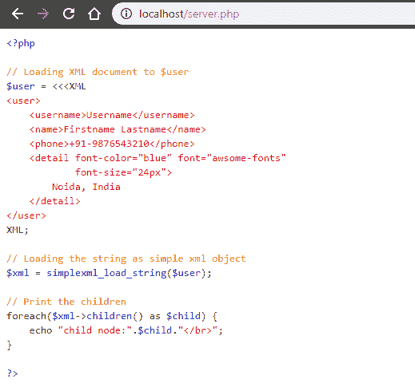

# PHP|Highlight_file()函数

> Original: [https://www.geeksforgeeks.org/php-highlight_file-function/](https://www.geeksforgeeks.org/php-highlight_file-function/)

**Highlight_file()函数**是 PHP 中的一个内置函数，用于突出显示 file 的语法。 语法通过使用 HTML 标记突出显示。

**语法：**

```php
highlight_file( $filename, $return )
```

**参数：**此函数接受上述两个参数，如下所述：

*   **$fileName：**必选参数。 它指定要显示其内容的文件。
*   **$return：**可选布尔型参数。 其默认值为 False。 如果设置为 true，则此函数将以字符串形式返回突出显示的代码，而不是打印出来。

**返回值：**成功返回 TRUE，失败返回 FALSE。 如果$return 设置为 true，它将以字符串形式返回突出显示的代码。

**注：**

*   此函数在 PHP 4.0.0 和更新版本上可用。
*   用于突出显示 PHP 语法的颜色可以使用 ini_set()函数或在 php.ini 文件中设置。
*   使用此功能将显示整个文件，其中可能包括密码等敏感数据。

**示例 1：**使用名称**server.php**保存给定的代码并运行程序。

```php
<!DOCTYPE html>
<html>

<body>
    <?php
        highlight_file("geeks.php");
    ?>
</body>

</html>
```

**输出：**


**示例 2：**使用名称**geeks.php**保存给定的代码。

```php
<?php

// Loading XML document to $user
$user = <<<XML
<user>
    <username>Username</username>
    <name>Firstname Lastname</name>
    <phone>+91-9876543210</phone>
    <detail font-color="blue" font="awsome-fonts" 
            font-size="24px">
        Noida, India
    </detail>
</user>
XML;

// Loading the string as simple xml object
$xml = simplexml_load_string($user);

// Print the children
foreach($xml->children() as $child) {
    echo "child node:".$child."</br>";
}

?>
```

在下面的程序中使用上面的文件名来突出显示语法。

```php
<!DOCTYPE html>
<html>

<body>
    <?php
        highlight_file("geeks.php");
    ?>
</body>

</html>
```

**输出：**


**引用：**[https://php.net/manual/en/function.highlight-file.php](https://php.net/manual/en/function.highlight-file.php)