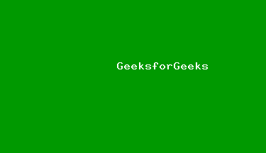

# PHP|imagechar()函数

> Original: [https://www.geeksforgeeks.org/php-imagechar-function/](https://www.geeksforgeeks.org/php-imagechar-function/)

**imagechar()**函数是 PHP 中的一个内置函数，用于水平绘制字符。 此函数用于绘制由 image 标识的图像中字符串的第一个字符及其 x 和 y 轴。 左上角的坐标是(0，0)。

**语法：**

```
bool imagechar( $image, $font, $x, $y, $c, $color )
```

**参数：**此函数接受上述 6 个参数，如下所述：

*   **$image：**它由图像创建函数之一返回，如 imagecreatetruecolor()。 它用于创建图像的大小。
*   **$FONT：**该参数用于设置字符的字体大小。 对于 Latin2 编码的内置字体，它的值可以是 1、2、3、4、5。 数字越大，字体越大，数字越小，字体越小。
*   **$x：**此参数用于设置 x 坐标以打印图像中的字符。
*   **$y：**此参数用于设置 y 坐标以打印图像中的字符。
*   **$c：**打印的字符。
*   **$color：**它设置图像的颜色。 由 imagecolorallocation()函数创建的颜色标识符。

**返回值：**此函数成功时返回 TRUE，失败时返回 FALSE。

下面的程序演示了 PHP 中的**imagechar()**函数：

**程序 1：**

```
<?php

// Creates image size
$image = imagecreate(400, 300);

$string = 'GeeksForGeeks';

// Set background color
$bg = imagecolorallocate($image, 0, 153, 0);

// Set text color.
$white = imagecolorallocate($image, 255, 255, 255);

// Prints a white G character
imagechar($image, 5, 190, 150, $string, $white);

header('Content-type: image/png');
imagepng($image);

?>
```

**输出：**


**程序 2：**

```
<?php

// Create image size
$image = imagecreate(400, 300);

$string = 'GeeksforGeeks';

// Find string length
$len = strlen($string);

// Set background color
$bg = imagecolorallocate($image, 0, 153, 0);

// Set text color
$white = imagecolorallocate($image, 255, 255, 255);

for($i = 0; $i < $len; $i++)

    // Prints white character of string using loop
    imagechar($image, 6, 190 + 10 * $i, 150, $string[$i], $white);

header('Content-type: image/png');
imagepng($image);

?>
```

**输出：**


**相关文章：**

*   [PHP|imagestring()函数](https://www.geeksforgeeks.org/php-imagestring-function/)
*   [PHP|imagecreate()函数](https://www.geeksforgeeks.org/php-imagecreate-function/)

**引用：**[http://php.net/manual/en/function.imagechar.php](http://php.net/manual/en/function.imagechar.php)