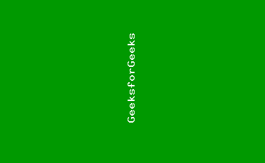

# PHP|imagecharup()函数

> Original: [https://www.geeksforgeeks.org/php-imagecharup-function/](https://www.geeksforgeeks.org/php-imagecharup-function/)

**imagecharup()**函数是 PHP 中的一个内置函数，用于垂直绘制字符。 此函数用于绘制图像中字符串的第一个字符，该图像由图像及其 x 和 y 轴标识。 左上角的坐标是(0，0)。

**语法：**

```
*bool* imagecharup( $image, $font, $x, $y, $c, $color )
```

**参数：**此函数接受上述 6 个参数，如下所述：

*   **$image：**它由图像创建函数之一返回，如 imagecreatetruecolor()。 它用于创建图像的大小。
*   **$FONT：**该参数用于设置字符的字体大小。 对于 Latin2 编码的内置字体，它的值可以是 1、2、3、4、5。 数字越大，字体越大，数字越小，字体越小。
*   **$x：**此参数用于设置 x 坐标以打印图像中的字符。
*   **$y：**此参数用于设置 y 坐标以打印图像中的字符。
*   **$c：**打印的字符。
*   **$color：**它设置颜色。 由 imagecolorallocation()函数创建的颜色标识符。

**返回值：**此函数成功时返回 TRUE，失败时返回 FALSE。

下面的程序演示了 PHP 中的**imagecharup()**函数。

**程序 1：**

```
<?php

// Creates the image size
$image = imagecreate(400, 300);

$string = 'GeeksForGeeks';

// Set background color
$bg = imagecolorallocate($image, 0, 153, 0);

// Set character color
$white = imagecolorallocate($image, 255, 255, 255);

// prints a white G character
imagecharup($image, 5, 190, 150, $string, $white);

header('Content-type: image/png');
imagepng($image);

?>
```

**输出：**


**程序 2：**

```
<?php

// Create image size
$image = imagecreate(400, 300);

$string = 'GeeksforGeeks';

// Find string length
$len = strlen($string);

// Set background color
$bg = imagecolorallocate($image, 0, 153, 0);

// Set character color
$white = imagecolorallocate($image, 255, 255, 255);

// Use loop to print string
for($i = 0; $i < $len; $i++)

    // Prints a white character $len times
    imagecharup($image, 6, 190, 230 - 10 * $i, $string[$i], $white);

header('Content-type: image/png');
imagepng($image);

?>
```

**输出：**


**相关文章：**

*   [PHP|imagecolorat()函数](https://www.geeksforgeeks.org/php-imagecolorat-function/)
*   [PHP|ImageEllse()函数](https://www.geeksforgeeks.org/php-imageellipse-function/)

**引用：**[http://php.net/manual/en/function.imagecharup.php](http://php.net/manual/en/function.imagecharup.php)