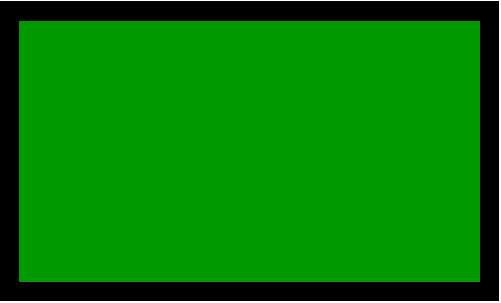
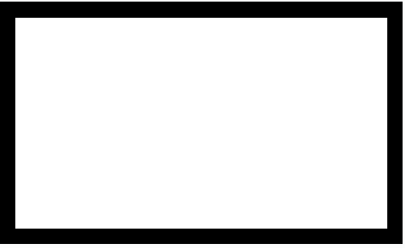

# PHP|imagefilledrectangle()函数

> Original: [https://www.geeksforgeeks.org/php-imagefilledrectangle-function/](https://www.geeksforgeeks.org/php-imagefilledrectangle-function/)

**imagefilledrectangle()**函数是 PHP 中的一个内置函数，用于创建填充矩形。 此函数用于在图像中创建用给定颜色填充的矩形。 图像的左上角是(0，0)。

**语法：**

```
*bool* imagefilledrectangle( $image, $x1, $y1, $x2, $y2, $color )
```

**参数：**此函数接受上述 6 个参数，如下所述：

*   **$image：**它由图像创建函数之一返回，如 imagecreatetruecolor()。 它用于创建图像的大小。
*   **$x1：**此参数用于设置点 1 的 x 坐标。
*   **$y1：**此参数用于设置点 1 的 y 坐标。
*   **$x2：**此参数用于设置点 2 的 x 坐标。
*   **$y2：**此参数用于设置点 2 的 y 坐标。
*   **$COLOR：**此参数包含填充的颜色标识符。 使用 imagecolorallocation()函数创建的颜色标识符。

**返回值：**此函数成功时返回 True，失败时返回 False。

下面的程序演示了 PHP 中的**imagefilledRectangle()**函数：

**程序 1：**

```
<?php

// Create an image of given size
$image = imagecreatetruecolor(500, 300);
$green = imagecolorallocate($image, 0, 153, 0);

// Draw the rectangle of green color
imagefilledrectangle($image, 20, 20, 480, 280, $green);

// Output image in png format
header("Content-type: image/png");
imagepng($image);

// Free memory
imagedestroy($image);
?>
```

**输出：**


**程序 2：**

```
<?php

// Create an image of given size
$image = imagecreatetruecolor(500, 300);
$white = imagecolorallocate($image, 255, 255, 255);

// Draw the rectangle of white color
imagefilledrectangle($image, 20, 20, 480, 280, $white);

// Output image
header("Content-type: image/png");
imagepng($image);

// Free memory
imagedestroy($image);
?>
```

**输出：**


**相关文章：**

*   [PHP|imagepolygon()函数](https://www.geeksforgeeks.org/php-imagepolygon-function/)
*   [PHP|imagefilledellipse()函数](https://www.geeksforgeeks.org/php-imagefilledellipse-function/)
*   [PHP|图像颜色分配()函数](https://www.geeksforgeeks.org/php-imagecolorallocate-function/)

**引用：**[http://php.net/manual/en/function.imagefilledrectangle.php](http://php.net/manual/en/function.imagefilledrectangle.php)