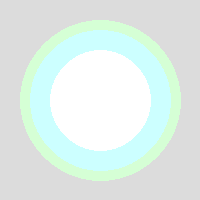
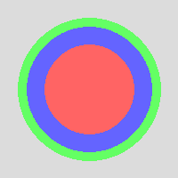

# PHP|ImagelayerEffect()函数

> Original: [https://www.geeksforgeeks.org/php-imagelayereffect-function/](https://www.geeksforgeeks.org/php-imagelayereffect-function/)

函数的作用是：**imagelayerffect()**是 PHP 的内置函数，用于设置 Alpha 混合标志以使用分层效果。 此函数成功时返回 True，失败时返回 False。

**语法：**

```
*bool* imagelayereffect( $image, $effect )
```

**参数：**此函数接受上述两个参数，如下所述：

*   **$image：**它由图像创建函数之一返回，如 imagecreatetruecolor()。 它用于创建图像的大小。
*   **$Effect：**该参数设置 Effect 常量的值。 效果常量的值如下所示：
    *   **img_Effect_Replace：**设置像素替换。 它等效于将 True 传递给 imagelphablating()函数。
    *   **img_Effect_ALPHABLEND：**设置正常像素混合。 它等效于将 false 传递给 imagelphablating()函数。
    *   **img_Effect_Normal：**与 img_Effect_ALPHABLEND 相同。
    *   **img_Effect_overlay：**这是一种效果，其中黑色背景像素将保持黑色，白色背景像素将保持白色，但灰色背景像素将采用前景像素的颜色。
    *   **img_Effect_Multiply：**它设置乘法效果。

**返回值：**此函数成功时返回 True，失败时返回 False。

下面的程序演示了 PHP 中的**imagelayerEffect()**函数：

**程序 1：**

```
<?php
// Setup an image
$im = imagecreatetruecolor(200, 200);

// Set a background
imagefilledrectangle($im, 0, 0, 200, 200, imagecolorallocate($im, 220, 220, 220));

// Apply the overlay alpha blending flag
imagelayereffect($im, IMG_EFFECT_OVERLAY);

// Draw two grey ellipses
imagefilledellipse($im, 100, 100, 160, 160, imagecolorallocate($im, 100, 255, 100));
imagefilledellipse($im, 100, 100, 140, 140, imagecolorallocate($im, 100, 100, 255));
imagefilledellipse($im, 100, 100, 100, 100, imagecolorallocate($im, 255, 100, 100));

// Output
header('Content-type: image/png');

imagepng($im);
imagedestroy($im);
?>
```

**输出：**


**程序 2：**

```
<?php
// Setup an image
$im = imagecreatetruecolor(200, 200);

// Set a background
imagefilledrectangle($im, 0, 0, 200, 200, imagecolorallocate($im, 220, 220, 220));

// Apply the overlay alpha blending flag
imagelayereffect($im, IMG_EFFECT_REPLACE);

// Draw two grey ellipses
imagefilledellipse($im, 100, 100, 160, 160, imagecolorallocate($im, 100, 255, 100));
imagefilledellipse($im, 100, 100, 140, 140, imagecolorallocate($im, 100, 100, 255));
imagefilledellipse($im, 100, 100, 100, 100, imagecolorallocate($im, 255, 100, 100));

// Output
header('Content-type: image/png');

imagepng($im);
imagedestroy($im);
?>
```

**输出：**


**引用：**[http://php.net/manual/en/function.imagelayereffect.php](http://php.net/manual/en/function.imagelayereffect.php)