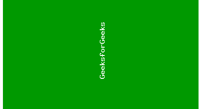

# PHP|ImageStringup()函数

> Original: [https://www.geeksforgeeks.org/php-imagestringup-function/](https://www.geeksforgeeks.org/php-imagestringup-function/)

函数的作用是：**imagestring up()**函数是 PHP 中的一个内置函数，用于垂直绘制字符串。

**语法：**

```
*bool* imagestringup( $image, $font, $x, $y, $string, $color )
```

**参数：**此函数接受上述 6 个参数，如下所述：

*   **$image：**imagecreatetruecolor()函数用于创建给定大小的空白图像。
*   **$FONT：**该参数用于设置字体大小。 Latin2 编码中的内置字体可以是 1、2、3、4、5 或使用 imageloadfont()函数注册的其他字体标识符。
*   **$x：**此参数用于保存左上角的 x 坐标。
*   **$y：**此参数用于保存左上角的 y 坐标。
*   **$string：**此参数用于保存要写入的字符串。
*   **$COLOR：**此参数用于保存图像的颜色。

**返回值：**此函数成功时返回 True，失败时返回 False。

下面的程序演示了 PHP 中的**ImageStringup()**函数：

**程序 1：**

```
<?php

// Create a 400*300 image
$im = imagecreatetruecolor(400, 300);

// Set the background color of image 
$background_color = imagecolorallocate($im,  0, 153, 0); 

// Fill background with above selected color 
imagefill($im, 0, 0, $background_color); 

// Write the text
$textcolor = imagecolorallocate($im, 255, 255, 255);
imagestringup($im, 6, 195, 200, 'GeeksforGeeks', $textcolor);

// Output the picture to the browser 
header('Content-type: image/png'); 

imagepng($im); 
?>
```

**输出：**


**程序 2：**

```
<?php

// Create a 400*300 image
$im = imagecreatetruecolor(400, 300);

// Set the background color of image 
$background_color = imagecolorallocate($im,  0xFF, 0xFF, 0xFF); 

// Fill background with above selected color 
imagefill($im, 0, 0, $background_color); 

// Write the text
$textcolor = imagecolorallocate($im, 0, 153, 0);
imagestringup($im, 6, 195, 200, 'GeeksforGeeks', $textcolor);

// Output the picture to the browser 
header('Content-type: image/png'); 

imagepng($im); 
?>
```

**输出：**


**引用：**[http://php.net/manual/en/function.imagestringup.php](http://php.net/manual/en/function.imagestringup.php)