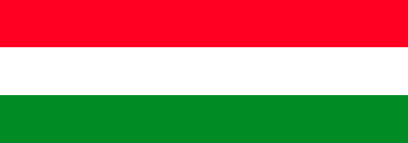

# PHP|Imagick appendImages()函数

> Original: [https://www.geeksforgeeks.org/php-imagick-appendimages-function/](https://www.geeksforgeeks.org/php-imagick-appendimages-function/)

**Imagick：：appendImages()**函数是 PHP 中的一个内置函数，用于追加图像集。 此函数用于将一组图像附加到单个图像中。

**语法：**

```php
Imagick::appendImages( $stack )
```

**参数：**此函数接受单个参数**$STACK**，这是必需的。 如果堆栈值为 False，则图像从左到右堆叠，如果堆栈值为 True，则图像从上到下堆叠。 堆栈的默认值为 False。

**返回值：**此函数在成功时返回 Imagick 实例。

**错误/异常：**此函数在出错时引发 ImagickException。

下面的程序演示了 PHP 中的**Imagick：：appendImages()**函数：

**程序 1：**

```php
<?php

/* Create new imagick object */
$image = new Imagick();

/* create red, green and blue images */
$image->newImage(600, 70, "red");
$image->newImage(600, 70, "white");
$image->newImage(600, 70, "green");

/* Append the images into one */
$image->resetIterator();
$combined = $image->appendImages(true);

/* Output the image */
$combined->setImageFormat("png");
header("Content-Type: image/png");
echo $combined;
?>
```

**输出：**


**程序 2：**

```php
<?php

/* Create new imagick object */
$image = new Imagick();

/* create red, green and blue images */
$image->newImage(210, 200, "red");
$image->newImage(210, 200, "white");
$image->newImage(210, 200, "green");

/* Append the images into one */
$image->resetIterator();
$combined = $image->appendImages(false);

/* Output the image */
$combined->setImageFormat("png");
header("Content-Type: image/png");
echo $combined;
?>
```

**输出：**


**相关文章：**

*   [PHP|Imagick AdaptiveBlurImage()函数](https://www.geeksforgeeks.org/php-imagickadaptiveblurimage-function/)
*   [PHP|Imagick AdaptiveSharpenImage()函数](https://www.geeksforgeeks.org/php-imagick-adaptivesharpenimage-function/)

**引用：**[http://php.net/manual/en/imagick.appendimages.php](http://php.net/manual/en/imagick.appendimages.php)