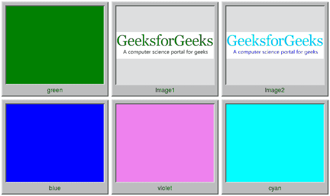

# PHP|Imagick montageImage()函数

> Original: [https://www.geeksforgeeks.org/php-imagick-montageimage-function/](https://www.geeksforgeeks.org/php-imagick-montageimage-function/)

**Imagick：：montageImage()函数**是 PHP 中的一个内置函数，用于通过组合许多分离的图像来创建合成图像。 此函数可选择将图像合成为带有 image 名称的平铺形式。

**语法：**

```php
*Imagick* Imagick::montageImage( *ImagickDraw* $draw, *string* $tile_geometry, 
                      *string* $thumbnail_geometry, *int* $mode, string *$frame* )
```

**参数：**此函数接受上述五个参数，如下所述：

*   **$Draw：**它指定字体名称、大小和颜色。
*   **$TILE_GEOMETRY：**它指定每行和每页的平铺数量。
*   **$THMBAILE_GEOMETRY：**它指定每个缩略图的首选图像大小和边框大小。
*   **$mode：**它包含与[MONTAGEMODE 常量](https://www.php.net/manual/en/imagick.constants.php#imagick.constants.montagemode-frame)之一相对应的整数值。
*   **$frame：**它指定是否用装饰性边框包围图像。

所有 MONTAGEMODE 常量列表如下：

*   ==同步，由 Elderman 更正==@ELDER_MAN
*   Imagick：：MONTAGEMODE_FURRAME(2)
*   Imagick：：Montagemode_Conatenate(3)

**返回值：**如果成功，此函数将返回一个新的 Imagick 对象。

**异常：**此函数在出错时引发 ImagickException。

下面的程序演示了 PHP 中的**Imagick：：montageImage()函数**：

**程序 1：**

```php
<?php

// Create a new Imagick object
$imagick = new Imagick(
'https://media.geeksforgeeks.org/wp-content/uploads/geeksforgeeks-13.png');

// Create a montage
$result = $imagick->montageImage(new ImagickDraw(), '4x2',
        '150x100+2+2', imagick::MONTAGEMODE_UNFRAME, "2x2+3+3");

// Display the image
$result->setImageFormat('png');
header("Content-Type: image/png");

echo $result->getImageBlob();
?>
```

**输出：**


**程序 2：**

```php
<?php

// Create a new Imagick object
$imagick = new Imagick();

// Create a new Image with label
$imagick->newimage(1000, 800, 'green');
$imagick->labelImage('green');

// Add a new Image with label
$imagick->addImage(new imagick(
'https://media.geeksforgeeks.org/wp-content/uploads/geeksforgeeks-13.png'));

$imagick->labelImage('Image1');

// Add a new Image with label
$imagick->addImage(new imagick(
'https://media.geeksforgeeks.org/wp-content/uploads/20190918234528/colorize1.png'));

$imagick->labelImage('Image2');

// Create a new Image with label
$imagick->newimage(1000, 800, 'blue');
$imagick->labelImage('blue');

// Create a new Image with label
$imagick->newimage(1000, 800, 'violet');
$imagick->labelImage('violet');

// Create a new Image with label
$imagick->newimage(1000, 800, 'cyan');
$imagick->labelImage('cyan');

// Create a montage
$result = $imagick->montageImage(new ImagickDraw(), "3x2+0+0", 
     "200x160+3+3>", Imagick::MONTAGEMODE_CONCATENATE, "10x10+2+2");

// Display the image
$result->setImageFormat('png');
header("Content-Type: image/png");

echo $result->getImageBlob();
?>
```

**输出：**


**引用：**[https://www.php.net/manual/en/imagick.montageimage.php](https://www.php.net/manual/en/imagick.montageimage.php)