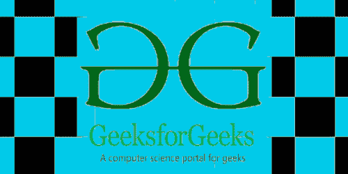

# PHP|Imagick opaquePaintImage()函数

> Original: [https://www.geeksforgeeks.org/php-imagick-opaquepaintimage-function/](https://www.geeksforgeeks.org/php-imagick-opaquepaintimage-function/)

**Imagick：：opaquePaintImage()函数**是 PHP 中的一个内置函数，用于将目标颜色替换为与目标颜色匹配的任何像素的指定填充颜色值。

**语法：**

```php
*bool* Imagick::opaquePaintImage( $target, $fill, $fuzz,
                   $invert, $channel = Imagick::CHANNEL_DEFAULT ] )

```

**参数：**此函数接受上述五个参数，如下所述：

*   **$target：**此参数保存需要更改的 ImagickPixel 对象或目标颜色。
*   **$Fill：**此参数保存替换的颜色。
*   **$fuzz：**此参数保存浮点类型的模糊量。
*   **$INVERT：**在 0 和 1 之间切换，其中 0 表示正常，1 表示反转。
*   **$channel：**此参数保存 Imagick 通道常量，这些常量提供对通道模式有效的任何通道常量。 可以使用按位运算符组合多个通道。

**返回值：**此函数成功时返回 TRUE，失败时返回 FALSE。

以下程序说明了 PHP 中的 Imagick：：opaquePaintImage()函数：

**程序 1：**

```php
<?php

// Image Path
$imagePath = 
"https://cdncontribute.geeksforgeeks.org/wp-content/uploads/geeksforgeeks-9.png";

// Target color
$target = 'rgb(255, 255, 255)';

// Replacing target color with another color
$fill = 'rgb(255, 234, 128)';
$fuzz = '0.1';

// Initialize invert variable
$invert = '0';

$imagick = new \Imagick($imagePath);

// Set the image format
$imagick->setimageformat('png');

$imagick->opaquePaintImage(
    $target, $fill, $fuzz * \Imagick::getQuantum(), $invert
);

// Use despeckleimage() function to reduce
// the speckle noise in an image
$imagick->despeckleimage();

header("Content-Type: image/png");

// Display the output image
echo $imagick->getImageBlob();

?>
```

**输出：**


**程序 2：**

```php
<?php

// Image Path
$imagePath = 
"https://media.geeksforgeeks.org/wp-content/uploads/20190826021518/checkerboardgfg.png";

// Target color
$target = 'rgb(255, 255, 255)';

// Replacing target color with another color
$fill = 'rgb(21, 200, 236)';
$fuzz = '0.1';

// Initialize invert variable
$invert = '0';

$imagick = new \Imagick($imagePath);

// Set the image format
$imagick->setimageformat('png');

$imagick->opaquePaintImage(
    $target, $fill, $fuzz * \Imagick::getQuantum(), $invert
);

header("Content-Type: image/png");

// Display the output image
echo $imagick->getImageBlob();

?>
```

**输出：**


**引用：**[https://www.php.net/manual/en/imagick.opaquepaintimage.php](https://www.php.net/manual/en/imagick.opaquepaintimage.php)