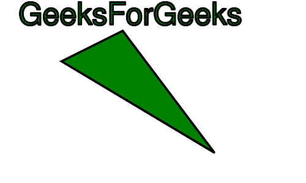

# PHP|ImagickDraw Annotation()函数

> Original: [https://www.geeksforgeeks.org/php-imagickdraw-annotation-function/](https://www.geeksforgeeks.org/php-imagickdraw-annotation-function/)

**ImagickDraw：：Annotation()**函数是 PHP 中的一个内置函数，用于在图像上绘制文本。

**语法：**

```php
*bool* ImagickDraw::annotation( $x, $y, $text )
```

**参数：**此函数接受上述三个参数，如下所述：

*   **$x：**此参数用于保存要绘制文本的 x 坐标值。
*   **$y：**此参数用于保存要绘制文本的 y 坐标值。
*   **$text：**此参数用于保存要在图像上绘制的字符串值。

**返回值：**此函数不返回值。

下面的程序说明了 PHP 中的**ImagickDraw：：Annotation()**函数：

**程序 1：**

```php
<?php

// Create an ImagickDraw Object
$draw = new ImagickDraw();

// Set Fill Color 
$draw->setFillColor('white');

// Set FOnt Size
$draw->setFontSize(20);

// Set Text
$draw->annotation(5, 75, "Geeksforgeeks!");
$draw->annotation(150, 75, "sarthak_ishu11");

// Create new Imagick Object
$imagick = new Imagick();
$imagick->newImage(300, 160, 'green');

// Set Image Format
$imagick->setImageFormat("png");
$imagick->drawImage($draw);
header("Content-Type: image/png");

// Display Image on Screen
echo $imagick->getImageBlob();
?>
```

**输出：**


**程序 2：**

```php
<?php

// Create an ImagickDraw Object
$draw = new ImagickDraw();

// Set Stroke Opacity
$draw->setStrokeOpacity(1);

// Set Stroke Color
$draw->setStrokeColor('Black');

// Set Fill Color
$draw->setFillColor('Green');

// Set Stroke Width
$draw->setStrokeWidth(3);

// Define the points
$points = [
        ['x' => 40 * 5, 'y' => 10 * 5],
        ['x' => 20 * 5, 'y' => 20 * 5],
        ['x' => 70 * 5, 'y' => 50 * 5],
        ['x' => 40 * 5, 'y' => 10 * 5]
    ];

// Set the Font Size 
$draw->setFontSize(50); 

// Set the font family 
$draw->setFontFamily('Ubuntu-Mono'); 

// Set the text to be added 
$draw->annotation(30, 40, "GeeksForGeeks"); 

// Call Polyline Function
$draw->polyline($points);

// Create an Imagick Object
$image = new Imagick();

// Create new Image
$image->newImage(500, 300, 'white');

// Set Image Format
$image->setImageFormat("png");

// Draw Image
$image->drawImage($draw);

header("Content-Type: image/png");
// Display the output image
echo $image->getImageBlob();
?>
```

**输出：**


**程序 3：**

```php
<?php
//Create a new Imagick object
$imagick = new Imagick();

// Create a image on imagick object
$imagick->newImage(800, 250, 'white');

// Create a new ImagickDraw object
$draw = new ImagickDraw();

// Set the text properties
$draw->setFontSize(110);
$draw->setFillColor('green');

// Apply the annotation() function
$draw->annotation(20, 120, 'GeeksforGeeks');

// Set the text properties
$draw->setFontSize(40);
$draw->setFillColor('black');

// Apply the annotation() function
$draw->annotation(70, 200, 'A computer science portal for geeks');

//  Render the draw commands in the ImagickDraw object
$imagick->drawImage($draw);

// Show the output
$imagick->setImageFormat("png");
header("Content-Type: image/png");
echo $imagick->getImageBlob();
?>
```

**输出：**


**引用：**[http://php.net/manual/en/imagickdraw.annotation.php](http://php.net/manual/en/imagickdraw.annotation.php)