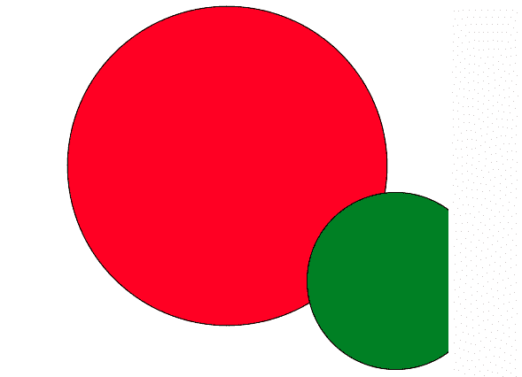
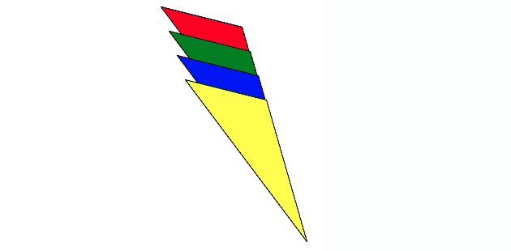

# PHP|ImagickDraw Translate()函数

> Original: [https://www.geeksforgeeks.org/php-imagickdraw-translate-function/](https://www.geeksforgeeks.org/php-imagickdraw-translate-function/)

**ImagickDraw：：Translate()**函数是 PHP 中的一个内置函数，用于将转换应用到当前坐标系。 它将平移应用于当前坐标系，从而将坐标系原点移动到指定坐标。

**语法：**

```
*bool* ImagickDraw::translate( $x, $y )
```

**参数：**此函数接受上述两个参数，如下所述：

*   **$x：**此参数用于保存 x 平移坐标的值。
*   **$y：**此参数用于保存 y 平移坐标的值。

**返回值：**此函数不返回任何值。

下面的程序说明了 PHP 中的**ImagickDraw：：Translate()函数**：

**程序 1：**

```
<?php

// require_once('path/vendor/autoload.php');

// Create a ImagickDraw object to draw into.
$draw = new ImagickDraw();

// Set the stroke color
$draw->setStrokeColor('black');

// Set the Image Filled Color
$draw->setFillColor('red');

// Draw the circle
$draw->circle(250, 250, 100, 150);

// Set the Image Filled Color
$draw->setFillColor('green');

// Set the translation points
$draw->translate(90, 30);

// Draw the circle
$draw->circle(350, 350, 250, 350);

// Create new imagick object
$image = new Imagick();

// Set the dimensions of the image
$image->newImage(500, 500, 'white');

// Set the image format
$image->setImageFormat("png");

// Draw the image
$image->drawImage($draw);
header("Content-Type: image/png");

// Display the image
echo $image->getImageBlob();
?>
```

**输出：**


**程序 2：**

```
<?php

// require_once('path/vendor/autoload.php');

// Create a ImagickDraw object to draw into.
$draw = new ImagickDraw();

// Set the Stroke color
$draw->setStrokeColor('black');

// Set the image filled color 
$draw->setFillColor('red');
$points = [['x' => 40 * 5, 'y' => 10 * 5], 
           ['x' => 70 * 5, 'y' => 50 * 5], 
           ['x' => 60 * 5, 'y' => 15 * 5], ];

// Draw the polygon
$draw->polygon($points);

// Set the image filled color 
$draw->setFillColor('green');

// Set the translation points
$draw->translate(10, 30);
$points = [['x' => 40 * 5, 'y' => 10 * 5], 
           ['x' => 70 * 5, 'y' => 50 * 5], 
           ['x' => 60 * 5, 'y' => 15 * 5], ];

// Draw the polygon
$draw->polygon($points);

// Set the image filled color 
$draw->setFillColor('blue');

// Set the translation points
$draw->translate(10, 30);
$points = [['x' => 40 * 5, 'y' => 10 * 5], 
           ['x' => 70 * 5, 'y' => 50 * 5], 
           ['x' => 60 * 5, 'y' => 15 * 5], ];

// Draw the polygon
$draw->polygon($points);

// Set the image filled color
$draw->setFillColor('yellow');

// Set the translation points
$draw->translate(10, 30);
$points = [['x' => 40 * 5, 'y' => 10 * 5], 
           ['x' => 70 * 5, 'y' => 50 * 5], 
           ['x' => 60 * 5, 'y' => 15 * 5], ];

// Draw the polygon
$draw->polygon($points);

// Create new imagick object
$image = new Imagick();

// Set the image dimensions
$image->newImage(400, 400, 'white');

// Set the image format
$image->setImageFormat("png");

// Draw the image 
$image->drawImage($draw);
header("Content-Type: image/png");

// Display the image
echo $image->getImageBlob();
?>
```

**输出：**


**引用：**[http://php.net/manual/en/imagickdraw.translate.php](http://php.net/manual/en/imagickdraw.translate.php)