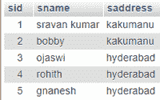
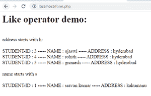
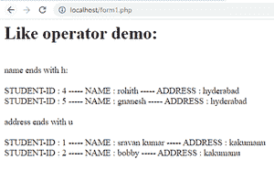
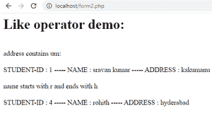

# PHP–MySQL LIKE 运算符

> 原文:[https://www.geeksforgeeks.org/php-mysql-like-operator/](https://www.geeksforgeeks.org/php-mysql-like-operator/)

**问题陈述:**

在本文中，我们将在 Xampp 服务器中使用 LIKE 运算符和 SQL 来显示数据。

这里我们将考虑学生地址数据库作为一个例子。

**要求:**

Xampp(洗发精)

**简介:**

PHP 代表超文本预处理器。它被用作服务器端脚本语言，可以用 xampp 工具连接 MySQL 服务器。

MySQL 是一种用于管理数据库的查询语言。

*   类似运算符

SQL 中的 LIKE 运算符在 WHERE 子句中用于搜索列中的指定模式。

有两个通配符可以与 LIKE 运算符结合使用。它们是:

1.  百分比符号(%)，表示零个、一个或多个字符
2.  下划线(_)代表一个单字符。

语法:

```html
SELECT column1, column2, ...,columnn
FROM table_name
WHERE columnn LIKE pattern;
```

**描述**

*   字母% =给出以给定字母开头的结果

示例:

请考虑下表:



查询:

地址以 h 开头:

```html
SELECT  * from student_address WHERE saddress LIKE 'h%'
```

输出:

```html
Address starts with h:
STUDENT-ID : 3 ----- NAME : ojaswi ----- ADDRESS : hyderabad
STUDENT-ID : 4 ----- NAME : rohith ----- ADDRESS : hyderabad
STUDENT-ID : 5 ----- NAME : gnanesh ----- ADDRESS : hyderabad
```

查询:

名称以 h 结尾:

```html
SELECT  * from student_address WHERE sname LIKE '%h';
```

输出:

```html
Name ends with h:
STUDENT-ID : 4 ----- NAME : rohith ----- ADDRESS : hyderabad
STUDENT-ID : 5 ----- NAME : gnanesh ----- ADDRESS : hyderabad
```

查询:

地址包含“um”模式

```html
SELECT  * from student_address WHERE sname LIKE '%um%';
```

输出:

```html
STUDENT-ID : 1 ----- NAME : sravan kumar ----- ADDRESS : kakumanu
```

查询:

地址以 r 开头，以 h 结尾。

```html
SELECT  * from student_address WHERE sname LIKE 'r%h';
```

输出:

```html
STUDENT-ID : 4 ----- NAME : rohith ----- ADDRESS : hyderabad.
```

**进场:**

*   创建数据库(命名数据库)并创建名为 student_address 的表
*   使用 PHP 将数据插入表中
*   编写 PHP 代码来执行类似的操作
*   观察结果

**步骤:**

*   启动 xampp 服务器。


*   创建名为 database 的数据库，并创建名为 student_address 的表


*   编写 PHP 代码将记录插入其中。(data1.php)

## 服务器端编程语言（Professional Hypertext Preprocessor 的缩写）

```html
<?php
//servername
$servername = "localhost";
//username
$username = "root";
//empty password
$password = "";
//database is the database name
$dbname = "database";

// Create connection by passing these connection parameters
$conn = new mysqli($servername, $username, $password, $dbname);
// Check this connection
if ($conn->connect_error) {
  die("Connection failed: " . $conn->connect_error);
}
//insert records into table
$sql  = "INSERT INTO student_address VALUES (1,'sravan kumar','kakumanu');";
$sql .= "INSERT INTO student_address VALUES (2,'bobby','kakumanu');";
$sql .= "INSERT INTO student_address  VALUES (3,'ojaswi','hyderabad');";
$sql .= "INSERT INTO student_address  VALUES (4,'rohith','hyderabad');";
$sql .= "INSERT INTO student_address  VALUES (5,'gnanesh','hyderabad');";

if ($conn->multi_query($sql) === TRUE) {
  echo "data stored successfully";
} else {
  echo "Error: " . $sql . "<br>" . $conn->error;
}

$conn->close();
?>
```

打开浏览器，键入“localhost.data1.php”执行。

输出:

```html
data stored successfully
```

*   一个字母的 like 运算符的 PHP 代码演示如下:

form.php

## 服务器端编程语言（Professional Hypertext Preprocessor 的缩写）

```html
<html>
<body>
<?php
//servername
$servername = "localhost";
//username
$username = "root";
//empty password
$password = "";
//database is the database name
$dbname = "database";

// Create connection by passing these connection parameters
$conn = new mysqli($servername, $username, $password, $dbname);
echo "<h1>"; echo "Like operator demo: "; echo"</h1>";
echo "<br>";
echo "address starts with h:";
echo "<br>";
echo "<br>";
//sql query
$sql = "SELECT  * from student_address WHERE saddress LIKE 'h%'";
$result = $conn->query($sql);
//display data on web page
while($row = mysqli_fetch_array($result)){
    echo " STUDENT-ID : ". $row['sid'], " ----- NAME : ". $row['sname'] ," ----- ADDRESS : ". $row['saddress'] ;
    echo "<br>";

}

echo "<br>";
echo "name starts with s ";
echo "<br>";
echo "<br>";
//sql query 
$sql1 = "SELECT  * from student_address WHERE sname LIKE 's%'";
$result1 = $conn->query($sql1);
//display data on web page
while($row = mysqli_fetch_array($result1)){
    echo " STUDENT-ID : ". $row['sid'], " ----- NAME : ". $row['sname'] ," ----- ADDRESS : ". $row['saddress'] ;
    echo "<br>";

}

//close the connection

$conn->close();
?>
</body>
</html>
```

输出:

localhost/form.php



*   一封信的 PHP 代码演示以:

form1.php

## 服务器端编程语言（Professional Hypertext Preprocessor 的缩写）

```html
<html>
<body>
<?php
//servername
$servername = "localhost";
//username
$username = "root";
//empty password
$password = "";
//database is the database name
$dbname = "database";

// Create connection by passing these connection parameters
$conn = new mysqli($servername, $username, $password, $dbname);
echo "<h1>"; echo "Like operator demo: "; echo"</h1>";
echo "<br>";
echo "name ends  with h:";
echo "<br>";
echo "<br>";
//sql query
$sql = "SELECT  * from student_address WHERE sname LIKE '%h'";
$result = $conn->query($sql);
//display data on web page
while($row = mysqli_fetch_array($result)){
    echo " STUDENT-ID : ". $row['sid'], " ----- NAME : ". $row['sname'] ," ----- ADDRESS : ". $row['saddress'] ;
    echo "<br>";

}

echo "<br>";
echo "address ends with u ";
echo "<br>";
echo "<br>";
//sql query 
$sql1 = "SELECT  * from student_address WHERE saddress LIKE '%u'";
$result1 = $conn->query($sql1);
//display data on web page
while($row = mysqli_fetch_array($result1)){
    echo " STUDENT-ID : ". $row['sid'], " ----- NAME : ". $row['sname'] ," ----- ADDRESS : ". $row['saddress'] ;
    echo "<br>";

}

//close the connection

$conn->close();
?>
</body>
</html>
```

输出:



*   PHP 代码演示了一个子字符串匹配，字母以-开头，以

form2.php

## 服务器端编程语言（Professional Hypertext Preprocessor 的缩写）

```html
<html>
<body>
<?php
//servername
$servername = "localhost";
//username
$username = "root";
//empty password
$password = "";
//database is the database name
$dbname = "database";

// Create connection by passing these connection parameters
$conn = new mysqli($servername, $username, $password, $dbname);
echo "<h1>"; echo "Like operator demo: "; echo"</h1>";
echo "<br>";
echo "address contains um:";
echo "<br>";
echo "<br>";
//sql query
$sql = "SELECT  * from student_address WHERE sname LIKE '%um%'";
$result = $conn->query($sql);
//display data on web page
while($row = mysqli_fetch_array($result)){
    echo " STUDENT-ID : ". $row['sid'], " ----- NAME : ". $row['sname'] ," ----- ADDRESS : ". $row['saddress'] ;
    echo "<br>";

}

echo "<br>";
echo "name starts with r and ends with h ";
echo "<br>";
echo "<br>";
//sql query 
$sql1 = "SELECT  * from student_address WHERE sname LIKE 'r%h'";
$result1 = $conn->query($sql1);
//display data on web page
while($row = mysqli_fetch_array($result1)){
    echo " STUDENT-ID : ". $row['sid'], " ----- NAME : ". $row['sname'] ," ----- ADDRESS : ". $row['saddress'] ;
    echo "<br>";

}

//close the connection

$conn->close();
?>
</body>
</html>
```

输出:

