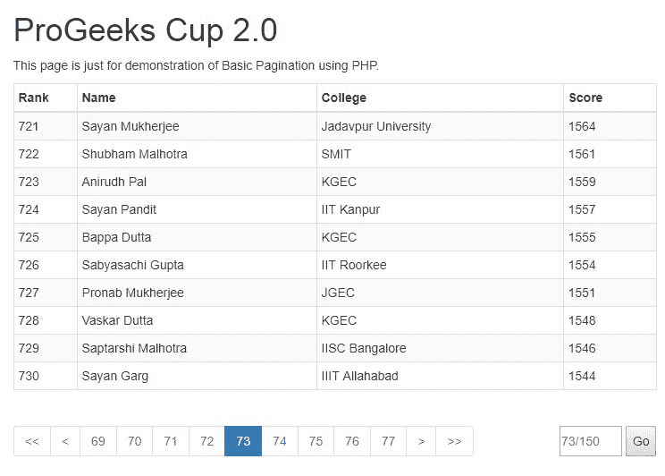

# PHP 分页|设置 3

> Original: [https://www.geeksforgeeks.org/php-pagination-set-3/](https://www.geeksforgeeks.org/php-pagination-set-3/)

在上一篇文章[PHP 分页|Set 2](https://www.geeksforgeeks.org/php-pagination-set-2/)中，我们开发了一个简单的分页系统，该系统在逻辑上是正确的，但它在视觉上并不美观，因为所有的页码堆叠在一起并占据了大量的屏幕空间。 那么补救措施是什么呢？ 很简单，当用户查找特定页码时，可以假设他将以顺序方式移动。 例如，如果您在第 12 页，我们可以假设您将转到附近的页面，而不是直接转到第 122 页。 假设这一点，许多分页系统都得到了发展，并且在视觉上也变得很吸引人。 让我们考虑一下 GeeksforGeek 分页系统。 下图相同。
[](https://media.geeksforgeeks.org/wp-content/uploads/gfg_pagination.jpg)
如您所见，GeeksforGeek 分页系统要好得多，它可以选择查看总页数。 它还具有最后一个和下一个按钮，类似地，上一个和第一个按钮也是动态呈现的，即基于当前页码显示这些按钮的组合。 现在，在开始增强我们自己的分页系统之前，我们应该记下我们应该选择哪些功能。

**特性分析**

*   首先，我们不想显示 150 页，我们将只显示基于当前页码的本地页面集。
*   我们还应该有一个用于快速导航的上一个/下一个和第一个/最后一个按钮。
*   如果你认为，用户的动作可以分为三类。 顺序、随机和混合。 通过创建到本地页面的链接和下一步/上一步按钮，我们实现了顺序运动。 对于随机移动，我们应该有一个输入字段，用户可以在其中键入特定的页码，其余的导航链接应该相应地更改。

既然我们已经确定了要添加的功能，让我们跳到最终的源代码并解释我们是如何实现需求的。

**最终源代码**

```
<!DOCTYPE html>
<html>
  <head>
    <title>ProGeeks Cup 2.0</title>
    <meta charset="utf-8">
    <meta name="viewport" content="width=device-width, initial-scale=1">
    <link rel="stylesheet" 
    href="https://maxcdn.bootstrapcdn.com/bootstrap/3.3.7/css/bootstrap.min.css">
    <style>
     .inline{
         display: inline-block;
         float: right;
         margin: 20px 0px;
     }

     input, button{
         height: 34px;
     }
    </style>
  </head>
  <body>
  <?php
    require_once "connection.php";

    $limit = 10;  
    if (isset($_GET["page"])) { 
      $pn  = $_GET["page"]; 
    } 
    else { 
      $pn=1; 
    };  

    $start_from = ($pn-1) * $limit;  

    $sql = "SELECT * FROM table1 LIMIT $start_from, $limit";  
    $rs_result = mysql_query ($sql); 

  ?>
  <div class="container">
    <br>
    <div>
      <h1>ProGeeks Cup 2.0</h1>
      <p>This page is just for demonstration of Basic Pagination using PHP.</p>
      <table class="table table-striped table-condensed table-bordered">
        <thead>
        <tr>
          <th width="10%">Rank</th>
          <th>Name</th>
          <th>College</th>
          <th>Score</th>
        </tr>
        </thead>
        <tbody>
        <?php  
          while ($row = mysql_fetch_array($rs_result, MYSQL_ASSOC)) {  
        ?>  
        <tr>  
          <td><?php echo $row["rank"]; ?></td>  
          <td><?php echo $row["name"]; ?></td>
          <td><?php echo $row["college"]; ?></td>
          <td><?php echo $row["score"]; ?></td>                                        
        </tr>  
        <?php  
        };  
        ?>  
        </tbody>
      </table>
      <div>
      <ul class="pagination">
      <?php  
        $sql = "SELECT COUNT(*) FROM table1";  
        $rs_result = mysql_query($sql);  
        $row = mysql_fetch_row($rs_result);  
        $total_records = $row[0];  
        $total_pages = ceil($total_records / $limit);
        $k = (($pn+4>$total_pages)?$total_pages-4:(($pn-4<1)?5:$pn));        
        $pagLink = "";
        if($pn>=2){
            echo "<li><a href='index.php?page=1'> << </a></li>";
            echo "<li><a href='index.php?page=".($pn-1)."'> < </a></li>";
        }
        for ($i=-4; $i<=4; $i++) {
          if($k+$i==$pn)
            $pagLink .= "<li class='active'><a href='index.php?page=".($k+$i)."'>".($k+$i)."</a></li>";
          else
            $pagLink .= "<li><a href='index.php?page=".($k+$i)."'>".($k+$i)."</a></li>";  
        };  
        echo $pagLink;
        if($pn<$total_pages){
            echo "<li><a href='index.php?page=".($pn+1)."'> > </a></li>";
            echo "<li><a href='index.php?page=".$total_pages."'> >> </a></li>";
        }    
      ?>
      </ul>
      <div class="inline">
      <input id="pn" type="number" min="1" max="<?php echo $total_pages?>" 
      placeholder="<?php echo $pn."/".$total_pages; ?>" required>
      <button onclick="go2Page();">Go</button>
      </div>
     </div> 
    </div>
  </div>
  <script>
    function go2Page()
    {
        var pn = document.getElementById("pn").value;
        pn = ((pn><?php echo $total_pages; ?>)?<?php echo $total_pages; ?>:((pn<1)?1:pn));
        window.location.href = 'index.php?page='+pn;
    }
  </script>
  </body>
</html>
```

哇哦！ 这太大了，让人难以理解！ 不用担心，我们只包含了那些突出显示的内容，其中还包括一些 CSS 样式、一些新的 HTML 标记和一些逻辑。 让我们不要再等待解释我们已经改变了什么，并公布最终结果。

**顺序运动代码**

这段代码背后的想法非常简单。 我们希望采用中间索引$k，并希望打印相邻页面以创建顺序链接。 在回显序列之前，如果当前页面不是首页，我们将回显上一页和首页链接。 类似地，在回显序列之后，如果当前页面不是最后一页，我们将回显下一页和最后一页链接。 在本例中，我们打算显示形成序列的总共 9 个页面链接。

```
// K is assumed to be the middle index.
$k = (($pn+4>$total_pages)?$total_pages-4:(($pn-4<1)?5:$pn));     

// Show prev and first-page links.
if($pn>=2){
  echo "<li><a href='index.php?page=1'> << </a></li>";
  echo "<li><a href='index.php?page=".($pn-1)."'> < </a></li>";
}

// Show sequential links.
for ($i=-4; $i<=4; $i++) {
  if($k+$i==$pn)
    $pagLink .= "<li class='active'><a href='index.php?page=".($k+$i)."'>".($k+$i)."</a></li>";
  else
    $pagLink .= "<li><a href='index.php?page=".($k+$i)."'>".($k+$i)."</a></li>";  
};  
echo $pagLink;

// Show next and last-page links.
if($pn<$total_pages){
  echo "<li><a href='index.php?page=".($pn+1)."'> > </a></li>";
  echo "<li><a href='index.php?page=".$total_pages."'> >> </a></li>";
}
```

**随机移动代码**

这背后的想法也相当简单，我们将提供一个输入字段，用户可以在其中输入任何数值，之后我们将检查给定值是否有效，然后我们将转到页面。 这不需要太多 PHP，因为可以使用 JS 完成。 PHP 仅用于提供$TOTAL_PAGES Present 等的值。为了开发上述功能，我们首先添加了以下标记，然后添加了处理单击事件的函数。

```
<div class="inline">
  <input id="pn" type="number" min="1" max="<?php echo $total_pages?>"
         placeholder="<?php echo $pn."/".$total_pages; ?>" required>
  <button onclick="go2Page();">Go</button>
</div>
```

```
function go2Page()
{
    var pn = document.getElementById("pn").value;
    // Check if pn is between the max and min.
  pn = ((pn><?php echo $total_pages; ?>)?<?php echo $total_pages; ?>:((pn<1)?1:pn));
  window.location.href = 'index.php?page=' + pn;
}
```

其余的更新只是一些 CSS，让它看起来有点规则。 最后，我们得到的最终结果如下图所示。
[](https://media.geeksforgeeks.org/wp-content/uploads/pagination_final.jpg)
我在创建这个分页系统时非常开心，我很高兴它被证明是不错的。 如果您需要源文件和数据集，请随时访问[我的存储库](https://github.com/PronabM/GeeksforGeeks-Projects/tree/master/Pagination/src)。 祝您学习愉快。