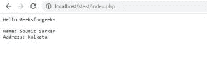

# 是什么。PHP 网页设计中的 tpl 文件？

> 原文:[https://www . geesforgeks . org/what-is-TPL-file-in-PHP-web-design/](https://www.geeksforgeeks.org/what-is-tpl-file-in-php-web-design/)

TPL 是一个**模板**文件，它是一个普通的文本文件，包含用户定义的变量，当 PHP web 应用程序解析模板文件时，这些变量有权被用户定义的输出内容覆盖。这些被使用服务器脚本 PHP(但不限于)作为模板文件的 web 应用程序使用。模板代码的主要内容是一个**。tpl** 文件存储在**中，该文件主要由纯 HTML 文本组成。tpl** 文件为纯文本，所以，可以用简单的文本编辑器编辑一个 tpl 文件。

**使用情况:**
虽然在 HTML 中集成 PHP 代码似乎很容易，但这并不被认为是一种好的代码管理实践，因为设计团队很难用 PHP 标签和 HTML 标签的混合来公平地维护文件。在这种情况下，模板代码用于将设计与开发分开。模板文件通过提供更简单的基于标签的语法来隔离 PHP。没有 PHP 知识是管理模板文件所必需的。对于网页设计师来说，这通常比 PHP 开发人员更重要。

**添加模板文件的常见区域很少**

*   第三方共享相同设计的代码的可重用性。示例–一个在线课程门户，学院可以在其中创建自己的页面来放置自己的课程。
*   内容管理系统或内容管理系统。
*   网页设计团队和 PHP 开发团队不同的项目。

**使用过程:**要使用带有 PHP 模板的网页设计，我们将使用一个名为 **Smarty** 的框架。Smarty 是一个开源的免费框架，它带有简单的基于标签的模板语句，为 PHP web 应用程序提供干净的可维护的表示代码。

**在 Apache 中开始使用 Smarty 的步骤。**

1.  从[https://github.com/smarty-php/smarty/archive/master.zip](https://github.com/smarty-php/smarty/archive/master.zip)下载最新的 Smarty。
2.  解压文件，添加两个文件夹 **template_c** 和**缓存**。
3.  通过添加 **include_path= "来配置 **php.ini** 文件。；第 3 步**中 libs 文件夹所在的路径。
4.  在 *htdocs(root)* 中创建一个名为 *smarty* 的文件夹，并从步骤 3 中原始下载的文件夹中复制文件夹**配置**。
5.  添加另一个名为**模板**的文件夹和一个 PHP 文件**index.php**。
6.  在模板文件夹中添加模板文件 **index.tpl**

因此，在**模板/index.tpl** 中，人们可以编写所有的模板代码来处理演示文稿，在*index.php*中，可以编写所有的 php 代码来处理数据处理。

**示例:**我们在这里演示一个显示 PHP 文件中数据的简单示例。

*   **```
    <?php
    include('Smarty.class.php');

    // create object
    $smarty = new Smarty;

    // assign some content. This would typically come from
    // a database or other source, but we'll use static
    $smarty->assign('name', 'Soumit Sarkar');
    $smarty->assign('address', 'Kolkata');

    // display it
    $smarty->display('templates/index.tpl');

    ?>
    ```** 
*   ****第三方物流:**

    ```
    <html>
        <head>
            <title>Info</title>
        </head>
        <body>
          <pre>
           Hello Geeksforgeeks
           Name: {$name}
           Address: {$address}
          </pre>
        </body>
    </html>
    ```** 
*   ****输出:**
    [](https://imgbb.com/)**

****使用的优势。第三方物流文件:****

*   **定制开发的灵活性。**
*   **干净的代码展示。**
*   **程序员和设计师的快速开发或部署。**
*   **快速且易于维护。**
*   **代码易于重用**
*   **安全性:与 PHP 绝缘。**

****用 PHP 实现模板文件的实际应用:**一个**的实例。PHP 中的 tpl** 文件是 **Phorum** 使用的模板文件。是一个基于 **PHP 和 MySQL 的**开源留言板系统。**。tpl** 文件显示由 Phorum 动态生成的数据，如消息上的**信息、搜索相关结果、**和**串私人消息。**
**。tpl** 文件具有模板语言的特定格式，通常包括 HTML 和简单的 Phorum 模板语句。这些语句支持四种数据类型，可能是**整数、字符串、PHP 常量、**和**模板变量**。**

****的重要性。Phorum 中带有 PHP 的 tpl 文件:**Phorum 使用**。php** 文件，如果它们放在模板目录中，并且除了使用存储简单模板代码的 TPL 文件之外，还使用适当的 basename 命名。第三方物流文件主要包括**风格数据**和其他关于 PHP 应用程序网页的信息。**

**如果 Phorum 显示的是页眉页脚模板，则首先在模板目录中搜索**header.php**，如果文件不存在，则查找 **header.tpl** 。这不仅仅是关于弗鲁姆。许多其他解析器和更常见的定制解决方案使用**。第三方物流**。如果是自定义的，可以在**中放置 PHP 代码。tpl** 文件也是如此，因为它们相当健壮。 **OpenCart** 就是一个很好的例子，这和 **vBulletin** 一样，在**里面。tpl** 可以看到里面使用了 PHP 代码。这就是为什么 **NGINX** 和许多其他服务器预建了预防措施，防止人们阅读**。tpl** 文件。**